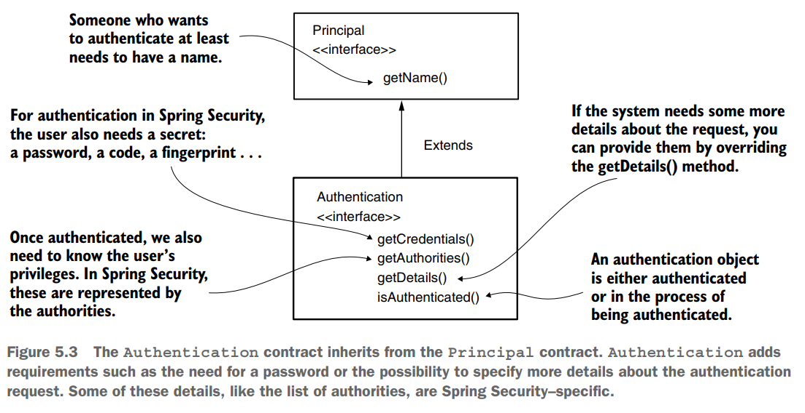
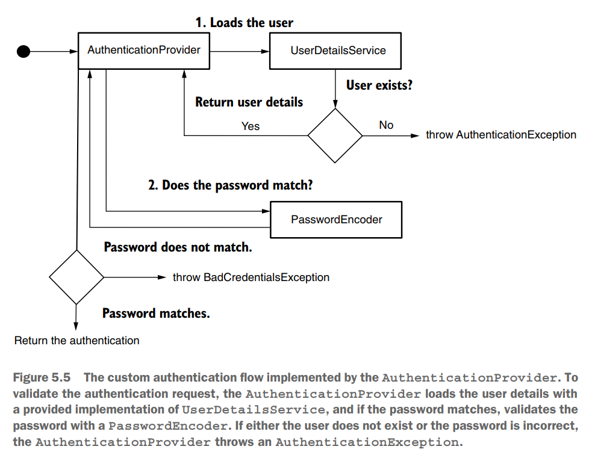
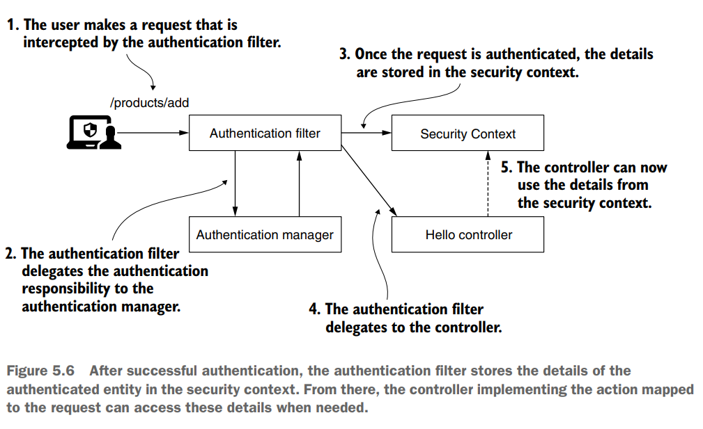

# [Pág. 102] Capítulo 05 - Implementar la autenticación

## Entendiendo el AuthenticationProvider

La capa AuthenticationProvider, es la responsable de la lógica de autenticación. **El AuthenticationProvider** es
donde encuentra las condiciones e instrucciones que deciden si autenticar una solicitud o no.

Solo hay dos posibles resultados:

1. **La entidad que realiza la solicitud no está autenticada.** El usuario no es reconocido, y la aplicación rechaza la
   solicitud sin delegar al proceso de autorización. Por lo general, en este caso, el estado de respuesta que se
   devuelve al cliente es **HTTP 401 Unauthorized.**
2. **La entidad que realiza la solicitud está autenticada.** Los detalles sobre el solicitante se almacenan de manera
   que la aplicación pueda utilizarlos para la autorización. Como descubrirá en este capítulo, la interfaz
   SecurityContext es la instancia que almacena los detalles sobre la solicitud autenticada actualmente.

## Representación de la solicitud durante la autenticación

**El Authentication** es una de las interfaces esenciales involucradas en el proceso de autenticación. La interfaz de
autenticación representa el evento de solicitud de autenticación y contiene los detalles de la entidad que solicita
acceso a la aplicación. Puede utilizar la información relacionada con el evento de solicitud de autenticación durante y
después del proceso de autenticación. **El usuario que solicita acceso a la aplicación se denomina PRINCIPAL**. La
interfaz de autenticación de Spring Security amplía la interfaz Principal.



Por el momento, los únicos métodos de este contrato que necesitas aprender son estos:

- **isAuthenticated():** devuelve verdadero si el proceso de autenticación finaliza o falso si el proceso de
  autenticación aún está en curso.
- **getCredentials():** devuelve una contraseña o cualquier secreto utilizado en el proceso de autenticación (password,
  fingerprint, sms code, etc.)
- **getAuthorities():** devuelve una colección de autorizaciones otorgadas para la solicitud autenticada.

## Implementando una lógica de autenticación personalizada

**El AuthenticationProvider en Spring Security se encarga de la lógica de autenticación**. La implementación
predeterminada de la interfaz AuthenticationProvider delega la responsabilidad de encontrar el usuario del sistema a un
UserDetailsService. También utiliza PasswordEncoder para la gestión de contraseñas en el proceso de
autenticación.

El siguiente código proporciona **la definición de AuthenticationProvider**, que debe implementar para definir
un proveedor de autenticación personalizado para su aplicación.

````java
public interface AuthenticationProvider {
    Authentication authenticate(Authentication authentication) throws AuthenticationException;

    boolean supports(Class<?> authentication);
}
````

La responsabilidad de AuthenticationProvider está estrechamente relacionada con el contrato de autenticación. El método
authenticate() recibe un objeto de autenticación como parámetro y devuelve un objeto de autenticación. **Implementamos
el método authenticate() para definir la lógica de autenticación.** Podemos resumir rápidamente la forma en que debe
implementar el método de autenticación() con tres viñetas:

- El método debe lanzar una **AuthenticationException** si falla la autenticación.
- Si el método recibe un objeto de autenticación que no es compatible con su implementación de AuthenticationProvider,
  entonces el método debe devolver un valor nulo. De esta forma, tenemos la posibilidad de utilizar múltiples tipos de
  Autenticación separados a nivel de filtro HTTP.
- El método debe devolver una instancia de autenticación que represente un objeto completamente autenticado. Para esta
  instancia, el método isAuthenticated() devuelve verdadero y contiene todos los detalles necesarios sobre la entidad
  autenticada. Por lo general, la aplicación también elimina datos confidenciales como una contraseña de esta instancia.
  Después de la implementación, la contraseña ya no es necesaria y mantener estos detalles puede exponerlos
  potencialmente a ojos no deseados.

**El segundo método en la interfaz de AuthenticationProvider es supports(Class<?> authentication)**. Puede implementar
este método para devolver verdadero si el AuthenticationProvider actual admite el tipo proporcionado como un objeto de
autenticación. Observe que incluso si este método devuelve verdadero para un objeto, aún existe la posibilidad de que el
método authenticate() rechace la solicitud al devolver un valor nulo. Spring Security está diseñado así para ser
más flexible y permitirle implementar un AuthenticationProvider que puede rechazar una solicitud de autenticación en
función de los detalles de la solicitud, no solo por su tipo.

Una analogía de cómo el administrador de autenticación y el proveedor de autenticación trabajan juntos para validar o
invalidar una solicitud de autenticación es tener una cerradura más compleja para su puerta. Puede abrir esta cerradura
usando una tarjeta o una llave física antigua (figura 5.4). La propia cerradura es el gestor de autenticación que decide
si se abre la puerta. Para tomar esa decisión, delega en los dos proveedores de autenticación: uno que sabe validar la
tarjeta o el otro que sabe verificar la clave física. Si presentas una tarjeta para abrir la puerta, el proveedor de
autenticación que trabaja solo con llaves físicas se queja de que no conoce este tipo de autenticación.
Pero el otro proveedor admite este tipo de autenticación y verifica si la tarjeta es válida para la puerta. **Este es en
realidad el propósito de los métodos support().**

Además de probar el tipo de autenticación, Spring Security agrega una capa más de flexibilidad. La cerradura de la
puerta puede reconocer múltiples tipos de tarjetas. En este caso, cuando presente una tarjeta, uno de los proveedores de
autenticación podría decir: “Entiendo que esto es una tarjeta. ¡Pero no es el tipo de tarjeta que puedo validar!” **Esto
sucede cuando supports() devuelve verdadero pero authenticate() devuelve nulo.**

## Aplicando lógica de autenticación personalizada

Los pasos para implementar un AuthenticationProvider personalizado son:

1. Declare una clase que implemente la interfaz AuthenticationProvider.
2. Decida qué tipos de objetos de autenticación admite el nuevo AuthenticationProvider:
    - Anule el método **supports(Class<?> c)** para especificar qué tipo de autenticación es compatible con el
      AuthenticationProvider que definimos.
    - Anule el método authenticate(Authentication a) para implementar la lógica de autenticación.
3. Registre una instancia de la nueva implementación de AuthenticationProvider con Spring Security.

````java

@Component
public class CustomAuthenticationProvider implements AuthenticationProvider {
    // Omitted code
    @Override
    public boolean supports(Class<?> authenticationType) {
        return authenticationType.equals(UsernamePasswordAuthenticationToken.class);
    }
}
````

En el código anterior definimos una nueva **clase que implementa la interfaz AuthenticationProvider**. Marcamos la clase
con **@Component para tener una instancia de su tipo en el contexto manejado por Spring**. Luego, tenemos que decidir
qué tipo de implementación de interfaz de autenticación admite este AuthenticationProvider. Eso depende del tipo que
esperamos que se proporcione como parámetro para el método de authenticate(). Si no personalizamos nada a nivel de
filtro de autenticación, entonces **la clase UsernamePasswordAuthenticationToken define el tipo.** **Esta clase es una
implementación de la interfaz de Authentication** y representa una solicitud de autenticación estándar con nombre de
usuario y contraseña.

Con esta definición, hicimos que AuthenticationProvider soporte un tipo específico de clave. Una vez que hemos
especificado el alcance de nuestro proveedor de autenticación, implementamos la lógica de autenticación anulando el
método de authenticate() como se muestra en el siguiente código:

````java

@Component
public class CustomAuthenticationProvider implements AuthenticationProvider {

    @Autowired
    private UserDetailsService userDetailsService;

    @Autowired
    private PasswordEncoder passwordEncoder;

    @Override
    public Authentication authenticate(Authentication authentication) {
        String username = authentication.getName();
        String password = authentication.getCredentials().toString();

        UserDetails u = this.userDetailsService.loadUserByUsername(username);

        if (this.passwordEncoder.matches(password, u.getPassword())) {
            return new UsernamePasswordAuthenticationToken(username, password, u.getAuthorities());
        }

        throw new BadCredentialsException("Something went wrong!");
    }

    // Omitted code
}
````

- **Si la contraseña coincide**, devuelve una implementación de la interfaz Authentication con los detalles necesarios.
- **Si la contraseña no coincide**, lanza una excepción de tipo AuthenticationException. BadCredentialsException hereda
  de AuthenticationException.

A continuación se muestra visualmente la lógica de autenticación que sigue nuestro CustomAuthenticationProvider:



Para poder conectar la nueva implementación del **AuthenticationProvider**, debemos sobreescribir el método configure()
de la clase WebSecurityConfigurerAdapter en nuestra clase de configuración principal de Spring Security
WebAuthorizationConfig:

````java

@Configuration
public class WebAuthorizationConfig extends WebSecurityConfigurerAdapter {
    @Autowired
    private AuthenticationProvider authenticationProvider;

    /* other code */

    @Override
    protected void configure(AuthenticationManagerBuilder auth) {
        auth.authenticationProvider(this.authenticationProvider);
    }
}
````

En el código anterior, usamos la inyección de dependencia a través del @Autowired para inyectar una implementación
del AuthenticationProvider, es decir, Spring sabe que necesita encontrar en su contexto una instancia de una
implementación para esa interfaz específica. En nuestro caso, la implementación es la instancia es
**CustomAuthenticationProvider**, que es la única de este tipo que declaramos y añadimos al contexto de Spring
usando la anotación @Component.

**NOTA**
> Hasta este punto, podemos ejecutar la aplicación y a través de curl verificar que podemos acceder al controlador con
> las credenciales almacenadas en la base de datos.

## Usando el SecurityContext

Una vez que AuthenticationManager completa con éxito el proceso de autenticación, almacena la instancia de autenticación
para el resto de la solicitud. **La instancia que almacena el objeto de autenticación se denomina contexto de seguridad
(SecurityContext).**



El contexto de seguridad de Spring Security se describe mediante la interfaz SecurityContext.

````java
public interface SecurityContext extends Serializable {
    Authentication getAuthentication();

    void setAuthentication(Authentication authentication);
}
````

Como puede observar en la definición del contrato, la responsabilidad principal de SecurityContext es almacenar el
objeto de autenticación. Pero, **¿cómo se gestiona el propio SecurityContext?** Spring Security ofrece tres estrategias
para administrar SecurityContext con **un objeto en el rol de administrador. Se llama SecurityContextHolder:**

- **MODE_THREADLOCAL:** permite que cada subproceso almacene sus propios detalles en el contexto de seguridad. En una
  aplicación web de subprocesos por solicitud, este es un enfoque común, ya que cada solicitud tiene un subproceso
  individual.
- **MODE_INHERITABLETHREADLOCAL:** similar a MODE_THREADLOCAL, pero también indica a Spring Security que copie el
  contexto de seguridad al siguiente subproceso en caso de un método asíncrono. De esta forma, podemos decir que el
  nuevo subproceso que ejecuta el método @Async hereda el contexto de seguridad.
- **MODE_GLOBAL:** hace que todos los subprocesos de la aplicación vean la misma instancia de contexto de seguridad.

La primera estrategia para administrar el contexto de seguridad es la estrategia **MODE_THREADLOCAL.**
**Esta estrategia también es la predeterminada** para administrar el contexto de seguridad utilizado por Spring
Security. Con esta estrategia, Spring Security usa ThreadLocal para administrar el contexto.

**Al ser la estrategia predeterminada para administrar el contexto de seguridad**, este proceso **no necesita
configurarse explícitamente.** Simplemente, **solicite el SecurityContext a partir del SecurityContextHolder
utilizando el método estático getContext()** donde lo necesite después del final del proceso de autenticación. Desde el
contexto de seguridad, puede obtener además el objeto de autenticación, que almacena los detalles sobre la entidad
autenticada.

En el siguiente código, encuentra un ejemplo de **cómo obtener el SecurityContext** en uno de los extremos de la
aplicación **a partir del SecurityContextHolder:**

````java

@RestController
@RequestMapping(path = "/greetings")
public class HelloController {

    @GetMapping(path = "/hello")
    public String hello() {
        SecurityContext context = SecurityContextHolder.getContext();
        Authentication authentication = context.getAuthentication();

        return "Hello, " + authentication.getName() + "!";
    }
}
````

Obtener la autenticación del contexto es aún más cómodo a nivel de punto final, ya que Spring sabe inyectarlo
directamente en los parámetros del método. No es necesario que se refiera cada vez a la clase SecurityContextHolder
explícitamente. Este enfoque, como se presenta en el siguiente fragmento de código, es mejor.

````java

@RestController
@RequestMapping(path = "/greetings")
public class HelloController {

    @GetMapping(path = "/hello")
    public String hello(Authentication authentication) {
        return "Hello, " + authentication.getName() + "!";
    }
}
````

### Probando con curl

````
curl -v -u martin:12345 http://localhost:8080/greetings/hello

--- Respuesta ---
Hello, martin!
````