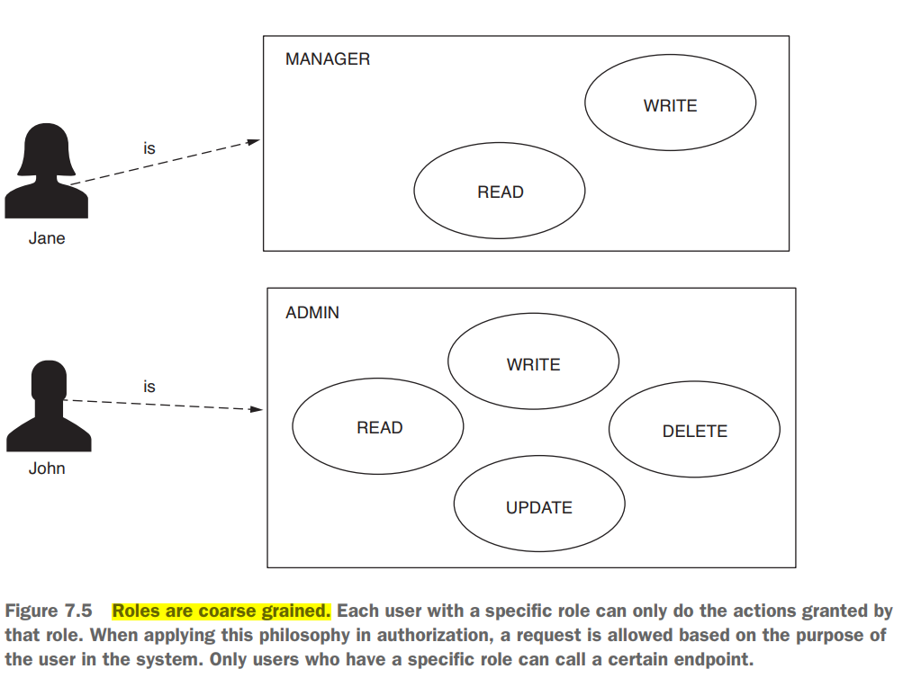

# [Pág. 153] Capítulo 7 - Configurando autorización: Restricción de acceso

Cuando el cliente realiza la solicitud, el Authentication Filter autentica al usuario. Después de una autenticación
exitosa, el Authentication Filter almacena los detalles del usuario en el contexto de seguridad y reenvía la solicitud
al filtro de autorización. El filtro de autorización decide si se permite la llamada. Para decidir si autorizar la
solicitud, el filtro de autorización utiliza los detalles del contexto de seguridad.


## [Pág. 157] Restricción del acceso para todos los end points en función a las AUTHORITIES del usuario

Un **Authority** es una acción que un usuario puede realizar con un recurso del sistema.


A continuación se muestran tres formas para configurar el acceso a los puntos finales en función de las
autorizaciones del usuario.

- **hasAuthority():** recibe como parámetros solo una autoridad para la que la aplicación configura las restricciones.
  Solo los usuarios que tienen esa autoridad pueden llamar al punto final.
- **hasAnyAuthority():** puede recibir más de una autoridad para la cual la aplicación configura las restricciones.
  El usuario debe tener al menos una de las autorizaciones especificadas para realizar una solicitud.
  ``Recomiendo usar este método o el método hasAuthority() por su simplicidad, dependiendo de la cantidad de privilegios
  que asigne a los usuarios. Estos son fáciles de leer en configuraciones y hacen que su código sea más fácil de entender.``
- **access():** le ofrece posibilidades ilimitadas para configurar el acceso porque la aplicación crea las reglas de
  autorización basadas en Spring Expression Language (SpEL). Sin embargo, hace que el código sea más difícil de leer y
  depurar. Por esta razón, lo recomiendo como la solución menor y solo si no puede aplicar los métodos hasAnyAuthority()
  o hasAuthority().

Ahora, como parte de un ejemplo práctico aseguraremos el acceso al siguiente end point a los usuarios que
tengan un authority en específico.

````java

@RestController
@RequestMapping(path = "/greetings")
public class HelloController {

    @GetMapping(path = "/hello")
    public String hello() {
        return "Hello!";
    }

}
````

Como configuramos en capítulos anteriores, necesitamos un PasswordEncoder y también una implementación de la interfaz
UserDetailsService, donde definiremos nuestros usuarios conocidos por Spring Security, los UserDetails.

````java

@Configuration
public class UserManagementConfig {

    @Bean
    public PasswordEncoder passwordEncoder() {
        return NoOpPasswordEncoder.getInstance();
    }

    @Bean
    public UserDetailsService userDetailsService() {
        UserDetails userDetails1 = User.builder()
                .username("admin")
                .password("12345")
                .authorities("WRITE")
                .build();
        UserDetails userDetails2 = User.builder()
                .username("martin")
                .password("12345")
                .authorities("READ")
                .build();

        InMemoryUserDetailsManager inMemoryUserDetailsManager = new InMemoryUserDetailsManager();
        inMemoryUserDetailsManager.createUser(userDetails1);
        inMemoryUserDetailsManager.createUser(userDetails2);

        return inMemoryUserDetailsManager;
    }
}
````

Ahora, sí es momento de agregar la configuración de autorización. Pero antes, veamos como teníamos configurado
en los capítulos anteriores nuestra clase de configuración con el **.permitAll()**:

````java

@Configuration
public class ProjectConfig extends WebSecurityConfigurerAdapter {

    @Override
    protected void configure(HttpSecurity http) throws Exception {
        http.httpBasic();
        http.authorizeRequests().anyRequest().permitAll();
    }
}
````

El método AuthorizeRequests() nos permite continuar con la especificación de reglas de autorización en puntos finales.
El método anyRequest() indica que la regla se aplica a todas las solicitudes, independientemente de la URL o el método
HTTP utilizado. El método permitAll() permite el acceso a todas las solicitudes, autenticadas o no.

Ahora, digamos que queremos asegurarnos de que solo los usuarios que tienen autorización de WRITE puedan acceder a
todos los puntos finales. Para nuestro ejemplo, esto significa solo admin. Podemos lograr nuestro objetivo y restringir
el acceso esta vez en función de las autoridades de un usuario. Echa un vistazo al siguiente código:

````java

@Configuration
public class ProjectConfig extends WebSecurityConfigurerAdapter {

    @Override
    protected void configure(HttpSecurity http) throws Exception {
        http.httpBasic();
        http.authorizeRequests().anyRequest().hasAuthority("WRITE");
    }
}
````

Puede ver que **reemplazamos el método permitAll()** con el **método hasAuthority()**.
``La aplicación necesita, primero, autenticar la solicitud y luego, según las autoridades del usuario,
la aplicación decide si permite la llamada.``

Ahora podemos comenzar a probar la aplicación llamando al punto final con cada uno de los dos usuarios. Cuando llamamos
al punto final **con el usuario admin**, el estado de la respuesta **HTTP es 200 OK** y vemos el cuerpo de la
respuesta "¡Hola!", pero cuando lo llamamos **con el usuario martin**, el estado de la respuesta **HTTP es 403
Forbidden** y obtenemos un cuerpo de respuesta vacío.

**HTTP es 200 OK**

````
curl -v -u admin:12345 http://localhost:8080/greetings/hello

--- Respuesta ---
< HTTP/1.1 200
< Set-Cookie: JSESSIONID=190819ACBA2A226ADEC74434E80F52A6; Path=/; HttpOnly
< Date: Thu, 01 Jun 2023 17:24:03 GMT
¡Hello!*
````

**HTTP es 403 Forbidden**

````
curl -v -u martin:12345 http://localhost:8080/greetings/hello

--- Respuesta ---
* Mark bundle as not supporting multiuse
< HTTP/1.1 403
< Set-Cookie: JSESSIONID=9C0B7D5C18E592E91F730CD1A522A08A; Path=/; HttpOnly
````

De manera similar, puede usar el método hasAnyAuthority(). Este método tiene el parámetro varargs; de esta forma, puede
recibir múltiples nombres de Authority. La aplicación permite la solicitud si el usuario tiene al menos una de las
authorities proporcionadas como parámetro al método. Podría reemplazar hasAuthority() en la lista anterior con
hasAnyAuthority("WRITE"), en cuyo caso, la aplicación funciona exactamente de la misma manera. Sin embargo, si reemplaza
hasAuthority() con hasAnyAuthority ("WRITE", "READ"), se aceptan las solicitudes de los usuarios que tienen
cualquiera de las dos autorizaciones.

Para el siguiente caso, la aplicación permite las solicitudes tanto de admin como de martin. En el siguiente listado,
puede ver cómo puede aplicar el método hasAnyAuthority().

````
http.authorizeRequests().anyRequest().hasAnyAuthority("WRITE", "READ");
````

Para especificar el acceso basado en las autoridades del usuario, **la tercera forma que encuentra en la práctica es el
método access()**. Sin embargo, el método access() es más general. Recibe como parámetro una expresión Spring (SpEL) que
especifica la condición de autorización. Este método es poderoso y no se refiere solo a las autoridades. Sin embargo,
este método también hace que el código sea más difícil de leer y comprender. Por esta razón, lo recomiendo como última
opción, y solo si no puede aplicar uno de los métodos hasAuthority() o hasAnyAuthority() presentados anteriormente en
esta sección.

````
http.authorizeRequests().anyRequest().access("hasAuthority('WRITE')");
````

### Escenario para el uso del método access()

A continuación se muestra un ejemplo del uso del método **access()** aplicado a una expresión que no es fácil de
escribir de otra manera.

Para este ejemplo, necesitamos crear un nuevo usuario al que le agregaremos 3 authorities: READ, WRITE y DELETE:

````
UserDetails userDetails3 = User.builder()
                .username("nophy")
                .password("12345")
                .authorities("READ", "WRITE", "DELETE")
                .build();
````

Ya con los tres usuarios y sus authorities definidos, el escenario será: ```el end point debe ser accesible para
aquellos usuarios que tienen authority de READ, pero no para aquellos que tienen authority de DELETE.``` Por lo que,
viendo las authorities de los usuarios que tenemos, el acceso debe ser únicamente posible para el usuario martin,
mientras que para el usuario admin no porque no tiene la authority de READ, tampoco para el nuevo usuario nophy,
a pesar de que tiene el authority READ, pero además tiene el authority DELETE, siendo este último determinante
para no permitirle su acceso.

Con la siguiente expresión establecemos que el usuario debe tener la authority de READ pero no DELETE.

````
String expression = "hasAuthority('READ') and !hasAuthority('DELETE')";
````

Por lo tanto, podríamos hacer uso de esa expresión para configurar el acceso usando el método **access()**:

````java

@Configuration
public class ProjectConfig extends WebSecurityConfigurerAdapter {

    @Override
    protected void configure(HttpSecurity http) throws Exception {
        http.httpBasic();

        String expression = "hasAuthority('READ') and !hasAuthority('DELETE')";
        http.authorizeRequests().anyRequest().access(expression);
    }
}
````

Podemos hacer la prueba usando **curl** y veremos que únicamente el usuario **martin** es el que tendrá acceso al
endpoint. Por supuesto, aún no hemos discutido la selección de qué solicitudes proteger según la ruta o el método HTTP.
En cambio, hemos aplicado las reglas para todas las solicitudes, independientemente del punto final expuesto por la
aplicación.

## [Pág. 165] Restricción del acceso para todos los end points en función de los ROLES del usuario

Los **Roles** son otra forma de referirse a lo que un usuario puede hacer. También los encuentra en aplicaciones del
mundo real, por lo que **es importante comprender los roles y la diferencia entre roles y autoridades.**



**Spring Security entiende las authorities como privilegios detallados** a los que aplicamos restricciones.
**Los roles** son como insignias para los usuarios. Estos **otorgan privilegios de usuario para un grupo de acciones**.
Algunas aplicaciones siempre proporcionan los mismos grupos de autoridades a usuarios específicos. Imagínese, en su
aplicación, un usuario puede tener solo autorización de **read** o tener todas las autorizaciones: **read, write, update
and delete**. En este caso, puede ser más cómodo pensar que aquellos usuarios que solo saben leer tienen un rol llamado
READER, mientras que los demás tienen el rol ADMIN. Tener el rol ADMIN significa que la aplicación le otorga privilegios
de read, write, update y delete. Potencialmente, podrías tener más roles. Por ejemplo, si en algún momento las
solicitudes especifican que también necesita un usuario que solo tenga permiso para read y write, puede crear un
tercer rol denominado MANAGER para su aplicación.

**NOTA**

> Cuando utilice un enfoque con roles en la aplicación, ya no tendrá que definir autoridades. Las autoridades
> existen, en este caso como concepto, y pueden aparecer en los requisitos de implementación. Pero en la aplicación,
> solo tiene que definir un rol para cubrir una o más de esas acciones que un usuario tiene el privilegio de realizar.

Los nombres que le da a los roles son como los nombres de los authorities: **es su propia elección**. Podríamos decir
que los roles son de grano grueso en comparación con las autoridades. Detrás de escena, de todos modos, **los roles se
representan usando el mismo contrato en Spring Security, GrantedAuthority**.

**Al definir un rol**, su nombre debe **comenzar con el prefijo ROLE_**. A nivel de implementación, **este prefijo
especifica la diferencia entre un rol y una autoridad.**

### Configuración de roles para los usuarios

En el siguiente código usando el mismo método **.authorities(...)** agregamos el ROL para cada usuario. Ahora,
teniendo el **prefijo ROLE_**, el GrantedAuthority ahora representa un role.

````java

@Configuration
public class UserManagementConfig {

    /* more code */

    @Bean
    public UserDetailsService userDetailsService() {
        UserDetails userDetails1 = User.builder()
                .username("admin")
                .password("12345")
                .authorities("ROLE_ADMIN")
                .build();
        UserDetails userDetails2 = User.builder()
                .username("martin")
                .password("12345")
                .authorities("ROLE_READER")
                .build();
        UserDetails userDetails3 = User.builder()
                .username("nophy")
                .password("12345")
                .authorities("ROLE_MANAGER")
                .build();

        InMemoryUserDetailsManager inMemoryUserDetailsManager = new InMemoryUserDetailsManager();
        inMemoryUserDetailsManager.createUser(userDetails1);
        inMemoryUserDetailsManager.createUser(userDetails2);
        inMemoryUserDetailsManager.createUser(userDetails3);

        return inMemoryUserDetailsManager;
    }

}
````

Para establecer restricciones para los roles de usuario, puede usar uno de los siguientes métodos:

- **hasRole():** recibe como parámetro el nombre del rol para el que la aplicación autorice la solicitud.
- **hasAnyRole():** recibe como parámetros los nombres de roles para los que la aplicación aprueba la solicitud.
- **access():** utiliza una expresión de Spring para especificar el rol o los roles para los que la aplicación autoriza
  las solicitudes. En términos de funciones, puede usar hasRole() o hasAnyRole() como expresiones SpEL.

Como observa, los nombres son similares a los métodos presentados en la sección 7.1.1. Los usamos de la misma manera,
pero para aplicar configuraciones para roles en lugar de autoridades. Mis recomendaciones también son similares: use
los métodos hasRole() o hasAnyRole() como su primera opción, y vuelva a usar access() solo cuando los dos anteriores
no se apliquen.

### Configurar la aplicación para aceptar solo peticiones de ADMIN

````java

@Configuration
public class ProjectConfig extends WebSecurityConfigurerAdapter {

    @Override
    protected void configure(HttpSecurity http) throws Exception {
        http.httpBasic();
        http.authorizeRequests().anyRequest().hasRole("ADMIN");
    }
}
````

**NOTA**

> Una cosa crítica a observar es que usamos el prefijo ROLE_ solo para declarar el rol. Pero cuando usamos el rol, lo
> hacemos solo por su nombre. En pocas palabras y según mi análisis, cuando usamos la función de Spring Security que
> diga ...Role(...), como por ejemplo:
>
> **.hasRole("ADMIN")** <------ No es necesario agregar el prefijo ROLE_, Spring Security lo agrega por debajo para
> obtener
> un ROLE_ADMIN, y es que el nombre de la función misma nos indica que será un Role y será
> Spring Security quien se encargará de agregarle el prefijo.
>
> Mientras que si usamos alguna función que diga ...authorities(...), como por ejemplo:
>
> **.authorities("ROLE_ADMIN")** <------- Allí sí es necesario agregar el ROLE_

Al probar la aplicación con los tres usuarios, vemos que solo el usuario admin al que se le definió el rol ROLE_ADMIN,
puede acceder a la información del controlador, los demás reciben un status 403 Forbidden:

````bash
curl -v -u admin:12345 http://localhost:8080/greetings/hello

--- Respuesta ---
< HTTP/1.1 200
< Set-Cookie: JSESSIONID=B6980FE44751E65BB5B17D74C9A273B6; Path=/; HttpOnly
< Date: Thu, 01 Jun 2023 22:15:47 GMT
<
¡Hello!* 
````

````bash
λ curl -v -u martin:12345 http://localhost:8080/greetings/hello

--- Respuesta ---
< HTTP/1.1 403
< Set-Cookie: JSESSIONID=2AFB240B515E5901FB083E5EAF75818A; Path=/; HttpOnly
<
* Connection
````

````bash
curl -v -u nophy:12345 http://localhost:8080/greetings/hello

--- Respuesta ---
< HTTP/1.1 403
< Set-Cookie: JSESSIONID=E7DBD6453B32278E4EAB12436521F6D2; Path=/; HttpOnly
<
* Connection
````

Ahora, haremos un pequeño cambio, recordemos que, al crear usuarios con la clase **User.builder** como hicimos
en el ejemplo de esta sección, especificamos los roles usando la función **.authorities("ROLE_ADMIN")**, pero tuvimos
que agregarle manualmente el prefijo "ROLE_", ahora, podemos usar un método más específico para definir el role,
usar el método **roles()**. Este método crea el objeto GrantedAuthority y **agrega automáticamente el prefijo ROLE_** a
los nombres que proporcione.

**NOTA**

> Asegúrese de que el parámetro que proporcione para el método roles() no incluya el prefijo ROLE_. Si ese prefijo se
> incluye inadvertidamente en el parámetro role(), el método genera una excepción.
>
> En resumen, cuando utilice el método de las authorities(), incluya el prefijo ROLE_. Cuando utilice el método roles(),
> no incluya el prefijo ROLE_.

````java

@Configuration
public class UserManagementConfig {

    /* more code */

    @Bean
    public UserDetailsService userDetailsService() {
        UserDetails userDetails1 = User.builder()
                .username("admin")
                .password("12345")
                .roles("ADMIN") //<---- El método roles() especifica los roles del usuario.
                .build();
        UserDetails userDetails2 = User.builder()
                .username("martin")
                .password("12345")
                .roles("READER") //<-----
                .build();
        UserDetails userDetails3 = User.builder()
                .username("nophy")
                .password("12345")
                .roles("MANAGER") //<-----
                .build();

        InMemoryUserDetailsManager inMemoryUserDetailsManager = new InMemoryUserDetailsManager();
        inMemoryUserDetailsManager.createUser(userDetails1);
        inMemoryUserDetailsManager.createUser(userDetails2);
        inMemoryUserDetailsManager.createUser(userDetails3);

        return inMemoryUserDetailsManager;
    }

}
````

### Más sobre el método access()

En las secciones 7.1.1 y 7.1.2, aprendió a utilizar el **método access()** para aplicar reglas de autorización
referentes a autoridades y roles. En general, en una aplicación las restricciones de autorización están relacionadas
con autoridades y roles. Pero es importante recordar que **el método access() es genérico**. Con los ejemplos que
presento me enfoco en enseñarles cómo aplicarlo para autoridades y roles, pero **en la práctica recibe cualquier
expresión SpEL**. No necesita necesariamente estar relacionado con autoridades y roles.

Un ejemplo sencillo sería configurar el acceso al endpoint para que solo se permita después de las 12:00 p. m. Para
resolver algo como esto, puede **usar la siguiente expresión SpEL:**

````
http.authorizeRequests().anyRequest().access("T(java.time.LocalTime).now().isAfter(T(java.time.LocalTime).of(12, 0))");
````

Podríamos decir que **con el método access(), básicamente puedes implementar cualquier tipo de regla.** Las
posibilidades son infinitas. Simplemente, no olvide que en las aplicaciones, siempre nos esforzamos por mantener la
sintaxis lo más simple posible. Complica tus configuraciones solo cuando no tengas otra opción.