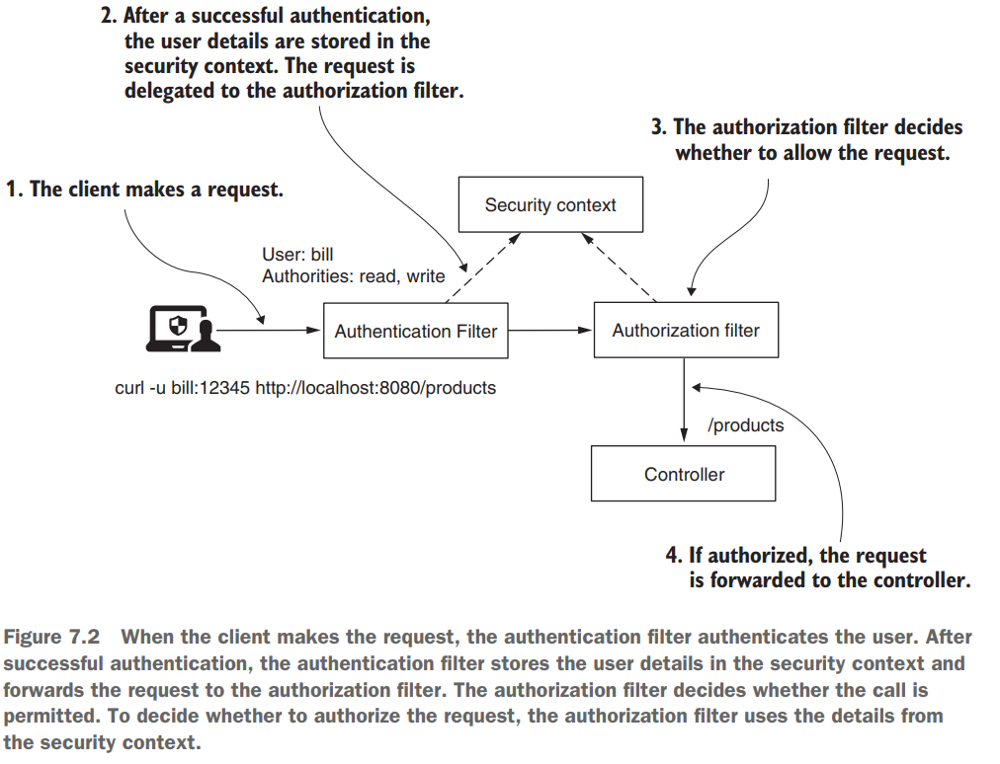
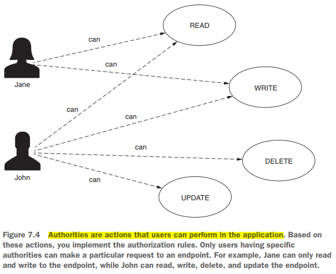

# [Pág. 153] Capítulo 7 - Configurando autorización: Restricción de acceso

Cuando el cliente realiza la solicitud, el Authentication Filter autentica al usuario. Después de una autenticación
exitosa, el Authentication Filter almacena los detalles del usuario en el contexto de seguridad y reenvía la solicitud
al filtro de autorización. El filtro de autorización decide si se permite la llamada. Para decidir si autorizar la
solicitud, el filtro de autorización utiliza los detalles del contexto de seguridad.



## [Pág. 157] Restricción del acceso para todos los end points en función a las AUTHORITIES del usuario

Un **Authority** es una acción que un usuario puede realizar con un recurso del sistema.



A continuación se muestran tres formas para configurar el acceso a los puntos finales en función de las
autorizaciones del usuario.

- **hasAuthority():** recibe como parámetros solo una autoridad para la que la aplicación configura las restricciones.
  Solo los usuarios que tienen esa autoridad pueden llamar al punto final.
- **hasAnyAuthority():** puede recibir más de una autoridad para la cual la aplicación configura las restricciones.
  El usuario debe tener al menos una de las autorizaciones especificadas para realizar una solicitud.
  ``Recomiendo usar este método o el método hasAuthority() por su simplicidad, dependiendo de la cantidad de privilegios
  que asigne a los usuarios. Estos son fáciles de leer en configuraciones y hacen que su código sea más fácil de entender.``
- **access():** le ofrece posibilidades ilimitadas para configurar el acceso porque la aplicación crea las reglas de
  autorización basadas en Spring Expression Language (SpEL). Sin embargo, hace que el código sea más difícil de leer y
  depurar. Por esta razón, lo recomiendo como la solución menor y solo si no puede aplicar los métodos hasAnyAuthority()
  o hasAuthority().

Ahora, como parte de un ejemplo práctico aseguraremos el acceso al siguiente end point a los usuarios que
tengan un authority en específico.

````java

@RestController
@RequestMapping(path = "/greetings")
public class HelloController {

    @GetMapping(path = "/hello")
    public String hello() {
        return "Hello!";
    }

}
````

Como configuramos en capítulos anteriores, necesitamos un PasswordEncoder y también una implementación de la interfaz
UserDetailsService, donde definiremos nuestros usuarios conocidos por Spring Security, los UserDetails.

````java

@Configuration
public class UserManagementConfig {

    @Bean
    public PasswordEncoder passwordEncoder() {
        return NoOpPasswordEncoder.getInstance();
    }

    @Bean
    public UserDetailsService userDetailsService() {
        UserDetails userDetails1 = User.builder()
                .username("admin")
                .password("12345")
                .authorities("WRITE")
                .build();
        UserDetails userDetails2 = User.builder()
                .username("martin")
                .password("12345")
                .authorities("READ")
                .build();

        InMemoryUserDetailsManager inMemoryUserDetailsManager = new InMemoryUserDetailsManager();
        inMemoryUserDetailsManager.createUser(userDetails1);
        inMemoryUserDetailsManager.createUser(userDetails2);

        return inMemoryUserDetailsManager;
    }
}
````

Ahora, sí es momento de agregar la configuración de autorización. Pero antes, veamos como teníamos configurado
en los capítulos anteriores nuestra clase de configuración con el **.permitAll()**:

````java

@Configuration
public class ProjectConfig extends WebSecurityConfigurerAdapter {

    @Override
    protected void configure(HttpSecurity http) throws Exception {
        http.httpBasic();
        http.authorizeRequests().anyRequest().permitAll();
    }
}
````

El método AuthorizeRequests() nos permite continuar con la especificación de reglas de autorización en puntos finales.
El método anyRequest() indica que la regla se aplica a todas las solicitudes, independientemente de la URL o el método
HTTP utilizado. El método permitAll() permite el acceso a todas las solicitudes, autenticadas o no.

Ahora, digamos que queremos asegurarnos de que solo los usuarios que tienen autorización de WRITE puedan acceder a
todos los puntos finales. Para nuestro ejemplo, esto significa solo admin. Podemos lograr nuestro objetivo y restringir
el acceso esta vez en función de las autoridades de un usuario. Echa un vistazo al siguiente código:

````java

@Configuration
public class ProjectConfig extends WebSecurityConfigurerAdapter {

    @Override
    protected void configure(HttpSecurity http) throws Exception {
        http.httpBasic();
        http.authorizeRequests().anyRequest().hasAuthority("WRITE");
    }
}
````

Puede ver que **reemplazamos el método permitAll()** con el **método hasAuthority()**.
``La aplicación necesita, primero, autenticar la solicitud y luego, según las autoridades del usuario,
la aplicación decide si permite la llamada.``

Ahora podemos comenzar a probar la aplicación llamando al punto final con cada uno de los dos usuarios. Cuando llamamos
al punto final **con el usuario admin**, el estado de la respuesta **HTTP es 200 OK** y vemos el cuerpo de la
respuesta "¡Hola!", pero cuando lo llamamos **con el usuario martin**, el estado de la respuesta **HTTP es 403
Forbidden** y obtenemos un cuerpo de respuesta vacío.

**HTTP es 200 OK**

````
curl -v -u admin:12345 http://localhost:8080/greetings/hello

--- Respuesta ---
< HTTP/1.1 200
< Set-Cookie: JSESSIONID=190819ACBA2A226ADEC74434E80F52A6; Path=/; HttpOnly
< Date: Thu, 01 Jun 2023 17:24:03 GMT
¡Hello!*
````

**HTTP es 403 Forbidden**

````
curl -v -u martin:12345 http://localhost:8080/greetings/hello

--- Respuesta ---
* Mark bundle as not supporting multiuse
< HTTP/1.1 403
< Set-Cookie: JSESSIONID=9C0B7D5C18E592E91F730CD1A522A08A; Path=/; HttpOnly
````

De manera similar, puede usar el método hasAnyAuthority(). Este método tiene el parámetro varargs; de esta forma, puede
recibir múltiples nombres de Authority. La aplicación permite la solicitud si el usuario tiene al menos una de las
authorities proporcionadas como parámetro al método. Podría reemplazar hasAuthority() en la lista anterior con
hasAnyAuthority("WRITE"), en cuyo caso, la aplicación funciona exactamente de la misma manera. Sin embargo, si reemplaza
hasAuthority() con hasAnyAuthority ("WRITE", "READ"), se aceptan las solicitudes de los usuarios que tienen
cualquiera de las dos autorizaciones.

Para el siguiente caso, la aplicación permite las solicitudes tanto de admin como de martin. En el siguiente listado,
puede ver cómo puede aplicar el método hasAnyAuthority().

````
http.authorizeRequests().anyRequest().hasAnyAuthority("WRITE", "READ");
````

Para especificar el acceso basado en las autoridades del usuario, **la tercera forma que encuentra en la práctica es el
método access()**. Sin embargo, el método access() es más general. Recibe como parámetro una expresión Spring (SpEL) que
especifica la condición de autorización. Este método es poderoso y no se refiere solo a las autoridades. Sin embargo,
este método también hace que el código sea más difícil de leer y comprender. Por esta razón, lo recomiendo como última
opción, y solo si no puede aplicar uno de los métodos hasAuthority() o hasAnyAuthority() presentados anteriormente en
esta sección.

````
http.authorizeRequests().anyRequest().access("hasAuthority('WRITE')");
````

### Escenario para el uso del método access()

A continuación se muestra un ejemplo del uso del método **access()** aplicado a una expresión que no es fácil de
escribir de otra manera.

Para este ejemplo, necesitamos crear un nuevo usuario al que le agregaremos 3 authorities: READ, WRITE y DELETE:

````
UserDetails userDetails3 = User.builder()
                .username("nophy")
                .password("12345")
                .authorities("READ", "WRITE", "DELETE")
                .build();
````

Ya con los tres usuarios y sus authorities definidos, el escenario será: ```el end point debe ser accesible para
aquellos usuarios que tienen authority de READ, pero no para aquellos que tienen authority de DELETE.``` Por lo que,
viendo las authorities de los usuarios que tenemos, el acceso debe ser únicamente posible para el usuario martin,
mientras que para el usuario admin no porque no tiene la authority de READ, tampoco para el nuevo usuario nophy,
a pesar de que tiene el authority READ, pero además tiene el authority DELETE, siendo este último determinante
para no permitirle su acceso.

Con la siguiente expresión establecemos que el usuario debe tener la authority de READ pero no DELETE.

````
String expression = "hasAuthority('READ') and !hasAuthority('DELETE')";
````

Por lo tanto, podríamos hacer uso de esa expresión para configurar el acceso usando el método **access()**:

````java

@Configuration
public class ProjectConfig extends WebSecurityConfigurerAdapter {

    @Override
    protected void configure(HttpSecurity http) throws Exception {
        http.httpBasic();

        String expression = "hasAuthority('READ') and !hasAuthority('DELETE')";
        http.authorizeRequests().anyRequest().access(expression);
    }
}
````

Podemos hacer la prueba usando **curl** y veremos que únicamente el usuario **martin** es el que tendrá acceso al
endpoint. Por supuesto, aún no hemos discutido la selección de qué solicitudes proteger según la ruta o el método HTTP.
En cambio, hemos aplicado las reglas para todas las solicitudes, independientemente del punto final expuesto por la
aplicación.