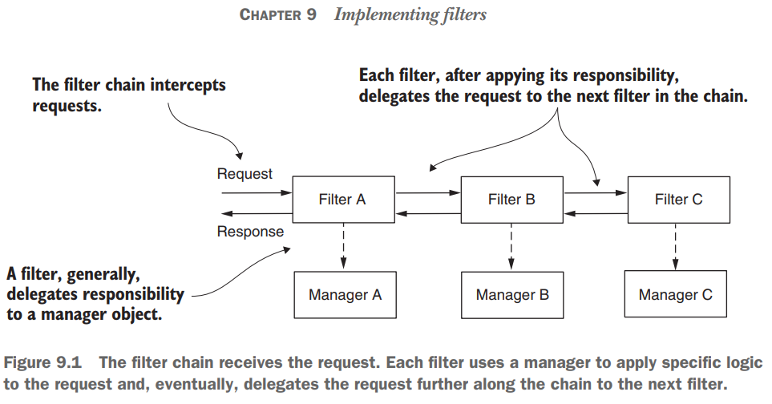
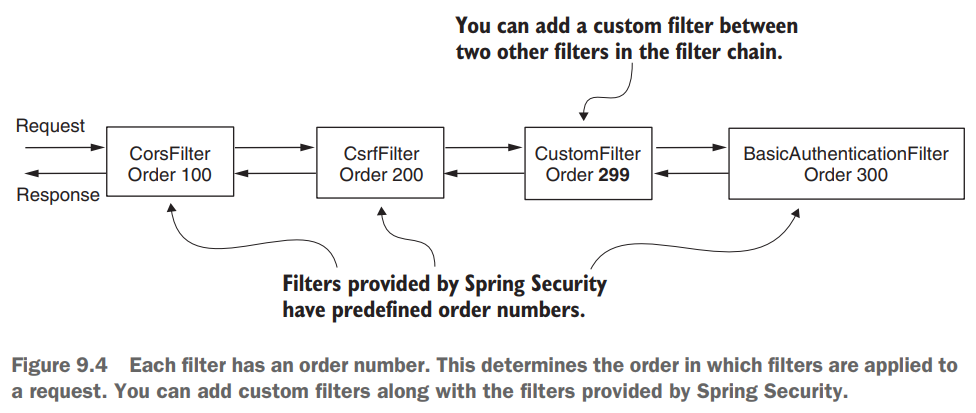
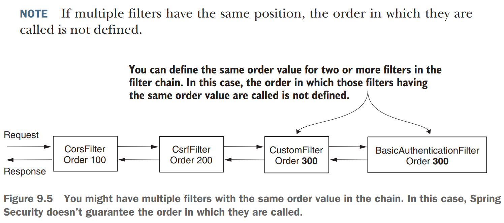

# [Pág. 195] Capítulo 09 - Implementando filtros

En los capítulos anteriores aprendimos sobre un componente que llamamos **Authentication Filter**, que delega la
responsabilidad de autenticación al Authentication Manager. También aprendió que cierto filtro se encarga de la
configuración de la autorización después de una autenticación exitosa.

En Spring Security, en general, los filtros HTTP gestionan cada responsabilidad que se debe aplicar a la solicitud. Los
filtros forman una cadena de responsabilidades. **Un filtro recibe una solicitud, ejecuta su lógica y, finalmente,
delega la solicitud al siguiente filtro de la cadena.**

En la práctica, las aplicaciones vienen con varios requisitos, donde el uso de configuraciones predeterminadas ya no
funciona. Deberá agregar o reemplazar los componentes existentes de la cadena. **Con la implementación predeterminada,
utiliza el método de autenticación HTTP basic, que le permite confiar en un nombre de usuario y una contraseña.** Pero
en escenarios prácticos, hay muchas situaciones en las que necesitará más que esto. **Tal vez necesite implementar una
estrategia diferente para la autenticación,** notificar a un sistema externo sobre un evento de autorización o
simplemente registrar una autenticación exitosa o fallida que luego se usa en el seguimiento y la auditoría (figura
9.3). Sea cual sea su escenario, **Spring Security le ofrece la flexibilidad de modelar la cadena de filtros exactamente
como lo necesita.**

Figura 9.3 Puede personalizar la cadena de filtros agregando nuevos filtros antes, después o en la posición de los
existentes. De esta manera, puede personalizar la autenticación, así como todo el proceso aplicado a la solicitud y
respuesta.

## Implementando filtros en la arquitectura Spring Security

Aprendió en los capítulos anteriores que el filtro de autenticación intercepta la solicitud y delega la responsabilidad
de autenticación al administrador de autenticación. Si queremos ejecutar cierta lógica antes de la autenticación, lo
hacemos insertando un filtro antes del filtro de autenticación.

Los filtros en la arquitectura de Spring Security son filtros HTTP típicos. **Podemos crear filtros implementando la
interfaz Filter del paquete javax.servlet.** En cuanto a cualquier otro filtro HTTP, **debe anular el método
doFilter()** para implementar su lógica. Este método recibe como parámetros ServletRequest, ServletResponse y
FilterChain:

- **ServletRequest**: representa la solicitud HTTP. Usamos el objeto ServletRequest para recuperar detalles sobre la
  solicitud.
- **ServletResponse**: representa la respuesta HTTP. Usamos el objeto ServletResponse para modificar la respuesta antes
  de enviarla al cliente o más adelante en la cadena de filtrado.
- **FilterChain**: representa la cadena de filtros. Usamos el objeto FilterChain para reenviar la solicitud al siguiente
  filtro de la cadena.

La cadena de filtros representa una colección de filtros **con un orden definido** en el que actúan.

Spring Security nos proporciona algunas implementaciones de filtros y su orden. Entre los filtros provistos:

- **BasicAuthenticationFilter**: Se encarga de la autenticación HTTP Basic, si está presente.
- **CsrfFilter**: se ocupa de la protección contra la falsificación de solicitudes entre sitios (CSRF), de la que
  hablaremos en el capítulo 10.
- **CorsFilter**: se encarga de las reglas de autorización de uso compartido de recursos de origen cruzado (CORS), que
  también analizaremos en el capítulo 10.

No necesita conocer todos los filtros, ya que probablemente no los tocará directamente desde su código, pero **sí debe
comprender cómo funciona la cadena de filtros y estar al tanto de algunas implementaciones.** En este libro, solo
explico aquellos filtros que son esenciales para los diversos temas que discutimos.

Es importante comprender que una aplicación no necesariamente tiene instancias de todos estos filtros en la cadena. La
cadena es más larga o más corta dependiendo de cómo configure la aplicación. Por ejemplo, en los capítulos 2 y 3,
aprendió que debe **llamar al método httpBasic() de la clase HttpSecurity si desea utilizar el método de autenticación
HTTP básico.** Lo que sucede es que **si llama al método httpBasic()**, se agrega una instancia de
**BasicAuthenticationFilter a la cadena.** De manera similar, dependiendo de las configuraciones que escriba, la
definición de la cadena de filtros se ve afectada.

Agregas un nuevo filtro a la cadena relativo a otro (figura 9.4). O bien, puede agregar un filtro antes, después o en la
posición de uno conocido. Cada posición es, de hecho, un índice (un número), y es posible que también se le llame "the
order". Puede agregar dos o más filtros en la misma posición (figura 9.5). En la sección 9.4, encontraremos un caso
común en el que esto podría ocurrir, uno que suele crear confusión entre los desarrolladores.

