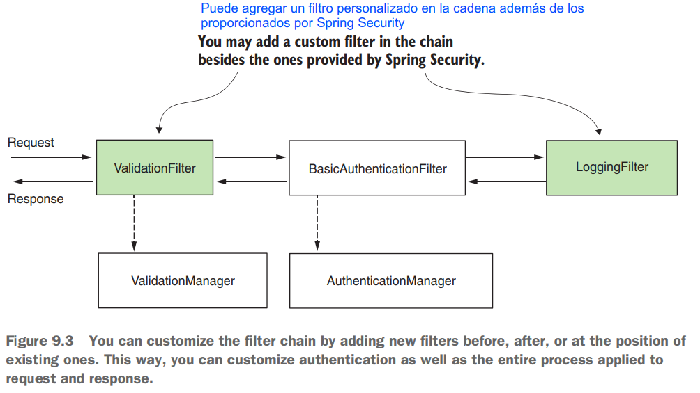
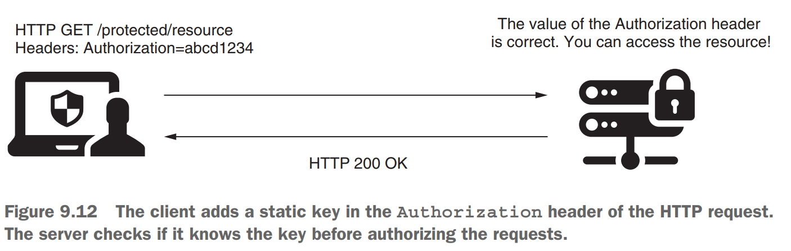

# [Pág. 195] Capítulo 09 - Implementando filtros

En los capítulos anteriores aprendimos sobre un componente que llamamos **Authentication Filter**, que delega la
responsabilidad de autenticación al Authentication Manager. También aprendió que cierto filtro se encarga de la
configuración de la autorización después de una autenticación exitosa.

En Spring Security, en general, los filtros HTTP gestionan cada responsabilidad que se debe aplicar a la solicitud. Los
filtros forman una cadena de responsabilidades. **Un filtro recibe una solicitud, ejecuta su lógica y, finalmente,
delega la solicitud al siguiente filtro de la cadena.**


En la práctica, las aplicaciones vienen con varios requisitos, donde el uso de configuraciones predeterminadas ya no
funciona. Deberá agregar o reemplazar los componentes existentes de la cadena. **Con la implementación predeterminada,
utiliza el método de autenticación HTTP basic, que le permite confiar en un nombre de usuario y una contraseña.** Pero
en escenarios prácticos, hay muchas situaciones en las que necesitará más que esto. **Tal vez necesite implementar una
estrategia diferente para la autenticación,** notificar a un sistema externo sobre un evento de autorización o
simplemente registrar una autenticación exitosa o fallida que luego se usa en el seguimiento y la auditoría (figura
9.3). Sea cual sea su escenario, **Spring Security le ofrece la flexibilidad de modelar la cadena de filtros exactamente
como lo necesita.**

Figura 9.3 Puede personalizar la cadena de filtros agregando nuevos filtros antes, después o en la posición de los
existentes. De esta manera, puede personalizar la autenticación, así como todo el proceso aplicado a la solicitud y
respuesta.



## Implementando filtros en la arquitectura Spring Security

Aprendió en los capítulos anteriores que el filtro de autenticación intercepta la solicitud y delega la responsabilidad
de autenticación al administrador de autenticación. Si queremos ejecutar cierta lógica antes de la autenticación, lo
hacemos insertando un filtro antes del filtro de autenticación.

Los filtros en la arquitectura de Spring Security son filtros HTTP típicos. **Podemos crear filtros implementando la
interfaz Filter del paquete javax.servlet.** En cuanto a cualquier otro filtro HTTP, **debe anular el método
doFilter()** para implementar su lógica. Este método recibe como parámetros ServletRequest, ServletResponse y
FilterChain:

- **ServletRequest**: representa la solicitud HTTP. Usamos el objeto ServletRequest para recuperar detalles sobre la
  solicitud.
- **ServletResponse**: representa la respuesta HTTP. Usamos el objeto ServletResponse para modificar la respuesta antes
  de enviarla al cliente o más adelante en la cadena de filtrado.
- **FilterChain**: representa la cadena de filtros. Usamos el objeto FilterChain para reenviar la solicitud al siguiente
  filtro de la cadena.

La cadena de filtros representa una colección de filtros **con un orden definido** en el que actúan.

Spring Security nos proporciona algunas implementaciones de filtros y su orden. Entre los filtros provistos:

- **BasicAuthenticationFilter**: Se encarga de la autenticación HTTP Basic, si está presente.
- **CsrfFilter**: se ocupa de la protección contra la falsificación de solicitudes entre sitios (CSRF), de la que
  hablaremos en el capítulo 10.
- **CorsFilter**: se encarga de las reglas de autorización de uso compartido de recursos de origen cruzado (CORS), que
  también analizaremos en el capítulo 10.

No necesita conocer todos los filtros, ya que probablemente no los tocará directamente desde su código, pero **sí debe
comprender cómo funciona la cadena de filtros y estar al tanto de algunas implementaciones.** En este libro, solo
explico aquellos filtros que son esenciales para los diversos temas que discutimos.

Es importante comprender que una aplicación no necesariamente tiene instancias de todos estos filtros en la cadena. La
cadena es más larga o más corta dependiendo de cómo configure la aplicación. Por ejemplo, en los capítulos 2 y 3,
aprendió que debe **llamar al método httpBasic() de la clase HttpSecurity si desea utilizar el método de autenticación
HTTP básico.** Lo que sucede es que **si llama al método httpBasic()**, se agrega una instancia de
**BasicAuthenticationFilter a la cadena.** De manera similar, dependiendo de las configuraciones que escriba, la
definición de la cadena de filtros se ve afectada.

Agregas un nuevo filtro a la cadena relativo a otro (figura 9.4). O bien, puede agregar un filtro antes, después o en la
posición de uno conocido. Cada posición es, de hecho, un índice (un número), y es posible que también se le llame "the
order". Puede agregar dos o más filtros en la misma posición (figura 9.5). En la sección 9.4, encontraremos un caso
común en el que esto podría ocurrir, uno que suele crear confusión entre los desarrolladores.


## Agregar un filtro antes de uno existente en la cadena

Para nuestra primera implementación de filtro personalizado, consideremos un escenario trivial:

Queremos asegurarnos de que **cualquier solicitud tenga un encabezado llamado Request-Id.**
Asumimos que nuestra aplicación usa este encabezado para rastrear solicitudes y que este encabezado es
obligatorio. Al mismo tiempo, queremos validar estas suposiciones antes de que la aplicación realice la autenticación.
El proceso de autenticación puede implicar consultar la base de datos u otras acciones que consumen recursos y que no
queremos que la aplicación ejecute si el formato de la solicitud no es válido.
```¿Cómo hacemos esto?```

Resolver el requerimiento actual solo toma dos pasos, y al final, la cadena de filtros se parece a la de la figura 9.6:


**PASO 01**: Implementando el filtro personalizado: RequestValidationFilter

Dentro del método doFilter(), escribimos la lógica del filtro. En nuestro ejemplo, verificamos si existe el encabezado
Request-Id. Si es así, reenviamos la solicitud al siguiente filtro de la cadena llamando al método doFilter(). Si el
encabezado no existe, establecemos un estado HTTP 400 Solicitud incorrecta en la respuesta sin reenviarla al siguiente
filtro de la cadena:

````java
public class RequestValidationFilter implements Filter {
    @Override
    public void doFilter(ServletRequest request, ServletResponse response, FilterChain filterChain)
            throws IOException, ServletException {
        HttpServletRequest httpRequest = (HttpServletRequest) request;
        HttpServletResponse httpResponse = (HttpServletResponse) response;

        String requestId = httpRequest.getHeader("Request-Id");
        if (requestId == null || requestId.isBlank()) {
            httpResponse.setStatus(HttpServletResponse.SC_BAD_REQUEST);
            return;
        }
        filterChain.doFilter(request, response); //<-- Reenvía la solicitud al siguiente filtro de la cadena
    }
}
````

**PASO 02**: Aplicando el filtro dentro de la clase de configuración

Usamos el método **addFilterBefore()** del objeto HttpSecurity porque queremos que la aplicación ejecute este filtro
personalizado antes de la autenticación. Este método recibe dos parámetros:

- **Una instancia del filtro personalizado que queremos agregar a la cadena**: en nuestro ejemplo esta es una instancia
  de nuestro filtro personalizado llamado RequestValidationFilter.
- **El tipo de filtro antes del cual agregamos la nueva instancia**: para este ejemplo, debido a que el requisito es
  ejecutar la lógica de filtro antes de la autenticación, debemos agregar nuestra instancia de filtro personalizado
  antes del filtro de autenticación. La clase BasicAuthenticationFilter define el tipo predeterminado del filtro de
  autenticación.

````java

@Configuration
public class ProjectConfig extends WebSecurityConfigurerAdapter {

    @Override
    protected void configure(HttpSecurity http) throws Exception {
        http.addFilterBefore(new RequestValidationFilter(), BasicAuthenticationFilter.class)
                .authorizeRequests().anyRequest().permitAll();
    }
}
````

Ahora puede ejecutar y probar la aplicación. Llamar al endpoint sin el encabezado genera una respuesta con el estado
HTTP 400 Bad Request. Si agrega el encabezado a la solicitud, el estado de la respuesta se convierte en HTTP 200 OK y
también verá el cuerpo de la respuesta, ¡Hello!

````bash
curl -v http://localhost:8080/greetings/hello

--- Respuesta ---
< HTTP/1.1 400
<
* Closing connection 0
````

````bash
curl -v -H "Request-Id:12345" http://localhost:8080/greetings/hello

--- Respuesta ---
< HTTP/1.1 200
<
¡Hello!
````

## Agregar un filtro después de uno existente en la cadena

Supongamos que tiene que ejecutar alguna lógica después del proceso de autenticación. Ejemplos de esto podrían ser
notificar a un sistema diferente después de ciertos eventos de autenticación o simplemente para fines de registro y
rastreo (figura 9.8).

Para nuestro ejemplo, registramos todos los eventos de autenticación exitosos agregando un filtro después del filtro de
autenticación (figura 9.8). Consideramos que lo que pasa por alto el filtro de autenticación representa un evento
autenticado con éxito y queremos registrarlo. Continuando con el ejemplo de la sección 9.1, también registramos el
Request-Id recibido a través del encabezado HTTP.


````java
public class AuthenticationLoginFilter implements Filter {
    private static final Logger LOG = LoggerFactory.getLogger(AuthenticationLoginFilter.class);

    @Override
    public void doFilter(ServletRequest request, ServletResponse response, FilterChain filterChain)
            throws IOException, ServletException {
        HttpServletRequest httpRequest = (HttpServletRequest) request;
        String requestId = httpRequest.getHeader("Request-Id");

        LOG.info("Successfully authenticated request with id: {}", requestId);

        filterChain.doFilter(request, response); //<-- Reenvía la solicitud al siguiente filtro de la cadena
    }
}
````

Para agregar el filtro personalizado en la cadena después del filtro de autenticación, llame al método addFilterAfter()
de HttpSecurity. La siguiente lista muestra la implementación.

````java

@Configuration
public class ProjectConfig extends WebSecurityConfigurerAdapter {

    @Override
    protected void configure(HttpSecurity http) throws Exception {
        http.addFilterBefore(new RequestValidationFilter(), BasicAuthenticationFilter.class)
                .addFilterAfter(new AuthenticationLoginFilter(), BasicAuthenticationFilter.class)
                .authorizeRequests().anyRequest().permitAll();
    }
}
````

Al ejecutar la aplicación y llamar al punto final, observamos que por cada llamada exitosa al punto final, la aplicación
imprime una línea de registro en la consola.

````bash
curl -v -H "Request-Id:12345" http://localhost:8080/greetings/hello

--- Respuesta ---
< HTTP/1.1 200
<
¡Hello!
````

````
2023-06-02 19:32:06.213  INFO 19792 --- [nio-8080-exec-1] c.m.b.s.a.f.AuthenticationLoginFilter    : Successfully authenticated request with id: 12345
````

## [Pág. 205] Agregar un filtro en la ubicación de otro en la cadena de filtros

Utiliza este enfoque especialmente cuando proporciona una implementación diferente para una responsabilidad que ya asume
uno de los filtros conocidos por Spring Security. **Un escenario típico es la autenticación.**

Supongamos que en lugar del flujo de autenticación HTTP Basic, desea implementar algo diferente. En lugar de usar un
nombre de usuario y una contraseña como credenciales de entrada según las cuales la aplicación autentica al usuario,
debe aplicar otro enfoque.

Algunos ejemplos de escenarios que podría encontrar son:

- Identificación basada en un valor de encabezado estático para autenticación.
- Uso de una clave simétrica para firmar la solicitud de autenticación.
- Uso de una contraseña de un solo uso (OTP) en el proceso de autenticación.

Implementemos un ejemplo para demostrar cómo aplicar un filtro personalizado. Para mantener el caso relevante pero
sencillo, nos enfocamos en la configuración y consideramos una lógica simple para la autenticación. En nuestro
escenario, tenemos el valor de una clave estática, que es la misma para todas las solicitudes. Para ser autenticado, el
usuario debe agregar el valor correcto de la clave estática en el encabezado de Autorización como se presenta en la
figura 9.12.



Comenzamos con la implementación de la clase de filtro, llamada **StaticKeyAuthenticationFilter.** Esta clase lee el
valor de la clave estática del archivo de propiedades y verifica si el valor del encabezado de autorización es igual a
él. Si los valores son iguales, el filtro reenvía la solicitud al siguiente componente de la cadena de filtros. De lo
contrario, el filtro establece el valor 401 Unauthorized en el estado HTTP de la respuesta sin reenviar la solicitud en
la cadena de filtros.

````java

//Este @Component agrega una instancia de la clase en el contexto de Spring. Nos servirá para permitirnos inyectar valores desde el archivo de propiedades.
@Component
public class StaticKeyAuthenticationFilter implements Filter {
    @Value("${authorization.key}")
    private String authorizationKey;

    @Override
    public void doFilter(ServletRequest request, ServletResponse response, FilterChain filterChain)
            throws IOException, ServletException {
        HttpServletRequest httpRequest = (HttpServletRequest) request;
        HttpServletResponse httpResponse = (HttpServletResponse) response;

        String authentication = httpRequest.getHeader("Authorization");

        if (authorizationKey.equals(authentication)) {
            filterChain.doFilter(request, response);
        } else {
            httpResponse.setStatus(HttpServletResponse.SC_UNAUTHORIZED);
        }
    }
}
````

````properties
authorization.key=abcd12345
````

Una vez que definimos el filtro, lo agregamos a la cadena de filtros en la posición de la clase
BasicAuthenticationFilter usando el método addFilterAt().

Pero recuerda lo que discutimos en la sección 9.1. Al agregar un filtro en una posición específica, Spring Security no
asume que es el único en esa posición. ```Puede agregar más filtros en la misma ubicación en la cadena. En este caso,
Spring Security no garantiza en qué orden actuarán.``` Te digo esto de nuevo porque he visto a mucha gente confundida
por cómo funciona esto. ```Algunos desarrolladores piensan que cuando aplica un filtro en una posición conocida, será
reemplazado. ¡Este no es el caso!``` **Debemos asegurarnos de no añadir filtros que no necesitemos a la cadena.**

**NOTA**

> Le aconsejo que no agregue varios filtros en la misma posición en la cadena. Cuando agrega más filtros en la misma
> ubicación, el orden en que se usan no está definido. Tiene sentido tener un orden definido en el que se llaman los
> filtros. Tener un orden conocido hace que su aplicación sea más fácil de entender y mantener.

A continuación se muestra la definición de la clase de configuración que agrega el filtro. **Observe que aquí no
llamamos al método httpBasic()** desde la clase HttpSecurity **porque no queremos que la instancia de
BasicAuthenticationFilter se agregue a la cadena de filtros.**

````java

@Configuration
public class ProjectConfig extends WebSecurityConfigurerAdapter {

    @Autowired
    private StaticKeyAuthenticationFilter customFilter;

    @Override
    protected void configure(HttpSecurity http) throws Exception {
        http.addFilterAt(this.customFilter, BasicAuthenticationFilter.class)
                .authorizeRequests().anyRequest().permitAll();
    }
}
````

Ahora podemos probar la aplicación. Esperamos que la aplicación permita solicitudes que tengan el valor correcto para el
encabezado de Autorización y rechace otras, devolviendo un estado HTTP 401 Unauthorized en la respuesta.

````bash
curl -v -H "Authorization: abcd12345" http://localhost:8080/greetings/hello

--- Respuesta ---
< HTTP/1.1 200
<
¡Hello!
````

````bash
curl -v -H "Authorization: abcd12345678" http://localhost:8080/greetings/hello

--- Respuesta ---
* Mark bundle as not supporting multiuse
< HTTP/1.1 401
<
* Connection #0 to host localhost left intact
````

## [Pág. 210] Implementaciones de filtros proporcionadas por Spring Security

Spring Security ofrece algunas clases abstractas que implementan la interfaz Filter y para las cuales puede ampliar sus
definiciones de filtro. Estas clases también agregan funcionalidad de la que sus implementaciones podrían beneficiarse
cuando las extienda. Por ejemplo, podría extender la clase **GenericFilterBean**, que le permite usar parámetros de
inicialización que definiría en un archivo descriptor web.xml cuando corresponda. Una clase más útil que amplía
GenericFilterBean es OncePerRequestFilter. Al agregar un filtro a la cadena, el marco no garantiza que se llamará solo
una vez por solicitud. **OncePerRequestFilter**, como sugiere el nombre, implementa la lógica para garantizar que el
método doFilter() del filtro se ejecute solo una vez por solicitud.

**Ejemplo:**

Queremos evitar registrar las mismas solicitudes varias veces. **Spring Security no garantiza que el filtro no se
llamará más de una vez**, por lo que tenemos que encargarnos de esto nosotros mismos. La forma más sencilla es
implementar el filtro mediante la clase OncePerRequestFilter.

Anteriormente, habíamos creado un filtro personalizado llamado **AuthenticationLoginFilter** que implementaba de
**Filter**, le haremos una modificación para que esta vez extienda de la clase abstracta **OncePerRequestFilter**:

````java
public class AuthenticationLoginFilter extends OncePerRequestFilter {

    private static final Logger LOG = LoggerFactory.getLogger(AuthenticationLoginFilter.class);

    @Override
    protected void doFilterInternal(HttpServletRequest request, HttpServletResponse response, FilterChain filterChain)
            throws ServletException, IOException {
        String requestId = request.getHeader("Request-Id");
        LOG.info("Successfully authenticated request with id: {}", requestId);
        filterChain.doFilter(request, response);
    }
}
````

````java

@Configuration
public class ProjectConfig extends WebSecurityConfigurerAdapter {

    @Autowired
    private StaticKeyAuthenticationFilter customFilter;

    @Override
    protected void configure(HttpSecurity http) throws Exception {
        http
                .addFilterBefore(new RequestValidationFilter(), BasicAuthenticationFilter.class)
                .addFilterAt(this.customFilter, BasicAuthenticationFilter.class)
                .addFilterAfter(new AuthenticationLoginFilter(), BasicAuthenticationFilter.class)
                .authorizeRequests().anyRequest().permitAll();
    }
}
````

Probando filtros:

````bash
curl -v -H "Authorization: abcd12345" -H "Request-Id:12345" http://localhost:8080/greetings/hello

--- Respuesta ---
* Mark bundle as not supporting multiuse
< HTTP/1.1 200
<
¡Hello!
````

````
--- Salida en consola ---
2023-06-05 11:11:06.381  INFO 17000 --- [nio-8080-exec-3] c.m.b.s.a.f.AuthenticationLoginFilter    : Successfully authenticated request with id: 12345
````

Recordar que las cabeceras "Authorization" y "Request-Id" corresponden a los filtros StaticKeyAuthenticationFilter y
RequestValidationFilter respectivamente.

Algunas observaciones sobe la clase **OncePerRequestFilter** que podría encontrar útil:

- **Solo admite solicitudes HTTP**, pero en realidad eso es lo que siempre usamos La ventaja es que emite los tipos y
  **recibimos directamente las solicitudes como HttpServletRequest y HttpServletResponse**. Recuerde, con la interfaz
  Filter, teníamos que emitir la solicitud y la respuesta.
- **Puede implementar la lógica para decidir si el filtro se aplica o no**, incluso si agregó el filtro a la cadena,
  puede decidir que no se aplica a ciertas solicitudes. Estableces esto anulando el método shouldNotFilter(
  HttpServletRequest). De forma predeterminada, el filtro se aplica a todas las solicitudes.
- **De forma predeterminada, OncePerRequestFilter no se aplica a solicitudes asincrónicas o solicitudes de envío de
  errores**, puede cambiar este comportamiento anulando los métodos shouldNotFilterAsyncDispatch() y
  shouldNotFilterErrorDispatch().