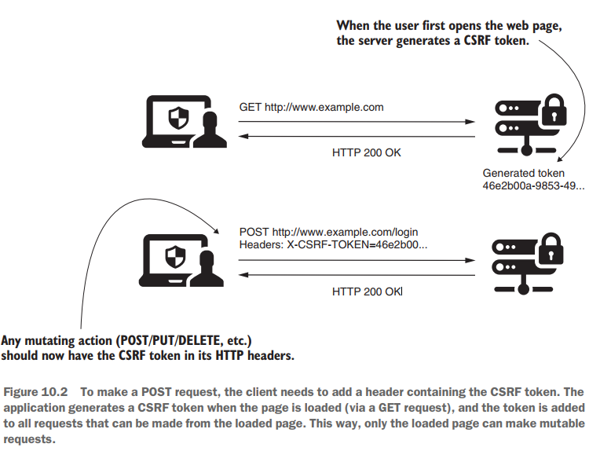
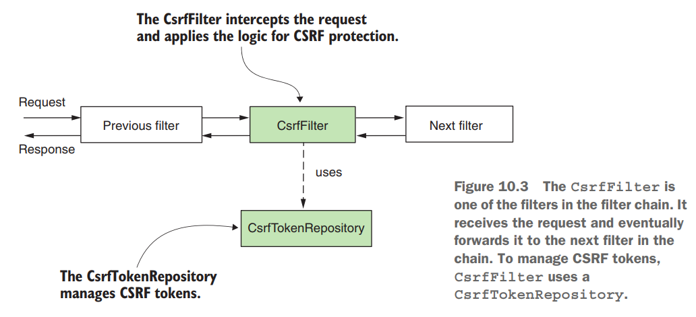
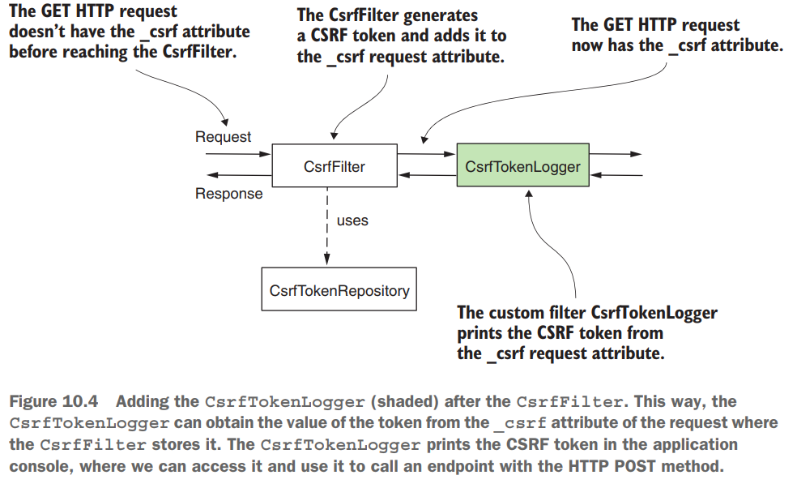
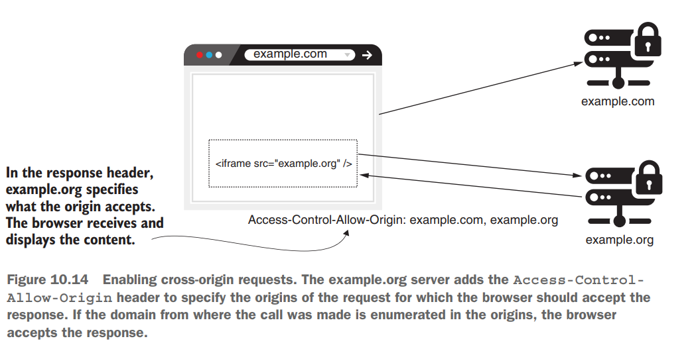

# [Pág. 213] Capítulo 10 - Aplicando protección CSRF y CORS

## [Pág. 213] Aplicando protección contra falsificación de solicitudes entre sitios (CSRF) en aplicaciones

Cuando necesitábamos configurar HTTP POST, también teníamos que agregar una instrucción adicional a la configuración
para deshabilitar la protección CSRF. **La razón por la que no puede llamar directamente a un punto final con HTTP POST
es por la protección CSRF,** que está habilitada de manera predeterminada en Spring Security.

CSRF es un tipo de ataque generalizado y las aplicaciones vulnerables a CSRF pueden obligar a los usuarios a ejecutar
acciones no deseadas en una aplicación web después de la autenticación. No desea que las aplicaciones que desarrolle
sean vulnerables a CSRF y permitan que los atacantes engañen a sus usuarios para que realicen acciones no deseadas.

## [Pág. 214] Cómo funciona la protección CSRF en Spring Security

Lo que la protección CSRF quiere garantizar es que solo la interfaz de las aplicaciones web pueda realizar operaciones
de mutación (por convención, métodos HTTP distintos de GET, HEAD, TRACE u OPTIONS). Entonces, una página ajena, no puede
actuar en nombre del usuario.

Lo que sí sabe con certeza es que antes de poder realizar cualquier acción que pueda cambiar los datos, un usuario debe
enviar una solicitud mediante HTTP GET para ver la página web al menos una vez. Cuando esto sucede, **la aplicación
genera un token único.** La aplicación ahora **acepta solo solicitudes de operaciones de mutación (POST, PUT, DELETE,
etc.)** que contienen este valor único en el encabezado. La aplicación considera que conocer el valor del token es una
prueba de que es la propia aplicación la que realiza la solicitud de mutación y no otro sistema. **Cualquier página que
contenga llamadas mutantes, como POST, PUT, DELETE, etc., debe recibir a través de la respuesta el token CSRF**, y la
página debe usar este token al realizar llamadas mutantes.

El punto de partida de la protección CSRF es un filtro en la cadena de filtros denominado CsrfFilter. **El CsrfFilter**
intercepta solicitudes y **permite todas aquellas que utilizan estos métodos HTTP: GET, HEAD, TRACE y OPTIONS.**
Para todas las demás solicitudes, el filtro espera recibir un encabezado que contenga un token. **Si este encabezado no
existe o contiene un valor de token incorrecto**, la aplicación rechaza la solicitud y establece el estado de la
respuesta en **HTTP 403 Forbidden.**



El CsrfFilter usa un componente llamado CsrfTokenRepository para administrar los valores de token CSRF que
generan nuevos tokens, almacenan tokens y eventualmente los invalidan. De forma predeterminada, CsrfTokenRepository
almacena el token en la sesión HTTP y genera los tokens como identificadores únicos universales (UUID) aleatorios.



Como aprenderá con este ejemplo, **CsrfFilter agrega el token CSRF generado al atributo de la solicitud HTTP denominada
_csrf**. Si sabemos esto, sabemos que después del CsrfFilter, podemos encontrar este atributo y tomar de él
el valor del token. Para esta pequeña aplicación, elegimos agregar un filtro personalizado después de CsrfFilter, como
aprendiste en el capítulo 9. Usas este filtro personalizado para imprimir en la consola de la aplicación el token CSRF
que la aplicación genera cuando llamamos al endpoint usando HTTP GET. Luego podemos copiar el valor del token desde la
consola y usarlo para realizar la llamada de mutación con HTTP POST.



En el siguiente código definimos el filtro personalizado que usamos para imprimir el valor del token CSRF en la consola.
Llamé al filtro personalizado CsrfTokenLogger. Cuando se llama, el filtro obtiene el valor del token CSRF del atributo
de solicitud _csrf y lo imprime en la consola. El nombre del atributo de solicitud, _csrf, es donde CsrfFilter establece
el valor del token CSRF generado como una instancia de la clase CsrfToken. Esta instancia de CsrfToken contiene el valor
de cadena del token CSRF. Puede obtenerlo llamando al método getToken().

````java
public class CsrfTokenLogger implements Filter {
    private static final Logger LOG = LoggerFactory.getLogger(CsrfTokenLogger.class);

    @Override
    public void doFilter(ServletRequest request, ServletResponse response, FilterChain filterChain)
            throws IOException, ServletException {

        Object csrfObject = request.getAttribute("_csrf");
        CsrfToken csrfToken = (CsrfToken) csrfObject;

        LOG.info("CSRF token: {}", csrfToken.getToken());

        filterChain.doFilter(request, response);
    }
}
````

En la clase de configuración, agregamos el filtro personalizado. Tenga en cuenta que no deshabilito la protección CSRF
en la lista.

````java

@Configuration
public class ProjectConfig extends WebSecurityConfigurerAdapter {

    @Override
    protected void configure(HttpSecurity http) throws Exception {
        http
                .addFilterAfter(new CsrfTokenLogger(), CsrfFilter.class)
                .authorizeRequests().anyRequest().permitAll();
    }
}
````

Nuestro controlador tendrá dos endpoints uno con GET y otro con POST

````java

@RestController
@RequestMapping(path = "/greetings")
public class HelloController {
    @GetMapping(path = "/hello")
    public String getHello() {
        return "Get ¡Hello!";
    }

    @PostMapping(path = "/hello")
    public String postHello() {
        return "Post ¡Hello!";
    }
}
````

Ahora podemos probar los endpoints. Comenzamos llamando al endpoint con HTTP GET. Debido a que la implementación
predeterminada de la interfaz CsrfTokenRepository usa la sesión HTTP para almacenar el valor del token en el lado del
servidor, también debemos recordar el ID de la sesión. Por esta razón, agrego el indicador -v a la llamada para poder
ver más detalles de la respuesta, incluido el ID de la sesión.

````bash
curl -v http://localhost:8080/greetings/hello

--- Respuesta ---
< HTTP/1.1 200
< Set-Cookie: JSESSIONID=301E882340B19B0E43DC6EDA2FD80BBC; Path=/; HttpOnly
<
Get ¡Hello!
````

````
--- En consola ---
2023-06-05 13:40:15.226  INFO 6976 --- [nio-8080-exec-2] c.m.b.s.app.filters.CsrfTokenLogger      : CSRF token: 4597b900-5e12-4d0c-b04d-1c70366ae4d9
````

**NOTA**

> ¿Cómo obtienen los clientes el token CSRF? La aplicación de back-end tiene la responsabilidad de agregar el valor del
> token CSRF en la respuesta HTTP que utilizará el cliente.

#### Sin proporcionar token CSRF:

````bash
-v -X POST http://localhost:8080/greetings/hello

--- Respuesta ---
< HTTP/1.1 403
< Set-Cookie: JSESSIONID=3F6183E22D9A98E41663A5EDB9D55F80; Path=/; HttpOnly
<
{"timestamp":"2023-06-05T18:45:35.516+00:00","status":403,"error":"Forbidden","path":"/greetings/hello"}
````

#### Proporcionando token CSRF y JSESSIONID

Pero **si proporciona el valor correcto para el token CSRF, la llamada es exitosa**. También **debe especificar el ID de
la sesión (JSESSIONID)** porque la implementación predeterminada de **CsrfTokenRepository almacena el valor del token
CSRF en la sesión:**

````bash
curl -v -X POST -H "Cookie: JSESSIONID=301E882340B19B0E43DC6EDA2FD80BBC" -H "X-CSRF-TOKEN: 4597b900-5e12-4d0c-b04d-1c70366ae4d9" http://localhost:8080/greetings/hello

--- Respuesta ---
< HTTP/1.1 200
<
Post ¡Hello!
````

## Uso de la protección CSRF en escenarios prácticos

Utiliza la protección CSRF para las aplicaciones web que se ejecutan en un navegador, donde debe esperar que el
navegador que carga el contenido mostrado de la aplicación pueda realizar operaciones de mutación. El ejemplo más básico
que puedo proporcionar aquí es una aplicación web simple desarrollada en el flujo estándar de Spring MVC. Ya hicimos una
aplicación de este tipo cuando discutimos el formulario de inicio de sesión en el capítulo 5, y esa aplicación web en
realidad usaba protección CSRF.

Para el inicio de sesión predeterminado, Spring Security aplica correctamente la protección CSRF para nosotros. El marco
se encarga de agregar el token CSRF a la solicitud de inicio de sesión. Ahora desarrollemos una aplicación similar para
ver más de cerca cómo funciona la protección CSRF.

Para este ejemplo, necesitamos trabajar con estas tres dependencias:

````xml

<dependencies>
    <dependency>
        <groupId>org.springframework.boot</groupId>
        <artifactId>spring-boot-starter-web</artifactId>
    </dependency>
    <dependency>
        <groupId>org.springframework.boot</groupId>
        <artifactId>spring-boot-starter-security</artifactId>
    </dependency>
    <dependency>
        <groupId>org.springframework.boot</groupId>
        <artifactId>spring-boot-starter-thymeleaf</artifactId>
    </dependency>
</dependencies>
````

Creamos el **@Controller** MainController cuyo path "/main" redirecciona a una página html main.html:

````java

@Controller
public class MainController {
    @GetMapping(path = "/main")
    public String main() {
        return "main.html";
    }
}
````

``En la path siguiente creamos el main.html /resources/templates/main.html``

Nuestra clase de configuración permitirá que solo los usuarios autenticados puedan acceder a cualquier endpoint. Para
poder autenticarse se hará a través de un **formLogin**:

````java

@Configuration
public class ProjectConfig extends WebSecurityConfigurerAdapter {

    @Override
    protected void configure(HttpSecurity http) throws Exception {
        http.authorizeRequests().anyRequest().authenticated();
        http.formLogin().defaultSuccessUrl("/main", true);
    }
}
````

Después de ejecutar la aplicación, puede acceder a la página de inicio de sesión predeterminada:

``http://localhost:8080/login``

Si inspecciona el formulario utilizando la función de elemento de inspección de su navegador, puede observar que la
implementación predeterminada del formulario de inicio de sesión envía el token CSRF. ¡Es por eso que su inicio de
sesión funciona con la protección CSRF habilitada incluso si usa una solicitud HTTP POST!. Dentro del formulario
mostrado en el navegador se envía el token CSRF a través de un **input hidden**, tal como se muestra a continuación:

````html

<form class="form-signin" method="post" action="/login">
    <h2 class="form-signin-heading">Please sign in</h2>

    <label for="username" class="sr-only">Username</label>
    <input type="text" id="username" name="username" class="form-control" placeholder="Username" required=""
           autofocus="">

    <label for="password" class="sr-only">Password</label>
    <input type="password" id="password" name="password" class="form-control" placeholder="Password" required="">

    <input name="_csrf" type="hidden" value="141fa4ff-ecce-4fd0-9d8f-8109344b5824">
    <button class="btn btn-lg btn-primary btn-block" type="submit">Sign in</button>
</form>
````

Pero, ¿qué pasa con el desarrollo de nuestros propios puntos finales que usan POST, PUT o DELETE como métodos HTTP? Para
estos, **tenemos que encargarnos de enviar el valor del token CSRF si la protección CSRF está habilitada.** Para probar
esto, agreguemos un punto final usando HTTP POST a nuestra aplicación.

````java

@Controller
@RequestMapping(path = "/products")
public class ProductController {
    private static final Logger LOG = LoggerFactory.getLogger(ProductController.class);

    @PostMapping(path = "/add")
    public String add(@RequestParam String name) {
        LOG.info("Adding product: {}", name);
        return "main.html";
    }
}
````

Ahora, en nuestra **main.html** agreguemos un pequeño formulario que tendrá estas configuraciones
**action="/products/add" method="POST"**:

````html

<form action="/products/add" method="POST">
    <span>Name:</span>
    <span><input type="text" name="name"/></span>
    <span><button type="submit">Add</button></span>
</form>
````

Volvemos a ejecutar la aplicación, ingresamos al formulario por defecto, colocamos las credenciales de algún usuario
válido y nos redireccionará al path definido por defecto **/main**, quien mostrará el formulario de productos.
Si tratamos de agregar un producto, nos arrojará el siguiente error:

````
--- Ruta enviada desde el formulario productos ---
http://localhost:8080/products/add

--- Resultado ---
Whitelabel Error Page
This application has no explicit mapping for /error, so you are seeing this as a fallback.

Mon Jun 05 17:12:20 PET 2023
There was an unexpected error (type=Forbidden, status=403).
````

Lo que observará es que al enviar la solicitud, se muestra una página de error predeterminada, que confirma un estado
HTTP 403 Forbidden en la respuesta del servidor. **El motivo del estado prohibido de HTTP 403 es la ausencia del token
CSRF.** Entonces, para solucionar el problema, sencillamente agregamos dentro del formulario:

````html
<input type="hidden" th:name="${_csrf.parameterName}" th:value="${_csrf.token}">
````

**NOTA**
> En el ejemplo, usamos Thymeleaf porque proporciona una forma sencilla de obtener el valor del atributo de solicitud en
> la vista. En nuestro caso, necesitamos imprimir el token CSRF. Recuerde que CsrfFilter agrega el valor del token en el
> atributo _csrf de la solicitud. No es obligatorio hacer esto con Thymeleaf. Puede usar cualquier alternativa de su
> elección para imprimir el valor del token en la respuesta.

Después de volver a ejecutar la aplicación, puede volver a probar el formulario. Esta vez, el servidor acepta la
solicitud y la aplicación imprime la línea de registro en la consola, lo que demuestra que la ejecución fue exitosa.
Además, si inspecciona el formulario, puede encontrar la entrada oculta con el valor del token CSRF. Después de enviar
el formulario, debería encontrar en la consola de la aplicación una línea similar a esta:

````
2023-06-05 17:21:43.068  INFO 13032 --- [nio-8080-exec-7] c.m.b.s.a.controllers.ProductController  : Adding product: Zapato
````

Los **tokens CSRF funcionan bien** en una arquitectura donde **el mismo servidor es responsable tanto del frontend como
del backend**, principalmente por su simplicidad. Pero **los tokens CSRF no funcionan bien cuando el cliente es
independiente de la solución de back-end que consume.** Este escenario ocurre cuando tienes una aplicación móvil como
cliente o una interfaz web desarrollada de forma independiente. Un cliente web desarrollado con un framework como
Angular, ReactJS o Vue.js es omnipresente en las arquitecturas de aplicaciones web, y es por eso que también necesita
saber cómo implementar el enfoque de seguridad para estos casos. Hablaremos de este tipo de diseños en los capítulos 11
a 15.

## [Pág. 226] Personalizando la protección CSRF

¿Qué sucede si deseamos deshabilitar la protección CSRF solo para algunas de las rutas de su aplicación? Puede hacer
esta configuración rápidamente con un objeto Customizer, similar a la forma en que personalizamos HTTP Basic para los
métodos de inicio de sesión de formulario en el capítulo 3. Probemos esto con un ejemplo.

En esta aplicación, agregamos dos endpoints llamados con HTTP POST, pero queremos excluir uno de estos del uso de
la protección CSRF. A continuación se define la clase de controlador para esto, a la que denomino HelloController:

````java

@RestController
public class HelloController {
    @PostMapping(path = "/hello")
    public String postHello() {
        return "Post hello!";
    }

    @PostMapping(path = "/ciao")
    public String postCiao() {
        return "Post ciao";
    }
}
````

````java

@Configuration
public class ProjectConfig extends WebSecurityConfigurerAdapter {

    @Override
    protected void configure(HttpSecurity http) throws Exception {
        http.csrf(httpSecurityCsrfConfigurer -> {
            httpSecurityCsrfConfigurer.ignoringAntMatchers("/ciao");
        });
        http.authorizeRequests().anyRequest().permitAll();
    }
}
````

## [Pág. 235] Uso del intercambio de recursos de origen cruzado (CORS)

Se prohíbe cualquier situación en la que una aplicación realice llamadas entre dos dominios diferentes. Pero, por
supuesto, puede encontrar casos en los que necesite realizar este tipo de llamadas. En estas situaciones, CORS le
permite especificar desde qué dominio su aplicación permite solicitudes y qué detalles se pueden compartir. El mecanismo
CORS funciona con encabezados HTTP. Los más importantes son:

- **Access-Control-Allow-Origin**, especifica los dominios externos (orígenes) que pueden acceder a los recursos de su
  dominio.
- **Access-Control-Allow-Methods**, nos permite referirnos solo a algunos métodos HTTP en situaciones en las que
  queremos permitir el acceso a un dominio diferente, pero solo a métodos HTTP específicos. Use esto si va a permitir
  que example.com llame a algún endpoint, pero solo con HTTP GET, por ejemplo.
- **Access-Control-Allow-Headers**, agrega limitaciones a los encabezados que puede usar en una solicitud específica.



Con Spring Security, de forma predeterminada, ninguno de estos encabezados se agrega a la respuesta. Entonces,
comencemos por el principio: qué sucede cuando realiza una llamada de origen cruzado si no configura CORS en su
aplicación. Cuando la aplicación realiza la solicitud, espera que la respuesta tenga un encabezado
Access-Control-Allow-Origin que contenga los orígenes aceptados por el servidor. Si esto no sucede, como en el caso del
comportamiento predeterminado de Spring Security, el navegador no aceptará la respuesta.

**El mecanismo CORS** está relacionado con el navegador y **no es una forma de proteger los endpoints**. **Lo
único que garantiza es que solo los dominios de origen que usted permita puedan realizar solicitudes desde páginas
específicas en el navegador.**

## [Pág. 240] Aplicar políticas CORS con la anotación @CrossOrigin

En esta sección, analizamos **cómo configurar CORS para permitir solicitudes de diferentes dominios mediante la
anotación @CrossOrigin.** Puede colocar la anotación @CrossOrigin directamente sobre el método que define el endpoint y
configurarlo utilizando los orígenes y métodos permitidos. Como aprenderá en esta sección, **la ventaja de usar la
anotación @CrossOrigin es que facilita la configuración de CORS para cada endpoint.**

Para que la llamada de origen cruzado funcione en la aplicación, lo único que debe hacer es **agregar la anotación
@CrossOrigin sobre el método, en este caso el método test(), en la clase del controlador.** El siguiente código muestra
cómo usar la anotación para hacer que localhost sea un origen permitido:

````java

@RestController
public class Test {

    @PostMapping("/test")
    @ResponseBody
    @CrossOrigin("http://localhost:8080")
    public String test() {
        logger.info("Test method called");
        return "HELLO";
    }
}
````

El parámetro de valor de @CrossOrigin recibe una matriz que le permite definir múltiples orígenes; por ejemplo,
**@CrossOrigin({"ejemplo.com", "ejemplo.org"}).** También puede establecer los encabezados y métodos permitidos
utilizando el atributo allowHeaders y el atributo de métodos de la anotación. Tanto para los orígenes como para los
encabezados, **puede usar el asterisco (*) para representar todos los encabezados o todos los orígenes.**

Al permitir todos los orígenes, expone la aplicación a solicitudes de secuencias de comandos entre sitios (XSS), que
eventualmente pueden provocar ataques DDoS, como discutimos en el capítulo 1. Personalmente, **evito permitir todos los
orígenes,** incluso en entornos de prueba. Sé que a veces las aplicaciones se ejecutan en infraestructuras mal definidas
que usan los mismos centros de datos para pruebas y producción.

La ventaja de usar @CrossOrigin para especificar las reglas directamente donde se definen los puntos finales es que crea
una buena transparencia de las reglas. La desventaja es que puede volverse detallado, obligándote a repetir mucho
código. También impone el riesgo de que el desarrollador se olvide de agregar la anotación para los puntos finales
recién implementados.

## [Pág. 242] Aplicar CORS usando CorsConfigurer

Aunque usar la anotación @CrossOrigin es fácil, como aprendió en la sección anterior, puede que le resulte más cómodo en
muchos casos definir la configuración de CORS en un solo lugar. En esta sección, cambiamos el ejemplo en el que
trabajamos en las secciones anteriores para aplicar la configuración de CORS en la clase de configuración usando un
Customizer.

En el siguiente fragmento de código, puedes encontrar los cambios que necesitamos hacer en la clase de configuración
para definir los orígenes y los métodos que queremos permitir:

````java

@Configuration
public class ProjectConfig extends WebSecurityConfigurerAdapter {

    @Override
    protected void configure(HttpSecurity http) throws Exception {
        http.cors(httpSecurityCorsConfigurer -> {
            CorsConfigurationSource source = request -> {
                CorsConfiguration config = new CorsConfiguration();
                config.setAllowedOrigins(List.of("example.com", "example.org"));
                config.setAllowedMethods(List.of("GET", "POST", "PUT", "DELETE"));
                return config;
            };
            httpSecurityCorsConfigurer.configurationSource(source);
        });
        http.csrf().disable();
        http.authorizeRequests().anyRequest().permitAll();
    }
}
````

El **método cors()** que llamamos **desde el objeto HttpSecurity** recibe como parámetro un objeto
**Customizer<CorsConfigurer>.** Para este objeto, configuramos un CorsConfigurationSource, que devuelve
CorsConfiguration para una solicitud HTTP. **CorsConfiguration es el objeto que indica cuáles son los orígenes, métodos
y encabezados permitidos.** Si utiliza este enfoque, **debe especificar al menos cuáles son los orígenes y los métodos.
** **Si solo especifica los orígenes**, su aplicación **no permitirá las solicitudes.** Este comportamiento ocurre
porque un objeto CorsConfiguration no define ningún método de forma predeterminada.

En este ejemplo, para simplificar la explicación, proporciono la implementación de CorsConfigurationSource como una
expresión lambda en el método configure() directamente. **Recomiendo encarecidamente separar este código en una clase
diferente en sus aplicaciones.** En las aplicaciones del mundo real, podría tener un código mucho más largo, por lo que
se vuelve difícil de leer si no está separado por la clase de configuración.

**RESUMEN**

- El uso compartido de recursos cruzados (CORS) se refiere a la situación en la que una aplicación web alojada en un
  dominio específico intenta acceder al contenido de otro dominio. **De forma predeterminada, el navegador no permite
  que esto suceda.** La configuración de CORS le permite que una parte de sus recursos se llame desde un dominio
  diferente en una aplicación web que se ejecuta en el navegador.
- Puede configurar CORS tanto para un punto final usando la anotación @CrossOrigin o centralizado en la clase de
  configuración usando el método cors() del objeto HttpSecurity.