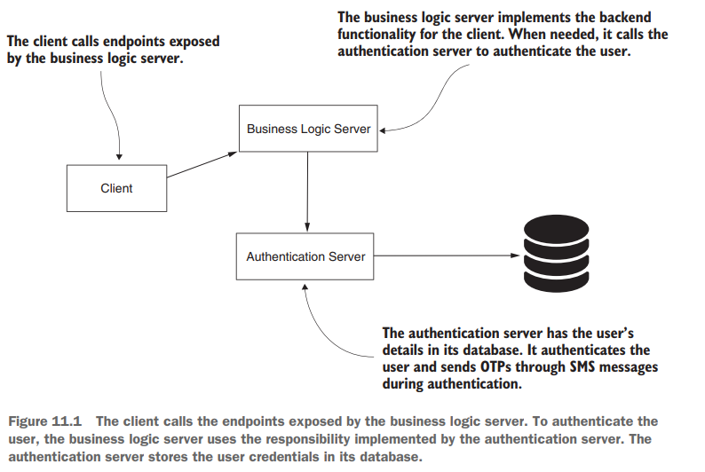
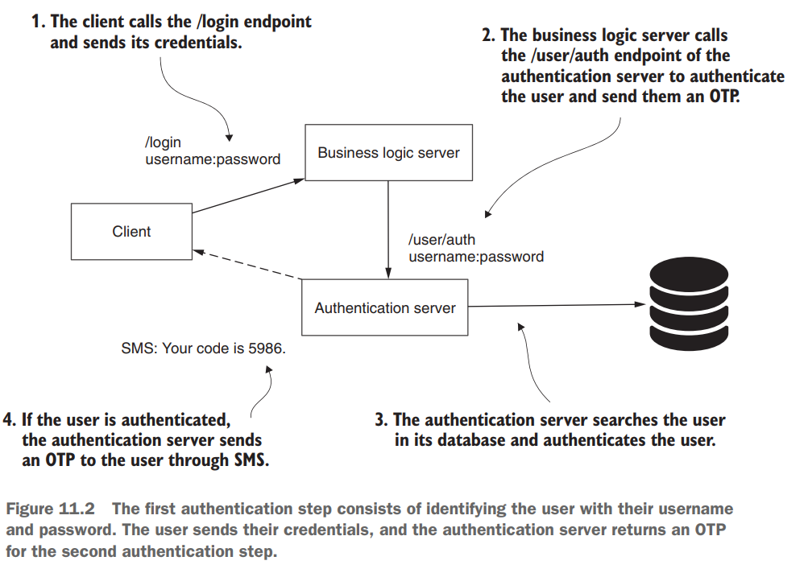
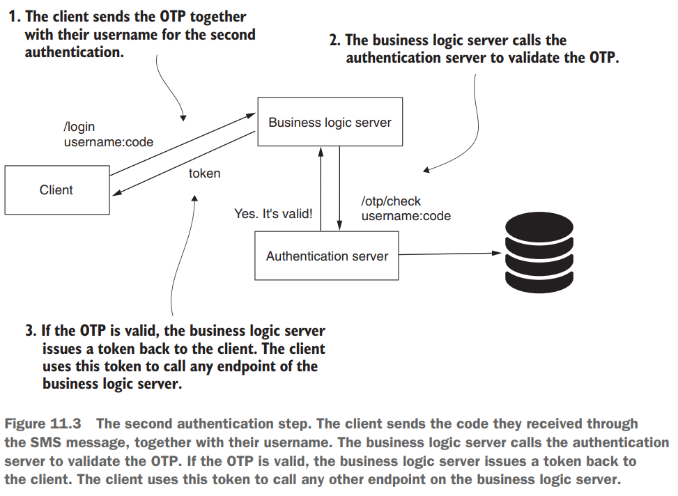
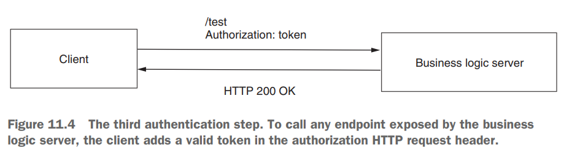
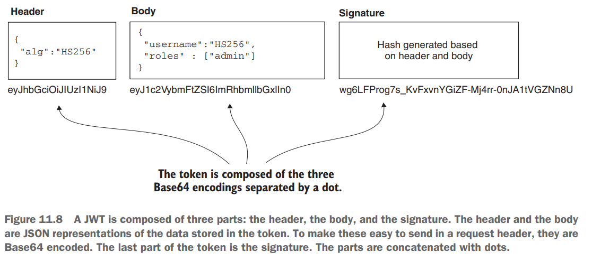

# [Pág. 244] Capítulo 11 - Manos a la obra: una separación de responsabilidades

En este capítulo, diseñaremos un sistema de tres actores: **el cliente, el servidor de autenticación y el servidor de
lógica empresarial.** A partir de estos tres actores, implementaremos la parte de backend del servidor de autenticación
y un servidor de lógica empresarial.

## El escenario y los requisitos del ejemplo

La arquitectura del sistema que diseñaremos tiene tres componentes:

- **El cliente**: esta es la aplicación que consume el backend. Podría ser una aplicación móvil o la interfaz de una
  aplicación web desarrollada con un framework como Angular, ReactJS o Vue.js. No implementamos la parte del cliente del
  sistema, pero tenga en cuenta que existe en una aplicación del mundo real. En lugar de usar el cliente para llamar a
  los puntos finales, usamos cURL.
- **El servidor de autenticación**: esta es una aplicación con una base de datos de credenciales de usuario. El
  propósito de esta aplicación es autenticar a los usuarios en función de sus credenciales (nombre de usuario y
  contraseña) y enviarles una contraseña de un solo uso (OTP) a través de SMS. Debido a que en realidad no enviaremos un
  SMS en este ejemplo, leeremos el valor de la OTP directamente desde la base de datos. En este capítulo, implementamos
  toda esta aplicación sin enviar el SMS.
- **El servidor de lógica empresarial**: esta es la aplicación que expone los endpoints que consume nuestro cliente.
  Queremos asegurar el acceso a estos endpoints. Antes de llamar a un endpoint el usuario debe autenticarse con su
  nombre de usuario y contraseña y luego enviar una OTP. El usuario recibe la OTP a través de un mensaje SMS. Debido a
  que esta aplicación es nuestra aplicación de destino, la protegeremos con Spring Security.

Para llamar a cualquier punto final en el servidor de lógica de negocios, el cliente debe seguir tres pasos:

1. Autenticar el nombre de usuario y la contraseña llamando al punto final /login en el servidor de lógica de negocios
   para obtener una OTP generada aleatoriamente.
2. Llame al punto final /login con el nombre de usuario y OTP.
3. Llame a cualquier endpoint agregando el token recibido en el paso 2 al encabezado de Autorización de la solicitud
   HTTP.

Cuando el cliente autentica el nombre de usuario y la contraseña, el servidor de lógica de negocio envía una solicitud
de OTP al servidor de autenticación. Después de una autenticación exitosa, el servidor de autenticación envía una OTP
generada aleatoriamente al cliente a través de SMS. **Esta forma de identificar al usuario se llama
autenticación multifactor (MFA)**, y es bastante común hoy en día. Por lo general, necesitamos que los usuarios
demuestren quiénes son usando sus credenciales y con otro medio de identificación (por ejemplo, que poseen un
dispositivo móvil específico).

En el segundo paso de autenticación, una vez que el cliente tiene el código del SMS recibido, el usuario puede llamar al
punto final /login, nuevamente con el nombre de usuario y el código. El servidor de lógica empresarial valida el código
con el servidor de autenticación. Si el código es válido, el cliente recibe un token que puede usar para llamar a
cualquier punto final en el servidor de lógica de negocio.

En el tercer paso de autenticación, el cliente ahora puede llamar a cualquier endpoint agregando el token que recibió en
el paso 2 al encabezado de Autorización de la solicitud HTTP.

**NOTA**

> Este ejemplo nos permite trabajar en una aplicación más grande, que incluye más de los conceptos que discutimos en
> capítulos anteriores. Para permitirle concentrarse en los conceptos de Spring Security que quiero incluir en la
> aplicación, simplifico la arquitectura del sistema. Alguien podría argumentar que esta arquitectura utiliza enfoques
> viciosos ya que el cliente solo debe compartir contraseñas con el servidor de autenticación y nunca con el servidor de
> lógica empresarial. ¡Esto es correcto! En nuestro caso, es solo una simplificación. En escenarios del mundo real, en
> general, nos esforzamos por mantener las credenciales y los secretos conocidos por la menor cantidad posible de
> componentes en el sistema. Además, alguien podría argumentar que el escenario MFA en sí mismo podría implementarse más
> fácilmente mediante el uso de un sistema de administración de terceros como Okta o algo similar. Parte del propósito
> del ejemplo es enseñarle cómo definir filtros personalizados. Por esta razón, elegí la forma difícil de implementar,
> nosotros mismos, esta parte de la arquitectura de autenticación.

## [Pág. 248] Implementación y uso de tokens

Una aplicación obtiene un token como resultado del proceso de autenticación y para acceder a los recursos. Los puntos
finales representan los recursos en una aplicación web. Para una aplicación web, un token es una cadena, generalmente
enviada a través de un encabezado HTTP por clientes que desean acceder a un punto final en particular. Esta cadena puede
ser simple como un identificador único universal (UUID) puro, o puede tener una forma más compleja como un token web
JSON (JWT).

**¿Qué es un token?**, los tokens proporcionan un método que utiliza una aplicación para demostrar que ha autenticado a
un usuario, lo que le permite acceder a los recursos de la aplicación.

**¿Qué es un JWT?**

* **JSON**, utiliza JSON para formatear los datos que contiene.
* **Web**, está diseñado para ser utilizado para solicitudes web.
* **Token**, es una implementación de token.

JWT es una implementación de token. Agrega el beneficio de transferir datos fácilmente durante la autenticación, así
como firmar datos para validar su integridad.

En este capítulo, usaremos [Java JSON Web Token (JJWT)](https://github.com/jwtk/jjwt#overview) como biblioteca para
crear y analizar JWT. Esta es una de las bibliotecas más utilizadas para generar y analizar tokens JWT en aplicaciones
Java.
