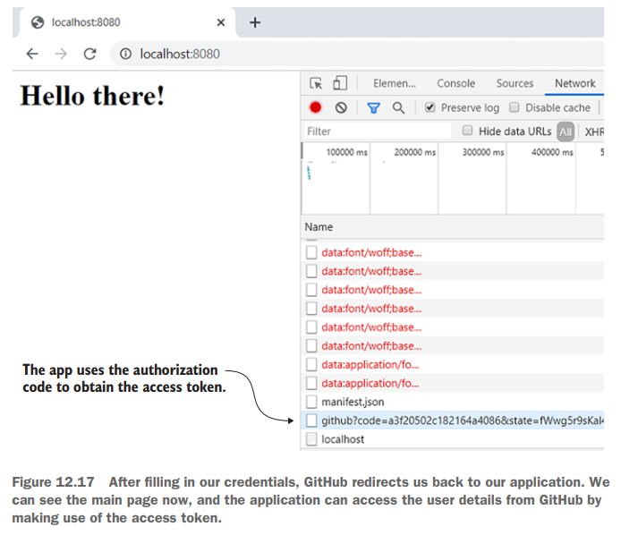

# [Pág. 299] Implementación de una aplicación simple de inicio de sesión único (SSO)

El código con el que trabajé al final de este capítulo está en el repositorio
[spring-security-in-action-2020-cap-12-authorization-code](https://github.com/magadiflo/spring-security-in-action-2020-cap-12-authorization-code.git)

Este ejemplo le muestra una descripción general de cómo aplicar OAuth 2 con Spring Security y le enseña los primeros
contratos que necesita saber.

Una aplicación de inicio de sesión único **(single sign-on, SSO)** es, como sugiere el nombre, una en la que se
autentica a través de un servidor de autorización y, luego, la aplicación lo mantiene conectado mediante un token de
actualización. En nuestro caso, representa solo al cliente de la arquitectura OAuth 2.


## [Pág. 300] Gestión de servidor de autorizaciones

En este capítulo, no implementaremos nuestro propio servidor de autorización, sino que usaremos uno existente:
**GitHub.**

Entonces, **¿qué debemos hacer para usar un tercero como GitHub como servidor de autorización?** Esto significa que, al
final, nuestra aplicación no administrará a sus usuarios y que **cualquiera puede iniciar sesión en nuestra aplicación
usando su cuenta de GitHub.** Como cualquier otro servidor de autorización, **GitHub necesita conocer la aplicación
cliente para la que emite tokens.** Recuerde en la sección 12.3, donde discutimos **las concesiones de OAuth 2,** que
las solicitudes **usaban una ID de cliente y un secreto de cliente.** Un cliente usa estas credenciales para
autenticarse en el servidor de autorización, por lo que la aplicación OAuth debe registrarse con el servidor de
autorización de GitHub. Para ello, completamos un breve formulario (figura 12.11) a través del siguiente enlace:

````
https://github.com/settings/applications/new
````

Cuando agrega una nueva aplicación OAuth, debe especificar un **nombre para la aplicación**, la **página de inicio** y
el **enlace al que GitHub devolverá la llamada a su aplicación**. **El tipo de concesión de OAuth 2 en el que funciona
es el tipo de concesión del código de autorización.** Este tipo de concesión asume que el cliente redirige al usuario al
servidor de autorización (GitHub, en nuestro caso) para iniciar sesión, y luego el servidor de autorización llama al
cliente a una URL definida, como discutimos en la sección 12.3.1. Es por eso que necesita identificar la URL de
devolución de llamada aquí. Debido a que ejecuto el ejemplo en mi sistema, uso localhost en ambos casos. Y debido a que
no cambio el puerto ( que es 8080 por defecto, como ya sabe), esto hace que http://localhost:8080 sea la URL de mi
página de inicio. Uso la misma URL para la devolución de llamada.

**NOTA**
> El lado del cliente de GitHub (su navegador) llama a localhost. Así es como puede probar su aplicación localmente.


Una vez que complete el formulario y elija Registrar aplicación, GitHub le proporciona un client ID y un Client secrets.
En mi caso, generó las siguientes credenciales:

````
Client ID: 7efb15ac1cdde34b0901
Client secrets: bccd7f002c96cae30645159d67d8d444bf16fb6c
````

**NOTA**
> Eliminaré estas credenciales posterior al desarrollo de esta sección.


Esta configuración es todo lo que necesitamos hacer para el servidor de autorización. Ahora que tenemos las credenciales
del cliente, podemos comenzar a trabajar en nuestra aplicación.

## [Pág. 303] Iniciando la implementación

Creamos una nueva aplicación Spring Boot y agregamos las siguientes dependencias al archivo pom.xml, recordar que
estoy trabajando con Spring Boot 2.6.4 y java 17:

````xml

<dependencies>
    <dependency>
        <groupId>org.springframework.boot</groupId>
        <artifactId>spring-boot-starter-security</artifactId>
    </dependency>
    <dependency>
        <groupId>org.springframework.boot</groupId>
        <artifactId>spring-boot-starter-web</artifactId>
    </dependency>
    <dependency>
        <groupId>org.springframework.boot</groupId>
        <artifactId>spring-boot-starter-oauth2-client</artifactId>
    </dependency>

    <dependency>
        <groupId>org.springframework.boot</groupId>
        <artifactId>spring-boot-starter-test</artifactId>
        <scope>test</scope>
    </dependency>
    <dependency>
        <groupId>org.springframework.security</groupId>
        <artifactId>spring-security-test</artifactId>
        <scope>test</scope>
    </dependency>
</dependencies>
````

Primero necesitamos tener algo que asegurar: una página web. Para hacer eso, creamos una clase de controlador y una
página HTML simple que representa nuestra aplicación.

````java
//package: controllers/

@Controller
public class MainController {
    private static final Logger LOG = LoggerFactory.getLogger(MainController.class);

    @GetMapping(path = "/")
    public String main(OAuth2AuthenticationToken token) {
        LOG.info(String.valueOf(token));
        return "main.html";
    }
}
````

````html
<!-- /resources/static/ -->
<!DOCTYPE html>
<html lang="en">
<head>
    <meta charset="UTF-8">
    <title>Main</title>
</head>
<body>
<h1>Hello Main Application!</h1>
</body>
</html>
````

¡Y ahora el verdadero trabajo! **Establezcamos las configuraciones de seguridad para permitir que nuestra aplicación use
el inicio de sesión con GitHub.** Empezamos escribiendo una **clase de configuración**, como estamos acostumbrados.
**Extendemos WebSecurityConfigurerAdapter y anulamos el método configure (HttpSecurity http).** Y ahora una diferencia:
en lugar de usar httpBasic() o formLogin() como aprendiste en el capítulo 4, **llamamos a un método diferente llamado
oauth2Login().** Este código se presenta en el siguiente listado.

````java

@Configuration
public class ProjectConfig extends WebSecurityConfigurerAdapter {
    @Override
    protected void configure(HttpSecurity http) throws Exception {
        http.oauth2Login();

        http.authorizeRequests().anyRequest().authenticated();
    }
}
````

En el código anterior llamamos a un nuevo método en el objeto HttpSecurity: el **oauth2Login().** Pero sabes lo que está
pasando. Al igual que con httpBasic() o formLogin(), **oauth2Login() simplemente agrega un nuevo filtro de autenticación
a la cadena de filtros.** Discutimos los filtros en el capítulo 9, donde aprendió que Spring Security tiene algunas
implementaciones de filtros, y también puede agregar implementaciones personalizadas a la cadena de filtros. En este
caso, **el filtro que el marco agrega a la cadena de filtros cuando llama al método oauth2Login() es
OAuth2LoginAuthenticationFilter** (figura 12.13). Este filtro intercepta solicitudes y aplica la lógica necesaria para
la autenticación OAuth 2.


## [Pág. 304] Implementando ClientRegistration

En esta sección, analizamos la implementación del vínculo entre el cliente OAuth 2 y el servidor de autorización. Esto
es vital si desea que su aplicación realmente haga algo. Si lo inicia tal como está ahora, no podrá acceder a la página
principal. La razón por la que no puede acceder a la página es que ha especificado que para cualquier solicitud, el
usuario debe autenticarse, pero no proporcionó ninguna forma de autenticación. **Necesitamos establecer que GitHub es
nuestro servidor de autorización.** Para ello, **Spring Security define el contrato ClientRegistration.**

La **interfaz ClientRegistration representa al cliente en la arquitectura OAuth 2.** Para el cliente, debe definir todos
los detalles necesarios, entre:

- El client id y client secret
- Tipo de concesión utilizado para la autenticación
- La URI de redirección
- El scope

Tal vez recuerde de la sección 12.3 que la aplicación necesita todos estos detalles para el proceso de autenticación.
Spring Security también ofrece una manera fácil de crear una instancia de un constructor, similar a la que ya usó para
construir instancias de UserDetails a partir del capítulo 2. **El listado 12.3** muestra cómo construir una instancia de
este tipo que representa la implementación de nuestro cliente con el constructor que proporciona Spring Security. En la
siguiente lista, muestro cómo proporcionar todos los detalles, pero para algunos proveedores, aprenderá más adelante en
esta sección que es incluso más fácil que esto.

````java

@Configuration
public class ProjectConfig extends WebSecurityConfigurerAdapter {
    /* other code */

    private ClientRegistration clientRegistration() {
        return ClientRegistration.withRegistrationId("github")
                .clientId("7efb15ac1cdde34b0901")
                .clientSecret("bccd7f002c96cae30645159d67d8d444bf16fb6c")
                .scope("read:user")
                .authorizationUri("https://github.com/login/oauth/authorize")
                .tokenUri("https://github.com/login/oauth/access_token")
                .userInfoUri("https://api.github.com/user")
                .userNameAttributeName("id")
                .clientName("GitHub")
                .authorizationGrantType(AuthorizationGrantType.AUTHORIZATION_CODE)
                .redirectUri("{baseUrl}/{action}/oauth2/code/{registrationId}")
                .build();
    }
}
````

**¿De dónde vienen todos esos detalles?** Sé que el código anterior puede dar miedo a primera vista, pero no es más que
**configurar el ID y el secreto del cliente.** Además, defino **los alcances** (autoridades otorgadas), **un
nombre de cliente** y un **withRegistrationId de mi elección.** Además de estos detalles, tuve que proporcionar las
URL del servidor de autorización:

- **Authorization URI**, el URI al que el cliente redirige al usuario para la autenticación.
- **Token URI**, el URI al que llama el cliente para obtener un token de acceso y un token de actualización.
- **User info URI**, el URI al que el cliente puede llamar después de obtener un token de acceso para obtener más
  detalles sobre el usuario.

¿De dónde obtuve todos esos URI? Bueno, si el servidor de autorizaciones no está desarrollado por usted, como en nuestro
caso, debe obtenerlos de la documentación. Para GitHub, por ejemplo, puede encontrarlos aquí:

````
https://developer.github.com/apps/building-oauth-apps/authorizing-oauth-apps/
````

¡Esperar! Spring Security es aún más inteligente que esto. **El framework define una clase denominada
CommonOAuth2Provider.** Esta clase **define parcialmente las instancias de ClientRegistration** para los proveedores más
comunes que puede usar para la autenticación, que incluyen:

- Google
- Facebook
- GitHub
- Okta

Si utiliza uno de estos proveedores, **puede definir su ClientRegistration como se presenta** en la siguiente lista. En
la sección 12.5.4, aprenderá cómo registrar este objeto ClientRegistration para que Spring Security lo use para la
autenticación.

````java

@Configuration
public class ProjectConfig extends WebSecurityConfigurerAdapter {
    /* other code */

    private ClientRegistration clientRegistration() {
        return CommonOAuth2Provider.GITHUB.getBuilder("github")
                .clientId("7efb15ac1cdde34b0901")
                .clientSecret("bccd7f002c96cae30645159d67d8d444bf16fb6c")
                .build();
    }
}
````

Como puede ver, esto es mucho más limpio y no tiene que buscar y configurar manualmente las URL para el servidor de
autorización. Por supuesto, **esto se aplica solo a los proveedores comunes.** Si su servidor de autorización no se
encuentra entre los proveedores comunes, entonces no tiene otra opción que definir ClientRegistration completamente como
se presenta en el listado 12.3

**NOTA**
> Usar los valores de la clase CommonOAuth2Provider también significa que confía en el hecho de que el proveedor que
> usa no cambiará las URL y los otros valores relevantes. Si bien esto no es probable, si desea evitar esta situación,
> la opción es implementar ClientRegistration como se presenta en el listado 12.3. Esto le permite configurar las
> direcciones URL y los valores de proveedores relacionados en un archivo de configuración.

## [Pág. 307] Implementando ClientRegistrationRepository

En esta sección, **aprenderá a registrar las instancias de ClientRegistration para que Spring Security las use para la
autenticación.** En la sección 12.5.3, aprendió cómo representar el cliente OAuth 2 para Spring Security mediante la
implementación del contrato **ClientRegistration**. Pero también debe configurarlo para usarlo para la autenticación.
Para ello, **Spring Security utiliza un objeto de tipo ClientRegistrationRepository** (figura 12.14)


La interfaz ClientRegistrationRepository es similar a la interfaz UserDetailsService, que aprendió en el capítulo 2. De
la misma manera que un objeto UserDetailsService encuentra UserDetails por su nombre de usuario, un objeto
ClientRegistrationRepository encuentra ClientRegistration por su ID de registro.

Puede implementar la interfaz ClientRegistrationRepository para decirle al framework dónde encontrar las instancias de
ClientRegistration. **Spring Security nos ofrece una implementación para ClientRegistrationRepository,** que almacena en
memoria las instancias de ClientRegistration: **InMemoryClientRegistrationRepository.** Como habrá adivinado,
esto funciona de manera similar a cómo funciona InMemoryUserDetailsManager para las instancias de UserDetails.
Hablamos de InMemoryUserDetailsManager en el capítulo 3.

Para finalizar la implementación de nuestra aplicación, defino un ClientRegistrationRepository usando la implementación
InMemoryClientRegistrationRepository y lo registro como un bean en el contexto de Spring. Agrego la instancia de
ClientRegistration que creamos en la sección 12.5.3 a InMemoryClientRegistrationRepository al proporcionarla como un
parámetro para el constructor InMemoryClientRegistrationRepository.

A continuación se muestra el código completo de nuestra clase de configuración de Spring Security y una clase adicional
de configuración que creé **para poder exponer el @Bean ClientRegistrationRepository**, de esta forma estamos separando
las responsabilidades. Ahora, **en el libro la clase ProjectConfig contiene ambos códigos, no está separado en dos
clases**. Yo lo separé porque cuando ejecuté el proyecto, no iniciaba la aplicación y mostraba un error de
**dependencias cíclicas**, por esa razón es que opté por separarlos, ya que este será el enfoque que tomaré por sobre
las dos otras alternativas que más adelante se muestran:

````java

@Configuration
public class ProjectConfig extends WebSecurityConfigurerAdapter {
    @Override
    protected void configure(HttpSecurity http) throws Exception {
        http.oauth2Login();

        http.authorizeRequests().anyRequest().authenticated();
    }
}
````

````java

@Configuration
public class ClientRegistrationConfig {

    @Bean
    public ClientRegistrationRepository clientRegistrationRepository() {
        ClientRegistration clientRegistration = this.clientRegistration();
        return new InMemoryClientRegistrationRepository(clientRegistration);
    }

    private ClientRegistration clientRegistration() {
        return CommonOAuth2Provider.GITHUB.getBuilder("github")
                .clientId("7efb15ac1cdde34b0901")
                .clientSecret("bccd7f002c96cae30645159d67d8d444bf16fb6c")
                .build();
    }
}
````

Como puede ver, agregar ClientRegistrationRepository como un bean en el contexto de Spring es suficiente para que Spring
Security lo encuentre y trabaje con él. **Como alternativa a esta forma de registrar ClientRegistrationRepository**,
puede utilizar un objeto Customizer como parámetro del método oauth2Login() del objeto HttpSecurity. Ha aprendido a
hacer algo similar con los métodos httpBasic() y formLogin() en los capítulos 7 y 8 y luego con los métodos cors() y
csrf() en el capítulo 10. Aquí se aplica el mismo principio.

````java

@Configuration
public class ProjectConfig extends WebSecurityConfigurerAdapter {

    @Override
    protected void configure(HttpSecurity http) throws Exception {
        http.oauth2Login(httpSecurityOAuth2LoginConfigurer -> {
            httpSecurityOAuth2LoginConfigurer.clientRegistrationRepository(this.clientRegistrationRepository());
        });

        http.authorizeRequests().anyRequest().authenticated();
    }

    private ClientRegistrationRepository clientRegistrationRepository() {
        ClientRegistration clientRegistration = this.clientRegistration();
        return new InMemoryClientRegistrationRepository(clientRegistration);
    }

    private ClientRegistration clientRegistration() {
        return CommonOAuth2Provider.GITHUB.getBuilder("github")
                .clientId("7efb15ac1cdde34b0901")
                .clientSecret("bccd7f002c96cae30645159d67d8d444bf16fb6c")
                .build();
    }
}
````

**NOTA**
> Una opción de configuración es tan buena como la otra, pero recuerde lo que discutimos en el capítulo 2. Para mantener
> su código fácil de entender, evite mezclar enfoques de configuración. Utilice un enfoque en el que establezca todo con
> beans en el contexto o utilice el estilo de configuración en línea del código.

## [Pág. 309] La magia pura de la configuración de Spring Boot

En esta sección, le muestro un tercer enfoque para configurar la aplicación que creamos anteriormente en este capítulo.
Spring Boot está diseñado para usar su magia y construir los objetos ClientRegistration y ClientRegistrationRepository
directamente desde el archivo de propiedades. Este enfoque no es inusual en un proyecto de Spring Boot. Vemos que esto
sucede con otros objetos también. Por ejemplo, a menudo vemos fuentes de datos configuradas en función del archivo de
propiedades. El siguiente fragmento de código muestra cómo configurar el registro del cliente para nuestro ejemplo en el
archivo application.properties:

````properties
spring.security.oauth2.client.registration.github.client-id=7efb15ac1cdde34b0901
spring.security.oauth2.client.registration.github.client-secret=bccd7f002c96cae30645159d67d8d444bf16fb6c
````

Con este tercer enfoque no necesitamos especificar en el archivo de configuración ningún detalle sobre
ClientRegistration y ClientRegistrationRepository porque Spring Boot los crea automáticamente en función del archivo de
propiedades. Si usamos un proveedor diferente a los comunes conocidos por Spring Security, también debemos especificar
los detalles para el servidor de autorización usando el grupo de propiedades que comienza con
**spring.security.oauth2.client.provider.** El siguiente fragmento de código le proporciona un ejemplo:

````properties
spring.security.oauth2.client.provider.myprovider.authorization-uri=<some uri>
spring.security.oauth2.client.provider.myprovider.token-uri=<some uri>
````

Finalmente, el autor del libro opta por trabajar usando este tercer enfoque, es decir configurando el cliente usando
el archivo de propiedades. Por mi parte, **lo trabajaré como el primer enfoque, es decir usando el bean del
ClientRegistrationRepository dentro de la clase de configuración de spring security.**

## [Pág. 311] Obteniendo detalles sobre un usuario autenticado

En esta sección, analizamos cómo obtener y usar los detalles de un usuario autenticado. Ya sabe que **en la arquitectura
de Spring Security, es el SecurityContext el que almacena los detalles de un usuario autenticado.** Una vez que finaliza
el proceso de autenticación, el filtro responsable almacena el objeto de autenticación en SecurityContext. La aplicación
puede tomar los detalles del usuario desde allí y usarlos cuando sea necesario. Lo mismo sucede con una autenticación
OAuth 2 también.

**La implementación del objeto de autenticación que utiliza el framework se denomina OAuth2AuthenticationToken** en este
caso. Puede **tomarlo directamente** desde **ecurityContext** o **dejar que Spring Boot lo inyecte por usted** en un
parámetro del punto final, como aprendió en el capítulo 6. La siguiente lista muestra cómo cambié el controlador para
recibir e imprimir detalles sobre un usuario en la consola.

````java

@Controller
public class MainController {
    private static final Logger LOG = LoggerFactory.getLogger(MainController.class);

    @GetMapping(path = "/")
    public String main(OAuth2AuthenticationToken token) { //<--- Spring Boot inyecta automáticamente el objeto de autenticación
        LOG.info(String.valueOf(token.getPrincipal()));
        return "main.html";
    }
}
````

## [Pág. 311] Probando la aplicación

En esta sección, probamos la aplicación en la que trabajamos en este capítulo. Junto con la verificación de la
funcionalidad, seguimos los pasos del tipo de concesión de código de autorización OAuth 2 (figura 12.15) para
asegurarnos de que lo entendiste correctamente y observas cómo Spring Security lo aplica con la configuración que
hicimos. Puede utilizar cualquiera de los tres proyectos que escribimos en este capítulo. Estos definen la misma
funcionalidad con diferentes formas de escribir la configuración, pero el resultado es el mismo.


Primero **me aseguro de no haber iniciado sesión en GitHub.** También me aseguro de abrir una consola del navegador para
verificar el historial de solicitudes de navegación. Este historial me brinda una descripción general de los pasos que
ocurren en el flujo de OAuth 2, los pasos que discutimos en la sección 12.3.1. Si estoy autenticado, la aplicación me
registra directamente. Luego inicio la aplicación y accedo a la página principal de nuestra aplicación en el navegador:

````
http://localhost:8080
````

La aplicación me redirige a la URL en el siguiente fragmento de código (y presentado en la figura 12.16). Esta URL está
configurada en la clase CommonOauth2Provider para GitHub como URL de autorización.

````
https://github.com/login?client_id=7efb15ac1cdde34b0901&return_to=%2Flogin%2Foauth%2Fauthorize%3Fclient_id%3D7efb15ac1cdde34b0901%26redirect_uri%3Dhttp%253A%252F%252Flocalhost%253A8080%252Flogin%252Foauth2%252Fcode%252Fgithub%26response_type%3Dcode%26scope%3Dread%253Auser%26state%3DkWbA31Wx6RNiE4uZ9xpyIPWyqjAxfaSzSbLJluS1tlM%253D
````


Nuestra aplicación adjunta los parámetros de consulta necesarios a la URL, como discutimos en la sección 12.3.1. Estos
son:

- **response_type** con el valor **code**.
- **client_id**
- **scope** (el valor read:user también se define en la clase CommonOauth2Provider)
- **state** con el CSRF Token.

Usamos nuestras credenciales de GitHub e iniciamos sesión en nuestra aplicación con GitHub. Somos autenticados y
redirigidos de regreso, como puede ver en la figura 12.17.



El siguiente fragmento de código muestra la URL en la que GitHub nos devuelve la llamada. Puedes observar que GitHub
proporciona el código de autorización que utiliza nuestra aplicación para solicitar un token de acceso:

````
http://localhost:8080/login/oauth2/code/github?code=5ecfc94b5f06edd840b8&state=kWbA31Wx6RNiE4uZ9xpyIPWyqjAxfaSzSbLJluS1tlM%3
````

No veremos las llamadas al endpoint del token desde el navegador, ya que esto sucede directamente desde nuestra
aplicación. Pero podemos confiar en que la aplicación logró obtener un token porque podemos ver los detalles del usuario
impresos en la consola. Esto significa que la aplicación logró llamar al punto final para recuperar los detalles del
usuario. El siguiente fragmento de código muestra parte de este resultado:

````
2023-06-09 18:09:21.966  INFO 16492 --- [nio-8080-exec-2] c.m.b.s.app.controllers.MainController   : 

Name: [38512764], 
Granted Authorities: [[ROLE_USER, SCOPE_read:user]], 
User Attributes: [{login=magadiflo, id=38512764, node_id=MDQ6VXNlcjM4NTEyNzY0, avatar_url=https://avatars.githubusercontent.com/u/38512764?v=4, gravatar_id=, url=https://api.github.com/users/magadiflo, html_url=https://github.com/magadiflo, followers_url=https://api.github.com/users/magadiflo/followers, following_url=https://api.github.com/users/magadiflo/following{/other_user}, gists_url=https://api.github.com/users/magadiflo/gists{/gist_id}, starred_url=https://api.github.com/users/magadiflo/starred{/owner}{/repo}, subscriptions_url=https://api.github.com/users/magadiflo/subscriptions, organizations_url=https://api.github.com/users/magadiflo/orgs, repos_url=https://api.github.com/users/magadiflo/repos, events_url=https://api.github.com/users/magadiflo/events{/privacy}, received_events_url=https://api.github.com/users/magadiflo/received_events, type=User, site_admin=false, name=Martín Díaz, company=null, blog=https://www.linkedin.com/in/magadiflo/, location=Perú, email=null, hireable=null, bio=Bachiller en Ingeniería de Sistemas e Informática, twitter_username=null, public_repos=193, public_gists=0, followers=1, following=1, created_at=2018-04-19T00:02:33Z, updated_at=2023-05-22T23:10:26Z, private_gists=7, total_private_repos=2, owned_private_repos=2, disk_usage=144734, collaborators=0, two_factor_authentication=false, plan={name=free, space=976562499, collaborators=0, private_repos=10000}}]
````