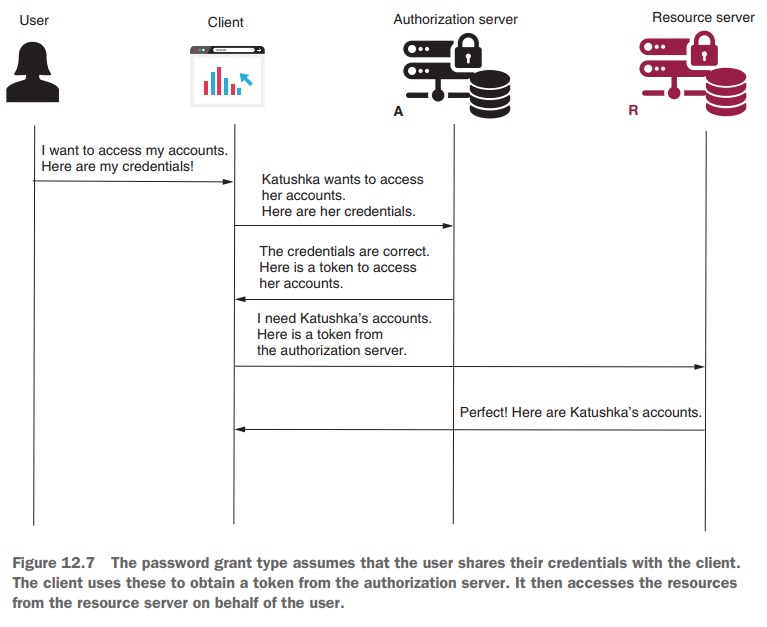

# [Pág. 284] Capítulo 12 - ¿Cómo trabaja OAuth 2?

En la mayoría de los casos, **OAuth 2** se conoce como framework de autorización (o framework de especificación) cuyo
propósito principal es **permitir que un sitio web o aplicación de terceros acceda a un recurso.** A veces, las personas
se refieren a OAuth 2 como un protocolo de delegación. Independientemente de cómo elija llamarlo, es importante recordar
que **OAuth 2 no es una implementación específica o una biblioteca.** También podría aplicar las definiciones de flujo
de OAuth 2 con otras plataformas, herramientas o lenguajes.

## [Pág. 287] Los componentes de la arquitectura de autenticación OAuth 2

Como se mencionó, los componentes de OAuth 2 incluyen:

- **El servidor de recursos:** la aplicación que aloja los recursos que son propiedad de los usuarios. Los recursos
  pueden ser los datos de los usuarios o sus acciones autorizadas.
- **El usuario (también conocido como propietario del recurso):** la persona que posee los recursos expuestos por el
  servidor de recursos. Un usuario generalmente tiene un nombre de usuario y una contraseña que utiliza para
  identificarse.
- **El cliente:** la aplicación que accede a los recursos propiedad del usuario en su nombre. El cliente utiliza un ID
  de cliente y un secreto de cliente para identificarse. Tenga cuidado, **estas credenciales no son las mismas que las
  credenciales de usuario.** El cliente necesita sus propias credenciales para identificarse cuando realiza una
  solicitud.
- **El servidor de autorización:** la aplicación que autoriza al cliente a acceder a los recursos del usuario expuestos
  por el servidor de recursos. Cuando el servidor de autorización decide que un cliente está autorizado para acceder a
  un recurso en nombre del usuario, emite un token. El cliente usa este token para demostrarle al servidor de recursos
  que fue autorizado por el servidor de autorización. El servidor de recursos permite que el cliente acceda al recurso
  que solicitó si tiene un token válido.

## [Pág. 288] Opciones de implementación con OAuth 2

Como aprenderá, OAuth 2 implica múltiples flujos de autenticación posibles y necesita saber cuál se aplica a su caso. En
esta sección, tomo los casos más comunes y los evalúo.

Entonces, ¿cómo funciona OAuth 2? ¿Qué significa implementar la autenticación y autorización OAuth 2? Principalmente,
**OAuth 2 se refiere al uso de tokens para autorización.** Una vez que obtiene un token, puede acceder a recursos
específicos. Pero **OAuth 2 ofrece múltiples posibilidades para obtener un token, llamados grants.** Estas son las
concesiones de OAuth 2 más comunes entre las que puede elegir:

- Authorization code
- Password
- Refresh token
- Client credentials

Al iniciar una implementación, debemos elegir nuestra concesión **(grant)**. ¿Lo seleccionamos al azar? Por supuesto que
no. Necesitamos saber cómo se crean los tokens para cada tipo de concesión. Luego, dependiendo de los requisitos de
nuestra aplicación, elegimos uno de ellos.

## [Pág. 289] Implementación del tipo de concesión de código de autorización (authorization code grant type)

En esta sección, analizamos el **tipo de concesión del código de autorización** (figura 12.5). También lo usaremos en la
aplicación que implementaremos en la sección 12.5. Este tipo de concesión es uno de los flujos de OAuth 2 más
utilizados, por lo que es muy importante comprender cómo funciona y cómo aplicarlo. Hay una alta probabilidad de que lo
use en las aplicaciones que desarrolle.

**NOTA**

> Las flechas de la figura 12.5 no representan necesariamente solicitudes y respuestas HTTP. Estos representan mensajes
> intercambiados entre los actores de OAuth 2. Por ejemplo, cuando el cliente le dice al usuario (segunda flecha desde
> la
> parte superior del diagrama), "Dígale al servidor de autorización que me permite realizar esta acción", el cliente
> luego
> redirige el usuario a la página de inicio de sesión del servidor de autorización. Cuando el servidor de autorización
> le
> da al cliente un token de acceso, el servidor de autorización en realidad llama al cliente en lo que llamamos un URI
> de
> redirección. Esta es una descripción simplificada de la comunicación entre los actores de OAuth 2.

Así es como funciona el **tipo de concesión de código de autorización**. Después de esto, nos sumergimos en los detalles
de cada paso:

1. Realizar la solicitud de autenticación.
2. Obtener un token de acceso.
3. Llamar al recurso protegido.

#### Paso 1. Realizar la solicitud de autenticación con el tipo concesión de código de autorización

El cliente redirige al usuario a un endpoint del servidor de autorización donde necesita autenticarse. Puede imaginar
que está utilizando la aplicación X y necesita acceder a un recurso protegido. Para acceder a ese recurso por usted, la
aplicación X necesita que se autentique. Le abre una página con un formulario de inicio de sesión en el servidor de
autorización que debe completar con sus credenciales.

**NOTA**
> Lo que es realmente importante observar aquí es que el usuario interactúa directamente con el servidor de
> autorización. El usuario no envía las credenciales a la aplicación cliente.

Técnicamente, lo que sucede aquí es que cuando el cliente redirige al usuario al servidor de autorización, el cliente
llama al endpoint de autorización con los siguientes detalles en la consulta de solicitud:

- **response_type** con el código de valor, que le dice al servidor de autorización que el cliente espera un código. El
  cliente necesita el código para obtener un token de acceso, como verás en el segundo paso.
- **client_id** con el valor del ID del cliente, que identifica a la propia aplicación.
- **redirect_uri** que le dice al servidor de autorización dónde redirigir al usuario después de una autenticación
  exitosa. A veces, el servidor de autorizaciones ya conoce un URI de redireccionamiento predeterminado para cada
  cliente. Por esta razón, el cliente no necesita enviar la URI de redirección.
- **scope**, que es similar a las autoridades concedidas que discutimos en el capítulo 5.
- **state**, que define un token de falsificación de solicitud entre sitios (CSRF) utilizado para la protección CSRF que
  analizamos en el capítulo 10.

**Después de una autenticación exitosa**, el servidor de autorización vuelve a llamar al cliente en el URI de
redirección y proporciona un código y el valor del estado. El cliente verifica que el valor del estado sea el mismo que
envió en la solicitud para confirmar que no fue otra persona intentando llamar al URI de redirección. El cliente usa el
código para obtener un token de acceso como será presentado en el paso 2.

#### Paso 2. Obtención de un token de acceso con el tipo de concesión de código de autorización

Para permitir que el usuario acceda a los recursos, **el código resultante del paso 1** es la **prueba** del cliente de
que el **usuario se autenticó.** Es **por eso que esto se llama** el **tipo de concesión de código de autorización.**
Ahora el cliente llama al servidor de autorización con el código para obtener el token.

**NOTA**
> En el primer paso, la interacción fue entre el usuario y el servidor de autorizaciones. En este paso, la interacción
> es entre el cliente y el servidor de autorizaciones.

**En muchos casos, estos dos primeros pasos crean confusión.** La gente generalmente está desconcertada acerca de **por
qué el flujo necesita dos llamadas al servidor de autorización** y dos tokens diferentes: **el código de autorización y
un token de acceso.** Tómese un momento para entender esto:

- El servidor de autorización genera el primer código como prueba de que el usuario interactuó directamente con él. El
  cliente recibe este código y tiene que autenticarse nuevamente usándolo junto a sus credenciales para obtener un token
  de acceso.
- El cliente usa el segundo token para acceder a los recursos en el servidor de recursos.

Entonces, **¿por qué el servidor de autorización no devolvió directamente el segundo token (token de acceso)?** Bueno,
OAuth 2 define un flujo llamado **tipo de concesión implícita** donde **el servidor de autorización devuelve
directamente un token de acceso.** **El tipo de concesión implícita** no se enumera en esta sección porque **no se
recomienda su uso** y la mayoría de **los servidores de autorización actuales no lo permiten**. El simple hecho de que
el servidor de autorización llame al URI de redirección directamente con un token de acceso sin asegurarse de que el
cliente correcto reciba ese token hace que el flujo sea menos seguro. **Al enviar primero un código de autorización, el
cliente debe demostrar nuevamente quién es utilizando sus credenciales para obtener un token de acceso.** El cliente
realiza una llamada final para obtener un token de acceso y envía:

- **El código de autorización**, que acredita que el usuario los autorizó.
- **Sus credenciales**, lo que demuestra que realmente es el mismo cliente y no otra persona que interceptó los códigos
  de autorización.

Regresando al paso 2, técnicamente, el cliente ahora realiza una solicitud al servidor de autorización. Esta solicitud
contiene los siguientes detalles:

- **code**, que es el código de autorización recibido en el paso 1. Esto prueba que el usuario se autenticó.
- **cliente_id y client_secret**, las credenciales del cliente.
- **redirect_uri**, que es el mismo que se usó en el paso 1 para la validación.
- **grant_type**, con el valor authorization_code, que identifica el tipo de flujo utilizado. Un servidor puede admitir
  múltiples flujos, por lo que siempre es esencial especificar cuál es el flujo de autenticación ejecutado actualmente.

Como respuesta, **el servidor devuelve un access_token.** Este token es un valor que el cliente puede usar para llamar a
los recursos expuestos por el servidor de recursos.

#### Paso 3. Llamar al recurso protegido con el tipo de concesión de código de autorización

Después de obtener con éxito el token de acceso del servidor de autorización, el cliente ahora puede solicitar el
recurso protegido. El cliente usa un token de acceso en el encabezado de la solicitud de autorización cuando llama a un
endpoint del servidor de recursos.

## [Pág. 293] Implementando el tipo de concesión de contraseña (password grant type)

Este tipo de concesión también **se conoce como el tipo de concesión de credenciales del propietario del recurso.** Las
aplicaciones que usan este flujo asumen que el cliente recopila las credenciales del usuario y las usa para autenticarse
y obtener un token de acceso del servidor de autorización.

¿Recuerda nuestro ejemplo práctico en el capítulo 11? La arquitectura que implementamos es bastante similar a lo que
sucede en el tipo de concesión de contraseña.

**Utilice este flujo de autenticación solo si el cliente y el servidor de autorización están creados y mantenidos por la
misma organización.** ¿Por qué? Supongamos que crea un sistema de microservicios y decide separar la responsabilidad de
autenticación como un microservicio diferente para mejorar la escalabilidad y mantener las responsabilidades separadas
para cada servicio. (Esta separación se usa ampliamente en muchos sistemas).

Supongamos además que los usuarios de su sistema usan una aplicación web de cliente desarrollada con un marco de
interfaz como Angular, ReactJS o Vue.js, o usan una aplicación móvil. En este caso, los usuarios pueden considerar
extraño ser redirigidos desde su sistema al mismo sistema para la autenticación y luego de regreso. Esto es lo que
sucedería con un flujo como el tipo de concesión de código de autorización. Con el tipo de concesión de contraseña,
esperaría que la aplicación presente un formulario de inicio de sesión al usuario y que el cliente se encargue de enviar
las credenciales al servidor para autenticarse. El usuario no necesita saber cómo diseñó la responsabilidad de
autenticación en su aplicación. Veamos qué sucede cuando se usa el tipo de concesión de contraseña. Las dos tareas son
las siguientes:

1. Solicitar un access token.
2. Usar el access token para llamar a los recursos.

#### Paso 1. Solicitando un access token cuando se usa el tipo de concesión password

El flujo es mucho más simple con el tipo de concesión de password. El cliente recopila las credenciales de usuario y
llama al servidor de autorización para obtener un token de acceso. Al solicitar el token de acceso, el cliente también
envía los siguientes detalles en la solicitud:

- **grant_type**, con el valor password.
- **client_id y client_secret**, que son las credenciales que utiliza el cliente para autenticarse.
- **scope**, que se puede entender como las autoridades otorgadas.
- **username y password**, que son las credenciales de usuario. Estos se envían en texto sin formato como valores del
  encabezado de la solicitud.

El cliente recibe un token de acceso en la respuesta. El cliente ahora puede usar el token de acceso para llamar a los
endpoints del servidor de recursos.

#### Paso 2. Usando un access token para llamar a los recursos cuando se usa el tipo de concesión password

Una vez que el cliente tiene un token de acceso, usa el token para llamar a los puntos finales en el servidor de
recursos, que es exactamente como el tipo de concesión de código de autorización. El cliente agrega el token de acceso a
las solicitudes en el encabezado de la solicitud de autorización.

**Una analogía para el tipo de concesión de password**

> Volviendo a la analogía que hice en la sección 12.3.1, imagina que la señora que vende los libros no me llama para
> confirmar que quiero que mi amigo obtenga los libros. En cambio, le daría mi identificación a mi amigo para probar que
> delegué a mi amigo para que recogiera los libros. ¿Ver la diferencia? **En este flujo, necesito compartir mi ID (
> credenciales) con el cliente.** Por esta razón, decimos que este tipo de concesión se aplica solo si el propietario
> del recurso “confía” en el cliente.

**NOTA**

El **tipo de concesión de password es menos seguro que el tipo de concesión de código de autorización**, principalmente
porque supone **compartir** las **credenciales de usuario con la aplicación cliente.** Si bien es cierto que es más
sencillo que el tipo de concesión de código de autorización y esta es la razón principal por la que también se usa mucho
en ejemplos teóricos, **intente evitar este tipo de concesión en escenarios del mundo real.** Incluso si el servidor de
autorización y el cliente están creados por la misma organización, **primero debe pensar en usar el tipo de concesión de
código de autorización.** Tome **el tipo de concesión de contraseña como su segunda opción.**

