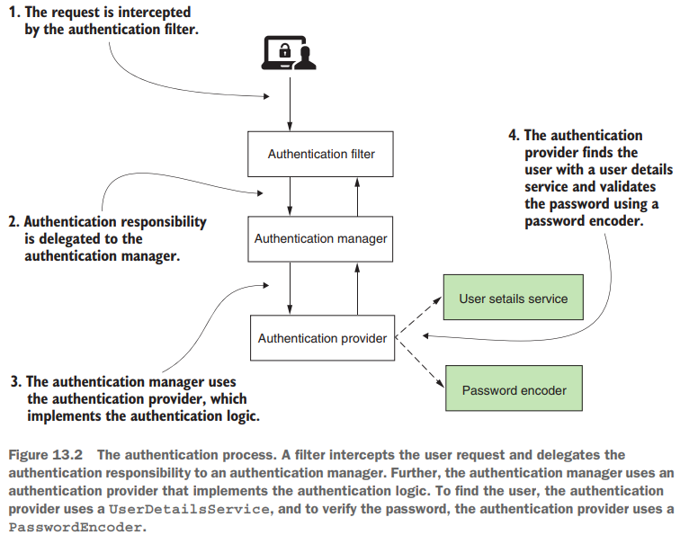

# [Pág. 316] Capítulo 13 - OAuth 2: Implementación de servidor de autorización

La función del servidor de autorización es autenticar al usuario y proporcionar un token al cliente. El cliente usa este
token para acceder a los recursos expuestos por el servidor de recursos en nombre del usuario. También aprendió que el
marco OAuth 2 define múltiples flujos para obtener un token. A estos flujos los llamamos concesiones **(grants).** El
comportamiento del servidor de autorizaciones es diferente según la concesión elegida.

En este capítulo, aprenderá cómo configurar un servidor de autorización con Spring Security para los tipos de concesión
de OAuth 2 más comunes:

- Authorization code grant type
- Password grant type
- Client credentials grant type

## [Pág. 318] Escribiendo su propia implementación del servidor de autorización

No hay flujo de OAuth 2 sin un servidor de autorización. El servidor de autorización es el componente de la arquitectura
OAuth 2 que emite tokens de acceso.

Las dependencias a agregar en el pom.xml:

````xml
<?xml version="1.0" encoding="UTF-8"?>
<project xmlns="http://maven.apache.org/POM/4.0.0" xmlns:xsi="http://www.w3.org/2001/XMLSchema-instance"
         xsi:schemaLocation="http://maven.apache.org/POM/4.0.0 https://maven.apache.org/xsd/maven-4.0.0.xsd">
    <modelVersion>4.0.0</modelVersion>

    <parent>
        <groupId>org.springframework.boot</groupId>
        <artifactId>spring-boot-starter-parent</artifactId>
        <version>2.3.0.RELEASE</version>
        <relativePath/>
    </parent>

    <groupId>com.magadiflo.book.security</groupId>
    <artifactId>spring-security-in-action-2020</artifactId>
    <version>0.0.1-SNAPSHOT</version>
    <name>spring-security-in-action-2020</name>
    <description>Demo project for Spring Boot</description>

    <properties>
        <java.version>17</java.version>
        <spring-cloud.version>Hoxton.SR1</spring-cloud.version>
    </properties>

    <dependencies>
        <dependency>
            <groupId>org.springframework.boot</groupId>
            <artifactId>spring-boot-starter-security</artifactId>
        </dependency>
        <dependency>
            <groupId>org.springframework.boot</groupId>
            <artifactId>spring-boot-starter-web</artifactId>
        </dependency>
        <dependency>
            <groupId>org.springframework.cloud</groupId>
            <artifactId>spring-cloud-starter-oauth2</artifactId>
        </dependency>

        <dependency>
            <groupId>org.springframework.boot</groupId>
            <artifactId>spring-boot-starter-test</artifactId>
            <scope>test</scope>
        </dependency>
        <dependency>
            <groupId>org.springframework.security</groupId>
            <artifactId>spring-security-test</artifactId>
            <scope>test</scope>
        </dependency>
    </dependencies>
    <dependencyManagement>
        <dependencies>
            <dependency>
                <groupId>org.springframework.cloud</groupId>
                <artifactId>spring-cloud-dependencies</artifactId>
                <version>${spring-cloud.version}</version>
                <type>pom</type>
                <scope>import</scope>
            </dependency>
        </dependencies>
    </dependencyManagement>

    <build>
        <plugins>
            <plugin>
                <groupId>org.springframework.boot</groupId>
                <artifactId>spring-boot-maven-plugin</artifactId>
            </plugin>
        </plugins>
    </build>

</project>
````

**NOTA**

> Observar que cambiamos la **versión de Spring Boot a 2.3.0.RELEASE** para usar la dependencia de **OAuth2**, además,
> como sabemos cada versión de Spring Boot se corresponde con su versión en Spring Cloud, en este caso establecimos
**la versión de Spring Cloud a Hoxton.SR1**.

Creamos la clase de configuración:

````java

@EnableAuthorizationServer
@Configuration
public class AuthServerConfig extends AuthorizationServerConfigurerAdapter {
}
````

**DONDE**

- **@EnableAuthorizationServer**, de esta forma, le indicamos a Spring Boot que habilite la configuración específica del
  servidor de autorización de OAuth 2.
- **AuthorizationServerConfigurerAdapter**, nos permitirá personalizar esta configuración al extenderla y anulando
  métodos específicos que analizaremos en este capítulo.

Ya tenemos la configuración mínima para nuestro servidor de autorizaciones. ¡Esto es increíble! Sin embargo, para que
sea utilizable, todavía tenemos que implementar la administración de usuarios, registrar al menos un cliente y decidir
qué tipos de concesiones admitir.

## [Pág. 319] Definición de la gestión de usuarios

El servidor de autorización es el componente que se ocupa de la autenticación de un usuario en el marco OAuth 2.
Entonces, naturalmente, necesita administrar usuarios. Afortunadamente, la implementación de la administración de
usuarios no ha cambiado con respecto a lo que aprendió en los capítulos 3 y 4. Seguimos usando los contratos
UserDetails, UserDetailsService y UserDetailsManager para administrar las credenciales. Y para administrar contraseñas,
seguimos usando el contrato PasswordEncoder. Aquí, estos tienen los mismos roles y funcionan de la misma manera que
aprendió en los capítulos 3 y 4. Detrás de escena está la arquitectura de autenticación estándar, que discutimos en los
capítulos anteriores.

La Figura 13.2 le recuerda los componentes principales que actúan en el proceso de autenticación en Spring Security.
**Lo que debe observar de manera diferente a la forma en que describimos la arquitectura de autenticación hasta ahora es
que ya no tenemos un SecurityContext en este diagrama.** Este cambio se produjo porque el resultado de la autenticación
no se almacena en SecurityContext. En cambio, la autenticación se gestiona con un token de un TokenStore.



A continuación creamos una nueva clase para implementar la gestión de usuarios:

````java

@Configuration
public class UserManagementConfig {
    @Bean
    public UserDetailsService userDetailsService() {
        UserDetails userDetails = User.builder()
                .username("admin")
                .password("12345")
                .build();

        InMemoryUserDetailsManager inMemoryUserDetailsManager = new InMemoryUserDetailsManager();
        inMemoryUserDetailsManager.createUser(userDetails);

        return inMemoryUserDetailsManager;
    }

    @Bean
    public PasswordEncoder passwordEncoder() {
        return NoOpPasswordEncoder.getInstance();
    }
}
````

Ahora que tenemos usuarios, solo **necesitamos vincular la administración de usuarios a la configuración del servidor de
autorización.** Para hacer esto, **expongo el AuthenticationManager como un bean en el contexto de Spring** y **luego lo
uso en la clase AuthServerConfig.** La siguiente lista le muestra cómo agregar AuthenticationManager como un bean en el
contexto de Spring.

````java

@Configuration
public class WebSecurityConfig extends WebSecurityConfigurerAdapter {
    @Bean
    @Override
    public AuthenticationManager authenticationManagerBean() throws Exception {
        return super.authenticationManagerBean();
    }
}
````

Ahora podemos cambiar la clase AuthServerConfig para **registrar el AuthenticationManager con el servidor de
autorización.** La siguiente lista le muestra los cambios que debe realizar en la clase AuthServerConfig.

````java

@EnableAuthorizationServer
@Configuration
public class AuthServerConfig extends AuthorizationServerConfigurerAdapter {

    @Autowired
    private AuthenticationManager authenticationManager;

    @Override
    public void configure(AuthorizationServerEndpointsConfigurer endpoints) throws Exception {
        endpoints.authenticationManager(this.authenticationManager);
    }
}
````

Con estas configuraciones implementadas, ahora tenemos usuarios que pueden autenticarse en nuestro servidor de
autenticación. Pero la arquitectura OAuth 2 implica que los usuarios otorgan privilegios a un cliente. Es el cliente que
utiliza los recursos en nombre de un usuario.

