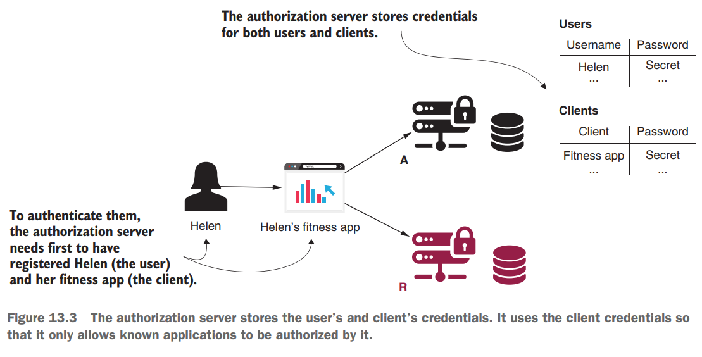
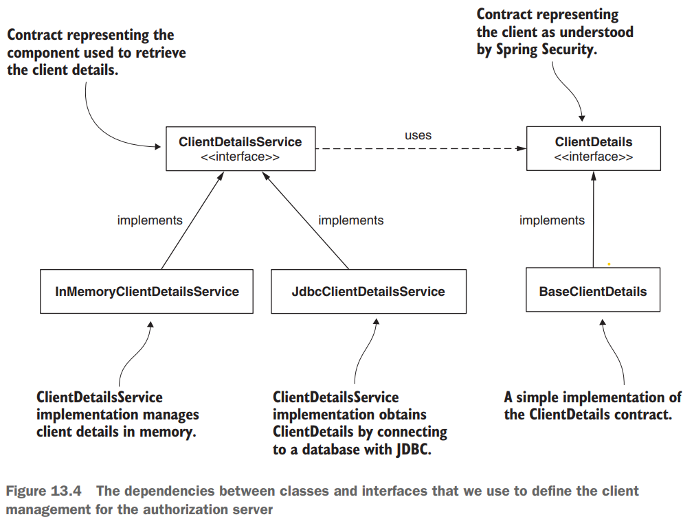

# [Pág. 316] Capítulo 13 - OAuth 2: Implementación de servidor de autorización

La función del servidor de autorización es autenticar al usuario y proporcionar un token al cliente. El cliente usa este
token para acceder a los recursos expuestos por el servidor de recursos en nombre del usuario. También aprendió que el
marco OAuth 2 define múltiples flujos para obtener un token. A estos flujos los llamamos concesiones **(grants).** El
comportamiento del servidor de autorizaciones es diferente según la concesión elegida.

En este capítulo, aprenderá cómo configurar un servidor de autorización con Spring Security para los tipos de concesión
de OAuth 2 más comunes:

- Authorization code grant type
- Password grant type
- Client credentials grant type

## [Pág. 318] Escribiendo su propia implementación del servidor de autorización

No hay flujo de OAuth 2 sin un servidor de autorización. El servidor de autorización es el componente de la arquitectura
OAuth 2 que emite tokens de acceso.

Las dependencias a agregar en el pom.xml:

````xml
<?xml version="1.0" encoding="UTF-8"?>
<project xmlns="http://maven.apache.org/POM/4.0.0" xmlns:xsi="http://www.w3.org/2001/XMLSchema-instance"
         xsi:schemaLocation="http://maven.apache.org/POM/4.0.0 https://maven.apache.org/xsd/maven-4.0.0.xsd">
    <modelVersion>4.0.0</modelVersion>

    <parent>
        <groupId>org.springframework.boot</groupId>
        <artifactId>spring-boot-starter-parent</artifactId>
        <version>2.3.0.RELEASE</version>
        <relativePath/>
    </parent>

    <groupId>com.magadiflo.book.security</groupId>
    <artifactId>spring-security-in-action-2020</artifactId>
    <version>0.0.1-SNAPSHOT</version>
    <name>spring-security-in-action-2020</name>
    <description>Demo project for Spring Boot</description>

    <properties>
        <java.version>17</java.version>
        <spring-cloud.version>Hoxton.SR1</spring-cloud.version>
    </properties>

    <dependencies>
        <dependency>
            <groupId>org.springframework.boot</groupId>
            <artifactId>spring-boot-starter-security</artifactId>
        </dependency>
        <dependency>
            <groupId>org.springframework.boot</groupId>
            <artifactId>spring-boot-starter-web</artifactId>
        </dependency>
        <dependency>
            <groupId>org.springframework.cloud</groupId>
            <artifactId>spring-cloud-starter-oauth2</artifactId>
        </dependency>

        <dependency>
            <groupId>org.springframework.boot</groupId>
            <artifactId>spring-boot-starter-test</artifactId>
            <scope>test</scope>
        </dependency>
        <dependency>
            <groupId>org.springframework.security</groupId>
            <artifactId>spring-security-test</artifactId>
            <scope>test</scope>
        </dependency>
    </dependencies>
    <dependencyManagement>
        <dependencies>
            <dependency>
                <groupId>org.springframework.cloud</groupId>
                <artifactId>spring-cloud-dependencies</artifactId>
                <version>${spring-cloud.version}</version>
                <type>pom</type>
                <scope>import</scope>
            </dependency>
        </dependencies>
    </dependencyManagement>

    <build>
        <plugins>
            <plugin>
                <groupId>org.springframework.boot</groupId>
                <artifactId>spring-boot-maven-plugin</artifactId>
            </plugin>
        </plugins>
    </build>

</project>
````

**NOTA**

> Observar que cambiamos la **versión de Spring Boot a 2.3.0.RELEASE** para usar la dependencia de **OAuth2**, además,
> como sabemos cada versión de Spring Boot se corresponde con su versión en Spring Cloud, en este caso establecimos
**la versión de Spring Cloud a Hoxton.SR1**.

Creamos la clase de configuración:

````java

@EnableAuthorizationServer
@Configuration
public class AuthServerConfig extends AuthorizationServerConfigurerAdapter {
}
````

**DONDE**

- **@EnableAuthorizationServer**, de esta forma, le indicamos a Spring Boot que habilite la configuración específica del
  servidor de autorización de OAuth 2.
- **AuthorizationServerConfigurerAdapter**, nos permitirá personalizar esta configuración al extenderla y anulando
  métodos específicos que analizaremos en este capítulo.

Ya tenemos la configuración mínima para nuestro servidor de autorizaciones. ¡Esto es increíble! Sin embargo, para que
sea utilizable, todavía tenemos que implementar la administración de usuarios, registrar al menos un cliente y decidir
qué tipos de concesiones admitir.

## [Pág. 319] Definición de la gestión de usuarios

El servidor de autorización es el componente que se ocupa de la autenticación de un usuario en el marco OAuth 2.
Entonces, naturalmente, necesita administrar usuarios. Afortunadamente, la implementación de la administración de
usuarios no ha cambiado con respecto a lo que aprendió en los capítulos 3 y 4. Seguimos usando los contratos
UserDetails, UserDetailsService y UserDetailsManager para administrar las credenciales. Y para administrar contraseñas,
seguimos usando el contrato PasswordEncoder. Aquí, estos tienen los mismos roles y funcionan de la misma manera que
aprendió en los capítulos 3 y 4. Detrás de escena está la arquitectura de autenticación estándar, que discutimos en los
capítulos anteriores.

La Figura 13.2 le recuerda los componentes principales que actúan en el proceso de autenticación en Spring Security.
**Lo que debe observar de manera diferente a la forma en que describimos la arquitectura de autenticación hasta ahora es
que ya no tenemos un SecurityContext en este diagrama.** Este cambio se produjo porque el resultado de la autenticación
no se almacena en SecurityContext. En cambio, la autenticación se gestiona con un token de un TokenStore.


A continuación creamos una nueva clase para implementar la gestión de usuarios:

````java

@Configuration
public class UserManagementConfig {
    @Bean
    public UserDetailsService userDetailsService() {
        UserDetails userDetails = User.builder()
                .username("admin")
                .password("12345")
                .build();

        InMemoryUserDetailsManager inMemoryUserDetailsManager = new InMemoryUserDetailsManager();
        inMemoryUserDetailsManager.createUser(userDetails);

        return inMemoryUserDetailsManager;
    }

    @Bean
    public PasswordEncoder passwordEncoder() {
        return NoOpPasswordEncoder.getInstance();
    }
}
````

Ahora que tenemos usuarios, solo **necesitamos vincular la administración de usuarios a la configuración del servidor de
autorización.** Para hacer esto, **expongo el AuthenticationManager como un bean en el contexto de Spring** y **luego lo
uso en la clase AuthServerConfig.** La siguiente lista le muestra cómo agregar AuthenticationManager como un bean en el
contexto de Spring.

````java

@Configuration
public class WebSecurityConfig extends WebSecurityConfigurerAdapter {
    @Bean
    @Override
    public AuthenticationManager authenticationManagerBean() throws Exception {
        return super.authenticationManagerBean();
    }
}
````

Ahora podemos cambiar la clase AuthServerConfig para **registrar el AuthenticationManager con el servidor de
autorización.** La siguiente lista le muestra los cambios que debe realizar en la clase AuthServerConfig.

````java

@EnableAuthorizationServer
@Configuration
public class AuthServerConfig extends AuthorizationServerConfigurerAdapter {

    @Autowired
    private AuthenticationManager authenticationManager;

    @Override
    public void configure(AuthorizationServerEndpointsConfigurer endpoints) throws Exception {
        endpoints.authenticationManager(this.authenticationManager);
    }
}
````

Con estas configuraciones implementadas, ahora tenemos usuarios que pueden autenticarse en nuestro servidor de
autenticación. Pero la arquitectura OAuth 2 implica que los usuarios otorgan privilegios a un cliente. Es el cliente que
utiliza los recursos en nombre de un usuario.

## [322] Registro de clientes con el servidor de autorizaciones

En esta sección, aprenderá cómo dar a conocer sus clientes al servidor de autorización. Para llamar al servidor de
autorización, una aplicación que actúa como cliente en la arquitectura OAuth 2 necesita sus propias credenciales. El
servidor de autorizaciones también gestiona estas credenciales y solo permite solicitudes de clientes conocidos (figura
13.3).



**¿Recuerda la aplicación de cliente que desarrollamos en el capítulo 12?** Usamos **GitHub como nuestro servidor de
autenticación.** GitHub necesitaba conocer la aplicación del cliente, por lo que lo primero que hicimos fue registrar la
aplicación en GitHub. Luego recibimos una identificación de cliente y un secreto de cliente: las credenciales del
cliente. Configuramos estas credenciales y nuestra aplicación las usó para autenticarse con el servidor de
autorización (GitHub). Lo mismo se aplica en este caso. Nuestro servidor de autorización necesita conocer a sus clientes
porque acepta solicitudes de ellos. Aquí el proceso debería volverse familiar.

El **contrato que define el cliente para el servidor de autorizaciones es ClientDetails.** El **contrato** que define el
objeto **para recuperar ClientDetails por sus ID es ClientDetailsService.**

**¿Te suenan familiares estos nombres?** Estas interfaces funcionan como las interfaces UserDetails y
UserDetailsService, pero representan a los clientes. Encontrará que muchas de las cosas que discutimos en el capítulo 3
funcionan de manera similar para ClientDetails y ClientDetailsService. Por ejemplo, nuestro InMemoryClientDetailsService
es una implementación de la interfaz ClientDetailsService, que administra ClientDetails en la memoria. Funciona de
manera similar a la clase InMemoryUserDetailsManager para UserDetails. Asimismo, JdbcClientDetailsService es similar a
JdbcUserDetailsManager. La Figura 13.4 muestra estas clases e interfaces, y las relaciones entre ellas.



Podemos resumir estas similitudes en unos pocos puntos que recordarás fácilmente:

- ClientDetails es para el cliente lo que UserDetails es para el usuario.
- ClientDetailsService es para el cliente lo que UserDetailsService es para el usuario.
- InMemoryClientDetailsService es para el cliente lo que InMemoryUserDetailsManager es para el usuario.
- JdbcClientDetailsService es para el cliente lo que JdbcUserDetailsManager es para el usuario.

El listado 13.5 le muestra cómo definir una configuración de cliente y configurarla usando InMemoryClientDetailsService.
La clase BaseClientDetails que uso en la lista es una implementación de la interfaz ClientDetails proporcionada por
Spring Security. En el listado 13.6, puede encontrar una forma más corta de escribir la misma configuración.

````java

@EnableAuthorizationServer
@Configuration
public class AuthServerConfig extends AuthorizationServerConfigurerAdapter {

    /* other code */

    @Override
    public void configure(ClientDetailsServiceConfigurer clients) throws Exception {
        BaseClientDetails clientDetails = new BaseClientDetails();
        clientDetails.setClientId("client");
        clientDetails.setClientSecret("secret");
        clientDetails.setScope(List.of("read"));
        clientDetails.setAuthorizedGrantTypes(List.of("password"));

        InMemoryClientDetailsService inMemoryClientDetailsService = new InMemoryClientDetailsService();
        inMemoryClientDetailsService.setClientDetailsStore(Map.of("client", clientDetails));

        clients.withClientDetails(inMemoryClientDetailsService);
    }
}
````

El listado 13.6 presenta un método más corto para escribir la misma configuración. Esto nos permite evitar la repetición
y escribir un código más limpio.

````java

@EnableAuthorizationServer
@Configuration
public class AuthServerConfig extends AuthorizationServerConfigurerAdapter {

    /* other code */

    @Override
    public void configure(ClientDetailsServiceConfigurer clients) throws Exception {
        clients.inMemory()
                .withClient("client")
                .secret("secret")
                .authorizedGrantTypes("password")
                .scopes("read");
    }
}
````

Para escribir menos código, prefiero usar la versión más corta que la más detallada del listado 13.5. Pero si escribe
una implementación en la que almacena los detalles del cliente en una base de datos, que es principalmente el caso de
los escenarios del mundo real, entonces es mejor usar los contratos del listado 13.5 (código más detallado).

**NOTA**
> Como hicimos con UserDetailsService, en este ejemplo usamos una implementación que administra los detalles en la
> memoria. Este enfoque solo funciona para ejemplos y propósitos de estudio. En un escenario del mundo real, usaría una
> implementación que conserva estos detalles, generalmente en una base de datos.

