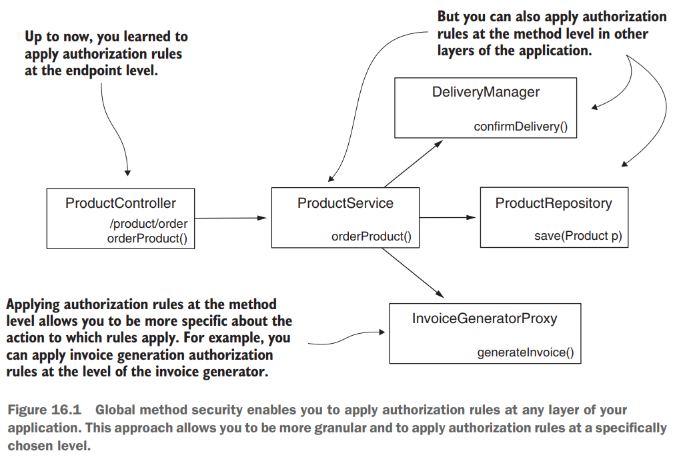
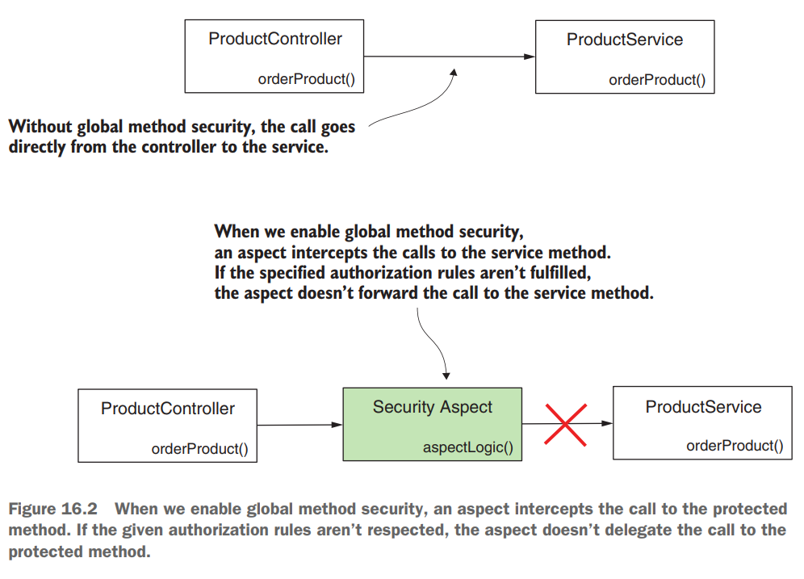
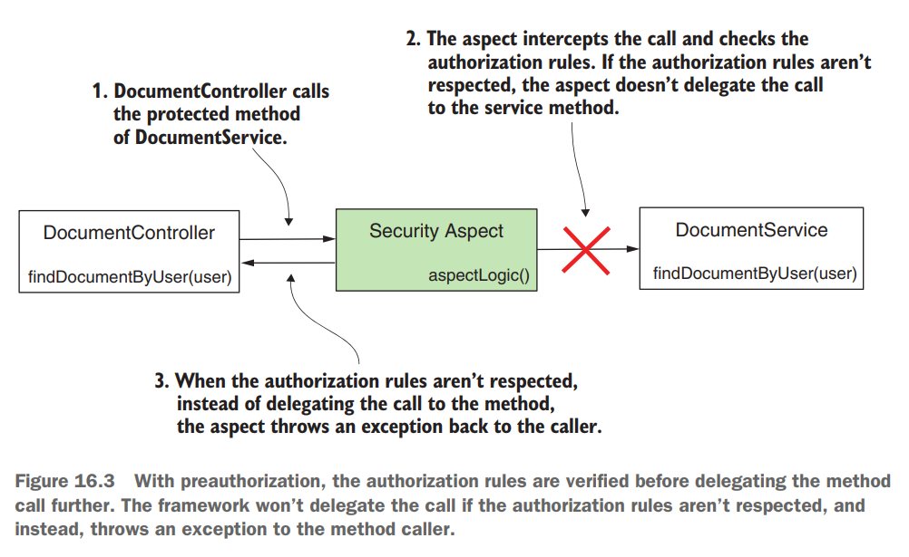
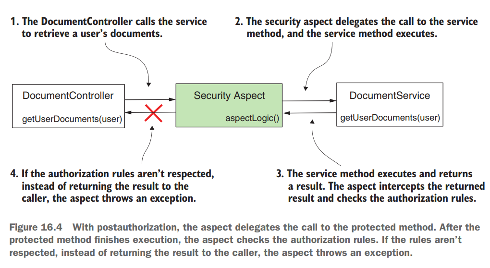
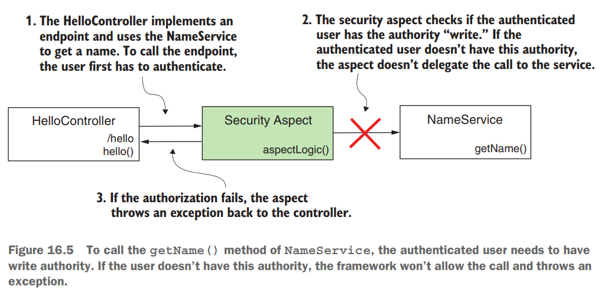
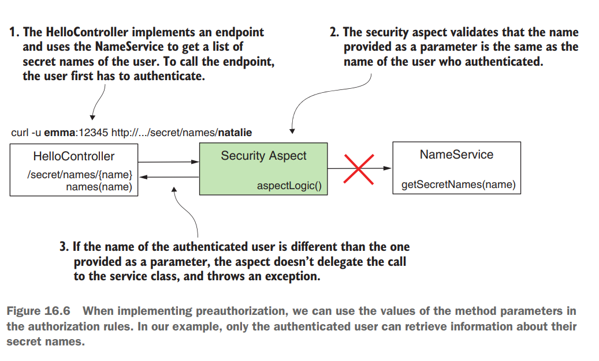

# [Pág. 387] Capítulo 16 - Seguridad global del método: Autorizaciones pre y post

Hasta ahora, discutimos varias formas de configurar la autenticación. Comenzamos con el enfoque más sencillo, HTTP basic
, en el capítulo 2, y luego le mostré cómo configurar el formulario de inicio de sesión en el capítulo 5. Cubrimos
OAuth 2 en los capítulos 12 al 15. Pero en términos de autorización, solo discutimos la configuración en el nivel del
endpoint.

Suponga que su aplicación no es una aplicación web, **¿no puede usar Spring Security también para autenticación y
autorización?** Spring Security es una buena opción para escenarios en los que su aplicación no se usa a través de
endpoints HTTP.

**En este capítulo, aprenderá a configurar la autorización a nivel de método.** Usaremos este **enfoque para**
configurar la autorización en **aplicaciones web y no web**, y lo llamaremos **seguridad de método global** (figura
16.1).



## [Pág. 388] Habilitación de la seguridad del método global

En esta sección, aprenderá cómo habilitar la autorización a nivel de método y las diferentes opciones que ofrece Spring
Security para aplicar varias reglas de autorización. **Este enfoque le proporciona una mayor flexibilidad a la hora de
solicitar la autorización.** Es una habilidad esencial que le permite resolver situaciones en las que la autorización
simplemente no se puede configurar solo a nivel de endpoint.

**De forma predeterminada, la seguridad del método global está deshabilitada**, por lo que si desea utilizar esta
funcionalidad, primero debe habilitarla. Además, la seguridad del método global ofrece múltiples enfoques para aplicar
la autorización. En resumen, puede hacer dos cosas principales con la seguridad de método global:

- **Call authorization**, decide si alguien **puede llamar a un método** de acuerdo con algunas reglas de privilegio
  implementadas **(autorización previa)** o si alguien puede acceder a lo que devuelve el método después de que se
  ejecuta **(autorización posterior).**
- **Filtering**, decide lo que un método puede recibir a través de sus parámetros (prefiltrado) y lo que la persona que
  llama puede recibir del método después de que se ejecuta el método (postfiltrado).

## [Pág. 389] Entendiendo la autorización de llamadas (Call authorization)

Uno de los enfoques para configurar las reglas de autorización que utiliza con la seguridad de método global es la
autorización de llamadas (call authorization). **El enfoque de autorización de llamadas se refiere a la aplicación de
reglas de autorización que deciden si se puede llamar a un método, o que permiten que se llame al método y luego deciden
si la persona que llama puede acceder al valor devuelto por el método.** A menudo, necesitamos decidir si alguien puede
acceder a una parte de la lógica según los parámetros proporcionados o su resultado.

¿Cómo funciona la seguridad del método global? ¿Cuál es el mecanismo detrás de la aplicación de las reglas de
autorización? Cuando habilitamos la seguridad del método global en nuestra aplicación, en realidad habilitamos un
aspecto de Spring. Este **aspecto intercepta las llamadas al método para el que aplicamos reglas de autorización y, en
base a estas reglas de autorización, decide si reenvía la llamada al método interceptado** (figura 16.2).



Muchas implementaciones en Spring Framework se basan en la programación orientada a aspectos (AOP). La seguridad del
método global es solo uno de los muchos componentes de las aplicaciones Spring que se basan en aspectos. Brevemente,
clasificamos la autorización de llamada como:

- **PreAuthorization**: el marco comprueba las reglas de autorización antes de la llamada al método.
- **PostAuthorization**: el marco verifica las reglas de autorización después de que se ejecuta el método.

### [Pág. 390] Uso del PreAuthorization para garantizar el acceso a los métodos

Digamos que tenemos un método findDocumentsByUser(String username) que regresa los documentos a la persona que llama
para un usuario específico. La persona que llama proporciona a través de los parámetros del método el nombre del usuario
para el cual el método recupera los documentos. Suponga que necesita asegurarse de que el usuario autenticado solo pueda
obtener sus propios documentos. **¿Podemos aplicar una regla a este método de modo que solo se permitan las llamadas al
método que recibe como parámetro el nombre del usuario autenticado?** ¡Sí! Esto es algo que hacemos con la autorización
previa.

**Cuando aplicamos reglas de autorización que prohíben por completo que alguien llame a un método en situaciones
específicas, lo llamamos preautorización** (figura 16.3). Este enfoque implica que el marco verifica las condiciones de
autorización antes de ejecutar el método. Si la persona que llama no tiene los permisos de acuerdo con las reglas de
autorización que definimos, el marco no delega la llamada al método. En su lugar, el marco lanza una excepción. Este es,
con mucho, el enfoque más utilizado para la seguridad de métodos globales.

Por lo general, no queremos que se ejecute una funcionalidad si no se cumplen algunas condiciones. **Puede aplicar
condiciones basadas en el usuario autenticado y también puede hacer referencia a los valores que recibió el método a
través de sus parámetros.**



### [Pág. 391] Uso del PostAuthorization para asegurar una llamada de método

Cuando aplicamos reglas de autorización que permiten a alguien llamar a un método pero **no necesariamente obtener el
resultado devuelto por el método**, estamos usando la postAuthorization (figura 16.4).

Con postAuthorization, Spring Security verifica las reglas de autorización después de que se ejecuta el método. Puede
utilizar este tipo de autorización para restringir el acceso a la devolución del método en determinadas condiciones.
Debido a que el postAuthorization ocurre después de la ejecución del método, puede aplicar las reglas de
autorización en el resultado devuelto por el método.



Por lo general, usamos el postAuthorization para aplicar reglas de autorización basadas en lo que devuelve el método
después de la ejecución. **¡Pero tenga cuidado con el postAuthorization!** Si el método muta algo durante su ejecución,
el cambio ocurre ya sea que la autorización tenga éxito o no al final.

**NOTA**
> Incluso con la anotación @Transactional, un cambio no se revierte si falla el postAuthorization. La excepción lanzada
> por la funcionalidad del postAuthorization ocurre después de que el administrador de transacciones confirma la
> transacción (commit).

## [Pág. 391] Habilitación de la seguridad de métodos globales en su proyecto

En esta sección, trabajamos en un proyecto para aplicar las **características de preAuthorization y postAuthorization
que ofrece la seguridad de método global**. La seguridad del método global **no está habilitada de forma predeterminada
en un proyecto de Spring Security.** Sin embargo, **habilitar esta funcionalidad es sencillo**. Puede hacer esto
simplemente usando la anotación **@EnableGlobalMethodSecurity** en la clase de configuración.

La seguridad de método global nos ofrece tres enfoques para definir las reglas de autorización que analizamos en este
capítulo:

- ``Las anotaciones PreAuthorization y PostAuthorization.``
- La anotación JSR 250, @RolesAllowed
- La anotación @Secured

Debido a que **en casi todos los casos, las anotaciones preAuthorization y postAuthorization son el único enfoque
utilizado**, analizamos este enfoque en este capítulo. **Para habilitar este enfoque**, usamos el atributo
**prePostEnabled de la anotación @EnableGlobalMethodSecurity.** Presentamos una breve descripción de las otras dos
opciones mencionadas anteriormente al final de este capítulo.

````java

@EnableGlobalMethodSecurity(prePostEnabled = true)
@Configuration
public class ProjectConfig {
}
````

Puede utilizar la seguridad de método global (GlobalMethodSecurity) con cualquier método de autenticación, desde la
autenticación **HTTP Basic hasta OAuth 2.** Para mantenerlo simple y permitirle concentrarse en nuevos detalles,
proporcionamos seguridad de método global con autenticación HTTP Basic. Por esta razón, **el archivo pom.xml para los
proyectos de este capítulo solo necesita las dependencias web y Spring Security**, como se presenta en el siguiente
fragmento de código:

````xml
<?xml version="1.0" encoding="UTF-8"?>
<project xmlns="http://maven.apache.org/POM/4.0.0" xmlns:xsi="http://www.w3.org/2001/XMLSchema-instance"
         xsi:schemaLocation="http://maven.apache.org/POM/4.0.0 https://maven.apache.org/xsd/maven-4.0.0.xsd">
    <modelVersion>4.0.0</modelVersion>

    <parent>
        <groupId>org.springframework.boot</groupId>
        <artifactId>spring-boot-starter-parent</artifactId>
        <version>2.6.4</version>
        <relativePath/> <!-- lookup parent from repository -->
    </parent>

    <groupId>com.magadiflo.book.security</groupId>
    <artifactId>spring-security-in-action-2020</artifactId>
    <version>0.0.1-SNAPSHOT</version>
    <name>spring-security-in-action-2020</name>
    <description>Demo project for Spring Boot</description>

    <properties>
        <java.version>17</java.version>
    </properties>

    <dependencies>
        <dependency>
            <groupId>org.springframework.boot</groupId>
            <artifactId>spring-boot-starter-security</artifactId>
        </dependency>
        <dependency>
            <groupId>org.springframework.boot</groupId>
            <artifactId>spring-boot-starter-web</artifactId>
        </dependency>

        <dependency>
            <groupId>org.springframework.boot</groupId>
            <artifactId>spring-boot-starter-test</artifactId>
            <scope>test</scope>
        </dependency>
    </dependencies>

    <build>
        <plugins>
            <plugin>
                <groupId>org.springframework.boot</groupId>
                <artifactId>spring-boot-maven-plugin</artifactId>
            </plugin>
        </plugins>
    </build>

</project>
````

## [Pág. 392] Aplicando PreAuthorization para authorities y roles

**La preAuthorization implica definir las reglas de autorización** que aplica Spring Security antes de llamar a un
método específico. Si no se respetan las reglas, el framework no llama al método.

La aplicación que implementamos en esta sección tiene un escenario simple. **Expone un punto final, /hello,** que
devuelve la cadena "Hello", seguida de un nombre. Para obtener el nombre, **el controlador llama a un método de
servicio** (figura 16.5). Este método aplica una regla de **autorización previa** para verificar que el usuario tiene
autorización de escritura.



Agregué un UserDetailsService y un PasswordEncoder para asegurarme de que tengo algunos usuarios para autenticar. Para
validar nuestra solución, **necesitamos dos usuarios**: un usuario con autoridad de escritura y otro que no tiene
autoridad de escritura. Probamos que **el primer usuario puede llamar con éxito al punto final**, mientras que para el
**segundo usuario, la aplicación genera una excepción de autorización** cuando intenta llamar al método.

La siguiente lista muestra la definición completa de la clase de configuración, que define UserDetailsService y
PasswordEncoder.

````java

@EnableGlobalMethodSecurity(prePostEnabled = true)
@Configuration
public class ProjectConfig {
    @Bean
    public UserDetailsService userDetailsService() {

        UserDetails u1 = User.builder()
                .username("admin")
                .password("12345")
                .authorities("write")
                .build();

        UserDetails u2 = User.builder()
                .username("martin")
                .password("12345")
                .authorities("read")
                .build();

        InMemoryUserDetailsManager inMemoryUserDetailsManager = new InMemoryUserDetailsManager();
        inMemoryUserDetailsManager.createUser(u1);
        inMemoryUserDetailsManager.createUser(u2);

        return inMemoryUserDetailsManager;
    }

    @Bean
    public PasswordEncoder passwordEncoder() {
        return NoOpPasswordEncoder.getInstance();
    }
}
````

Para definir la regla de autorización para este método, usamos la anotación @PreAuthorize. **La anotación
@PreAuthorize** recibe como valor una expresión **Spring Expression Language (SpEL)** que **describe la regla de
autorización.** En este ejemplo, aplicamos una regla simple.

**Puede definir restricciones para los usuarios en función de sus autoridades utilizando el método hasAuthority().**
Aprendió sobre el método hasAuthority() en el capítulo 7, donde discutimos la aplicación de autorización en el nivel de
punto final. La siguiente lista define la clase de servicio, que proporciona el valor para el nombre.

````java

@Service
public class NameService {
    @PreAuthorize("hasAuthority('write')")
    public String getName() {
        return "Systems!";
    }
}
````

Definimos la clase de controlador en el siguiente listado. Utiliza NameService como dependencia.

````java

@RestController
public class HelloController {
    @Autowired
    private NameService nameService;

    @GetMapping(path = "/hello")
    public String hello() {
        return String.format("Hello, %s", this.nameService.getName());
    }
}
````

Ahora puede iniciar la aplicación y probar su comportamiento. Esperamos que solo el usuario admin esté autorizado para
llamar al extremo porque tiene autorización de write.

El siguiente fragmento de código presenta las llamadas para el extremo con nuestros dos usuarios, **admin y martin**.
Para llamar al extremo /hello y autenticarse con el usuario admin, use este comando cURL:

````bash
curl -v -u admin:12345 http://localhost:8080/hello

--- Response ---
< HTTP/1.1 200
<
Hello, Systems!
````

Para llamar al extremo /hello y autenticarse con el usuario martin, use este comando cURL:

````bash
curl -v -u martin:12345 http://localhost:8080/hello

--- Response ---
< HTTP/1.1 403
<
{ 
  "timestamp":"2023-06-15T23:10:17.840+00:00",
  "status":403,
  "error":"Forbidden",
  "path":"/hello"
}
````

De manera similar, puede usar cualquier otra expresión que discutimos en el capítulo 7 para la autenticación de punto
final. He aquí un breve resumen de ellos:

- **hasAnyAuthority()**, especifica varias autoridades. El usuario debe tener al menos una de estas autorizaciones para
  llamar al método.
- **hasRole()**, especifica un rol que un usuario debe tener para llamar al método.
- **hasAnyRole()**, especifica varios roles. El usuario debe tener al menos uno de ellos para llamar al método.

Ampliemos nuestro ejemplo para probar cómo puede usar los valores de los parámetros del método para definir las reglas
de autorización (figura 16.6):



El punto final ahora toma un valor a través de una variable de ruta y llama a una clase de servicio para obtener los "
nombres secretos" para un nombre de usuario determinado. Por supuesto, en este caso, los nombres secretos son solo un
invento mío que hace referencia a una característica del usuario, que es algo que no todos pueden ver. Defino la clase
de controlador como se presenta en el siguiente listado.

````java

@RestController
public class HelloController {
    @Autowired
    private NameService nameService;

    /* other code */

    @GetMapping(path = "/secret/names/{name}")
    public List<String> names(@PathVariable String name) {
        return this.nameService.getSecretNames(name);
    }
}
````

Ahora echemos un vistazo a cómo implementar la clase NameService en el listado 16.6. **La expresión que usamos para la
autorización ahora es #name == authentication.principal.username.** En esta expresión, usamos **#name para referirnos al
valor del parámetro del método getSecretNames(String name) <-- el parámetro name,** y tenemos acceso directo al objeto
de autenticación que podemos usar para referirnos al usuario actualmente autenticado. **La expresión que usamos indica**
que el método puede llamarse solo si el nombre de usuario del usuario autenticado es el mismo que el valor enviado a
través del parámetro del método. En otras palabras, **un usuario solo puede recuperar sus propios nombres secretos.**

````java

@Service
public class NameService {
    /* other code */

    @PreAuthorize("#name == authentication.principal.username")
    public List<String> getSecretNames(String name) { //<--- el #name, toma el valor de este name
        return this.secretName.get(name);
    }

    private final Map<String, List<String>> secretName = Map.of(
            "admin", List.of("Enérgico", "Perfecto"),
            "martin", List.of("Fantástico"));

}
````

Iniciamos la aplicación y la probamos para comprobar que funciona como se desea. El siguiente fragmento de código
muestra el comportamiento de la aplicación al llamar al punto final, proporcionando el valor de la variable de ruta
igual al nombre del usuario:

````bash
curl -v -u martin:12345 http://localhost:8080/secret/names/martin

--- Response ---
< HTTP/1.1 200
<
["Fantástico"]
````

Ahora, al autenticarnos con el usuario martin, tratamos de obtener los nombres secretos de admin. La llamada no
funciona:

````bash
curl -v -u martin:12345 http://localhost:8080/secret/names/admin

--- Response ---
< HTTP/1.1 403
<
{ 
  "timestamp":"2023-06-15T23:45:32.608+00:00",
  "status":403,
  "error":"Forbidden",
  "path":"/secret/names/admin"
}
````

Sin embargo, la admin puede obtener sus propios nombres secretos. El siguiente fragmento de código lo
demuestra:

````bash
curl -v -u admin:12345 http://localhost:8080/secret/names/admin

--- Response ---
< HTTP/1.1 200
<
["Enérgico","Perfecto"]
````

**NOTA**

Recuerde, ``puede aplicar seguridad de método global a cualquier capa de su aplicación.`` En los ejemplos presentados en
este capítulo, encontrará las reglas de autorización aplicadas para los métodos de las clases de servicio. Pero puede
aplicar reglas de autorización con seguridad de método global en cualquier parte de su aplicación: repositorios,
administradores, proxies, etc.