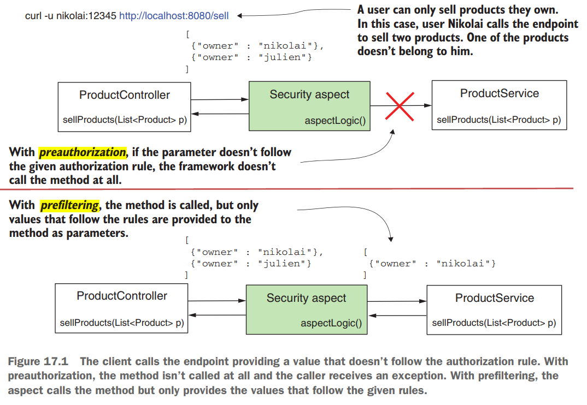
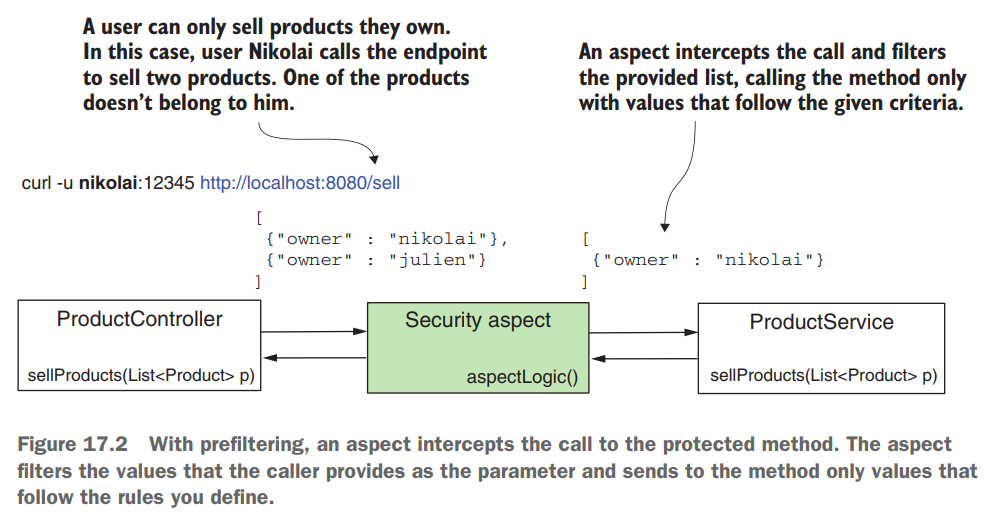
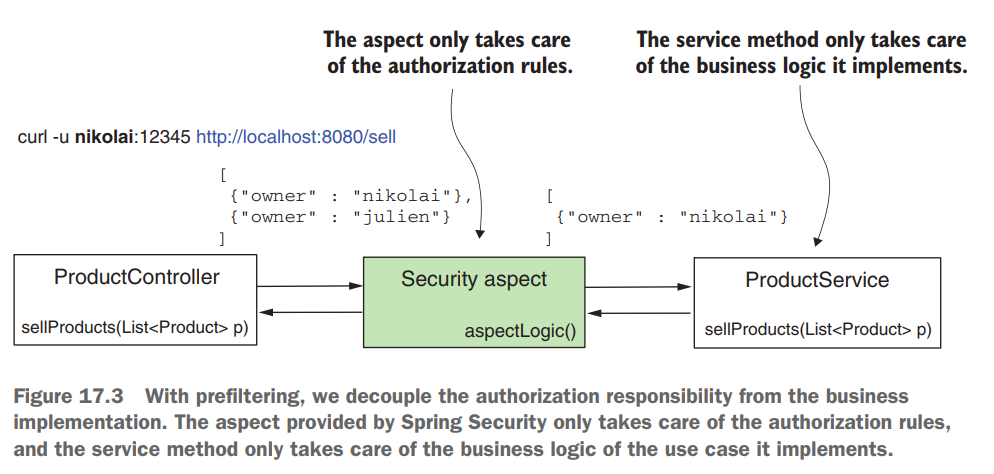
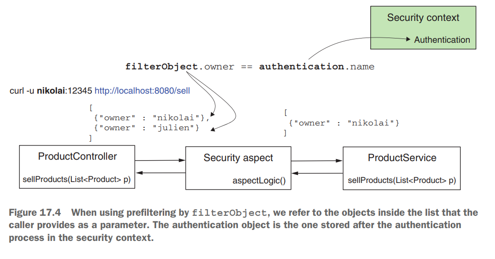
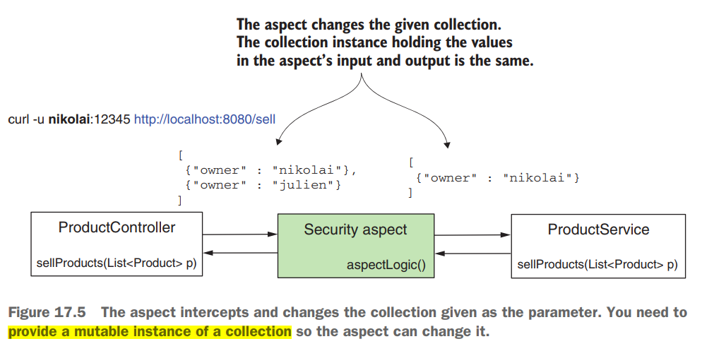

# [Pág. 413] Capítulo 17 - Seguridad global del método: pre y post filtrado

En el capítulo 16, aprendió cómo aplicar reglas de autorización usando seguridad de método global. Trabajamos en
ejemplos usando las anotaciones **@PreAuthorize y @PostAuthorize**. Al usar estas anotaciones, aplica un enfoque en el
que la aplicación permite la llamada al método o la rechaza por completo. **Suponga que no quiere prohibir la llamada
a un método, pero quiere asegurarse de que los parámetros enviados sigan algunas reglas**. O, en otro escenario, quiere
asegurarse de que después de que alguien llame al método, la persona que llama al método solo reciba una parte
autorizada del valor devuelto. **Llamamos filtrado de funcionalidad a este tipo y lo clasificamos en dos categorías:**

- **Prefiltering**, el framework filtra los valores de los parámetros antes de llamar al método.
- **Postfiltering**, el framework filtra el valor devuelto después de la llamaa al método.



El filtrado funciona de manera diferente a la autorización de llamadas (figura 17.1). Con el filtrado, el marco ejecuta
la llamada y no lanza una excepción si un parámetro o valor devuelto no sigue una regla de autorización que defina. En
su lugar, filtra los elementos que no siguen las condiciones que especificas.

**Es importante mencionar desde el principio que solo puede aplicar filtros a colecciones y matrices.** Utiliza el
prefiltrado solo si el método recibe como parámetro una matriz o una colección de objetos. El marco filtra esta
colección o matriz de acuerdo con las reglas que defina. Lo mismo para el filtrado posterior: solo puede aplicar este
enfoque si el método devuelve una colección o una matriz. El marco filtra el valor que devuelve el método en función de
las reglas que especifique.

## [Pág. 414] Aplicación de filtrado previo para la autorización de métodos

En esta sección, analizamos el mecanismo detrás del prefiltrado y luego implementamos el prefiltrado en un ejemplo.
Puede usar el filtrado para indicarle al marco que valide los valores enviados a través de los parámetros del método
cuando alguien llama a un método. El marco filtra los valores que no coinciden con los criterios dados y llama al método
solo con valores que sí coinciden con los criterios. **A esta funcionalidad la llamamos prefiltrado (figura 17.2).**



Encontrará requisitos en ejemplos del mundo real donde el prefiltrado se aplica bien porque desvincula las reglas de
autorización de la lógica comercial que implementa el método. Supongamos que implementa un caso de uso en el que procesa
solo detalles específicos que pertenecen al usuario autenticado. Este caso de uso se puede llamar desde varios lugares.
Aun así, su responsabilidad siempre establece que solo se pueden procesar los datos del usuario autenticado,
independientemente de quién invoque el caso de uso. En lugar de asegurarse de que el invocador del caso de uso aplique
correctamente las reglas de autorización, haga que el caso aplique sus propias reglas de autorización. Por supuesto,
puede hacer esto dentro del método. Pero desvincular la lógica de autorización de la lógica empresarial mejora la
capacidad de mantenimiento de su código y facilita que otros lo lean y comprendan.

Como en el caso de la autorización de llamadas, que analizamos en el capítulo 16, Spring Security también implementa el
filtrado mediante el uso de aspectos. Los aspectos interceptan llamadas de métodos específicos y pueden aumentarlos con
otras instrucciones. Para el filtrado previo, un aspecto intercepta los métodos anotados con la anotación @PreFilter y
filtra los valores de la colección proporcionados como parámetro según los criterios que defina (figura 17.3).



Similar a las anotaciones @PreAuthorize y @PostAuthorize que analizamos en el capítulo 16, las reglas de autorización se
establecen como el valor de la anotación @PreFilter. En estas reglas, que proporciona como expresiones SpEL, **utiliza
filterObject para hacer referencia a cualquier elemento dentro de la colección o matriz** que proporcione como parámetro
para el método.

Digamos que tiene una aplicación para comprar y vender productos, y su backend implementa el punto final /sell. La
interfaz de la aplicación llama a este punto final cuando un usuario vende un producto. Pero el usuario que ha iniciado
sesión solo puede vender productos de su propiedad. Implementemos un escenario simple de un método de servicio llamado
para vender los productos recibidos como parámetro. Con este ejemplo, aprenderá a aplicar la anotación @PreFilter, ya
que esto es lo que usamos para asegurarnos de que el método solo reciba productos que pertenecen al usuario que ha
iniciado sesión actualmente.

Escribimos una clase de configuración para asegurarnos de que tenemos un par de usuarios para probar nuestra
implementación.

````java

@Configuration
public class UserManagementConfig {
    @Bean
    public UserDetailsService userDetailsService() {

        UserDetails u1 = User.builder()
                .username("nikolai")
                .password("12345")
                .authorities("read")
                .build();

        UserDetails u2 = User.builder()
                .username("julien")
                .password("12345")
                .authorities("write")
                .build();

        InMemoryUserDetailsManager inMemoryUserDetailsManager = new InMemoryUserDetailsManager();
        inMemoryUserDetailsManager.createUser(u1);
        inMemoryUserDetailsManager.createUser(u2);

        return inMemoryUserDetailsManager;
    }

    @Bean
    public PasswordEncoder passwordEncoder() {
        return NoOpPasswordEncoder.getInstance();
    }
}
````

La clase de configuración a la que llamo ProjectConfig lo anoto con @GlobalMethodSecurity(prePostEnabled=true).

````java

@EnableGlobalMethodSecurity(prePostEnabled = true)
@Configuration
public class ProjectConfig {

}
````

Para la anotación de filtrado, aún necesitamos usar la anotación @EnableGlobalMethodSecurity y habilitar las anotaciones
previas y posteriores a la autorización. El UserDetailsService proporcionado define los dos usuarios que necesitamos en
nuestras pruebas: Nikolai y Julien.

Describo el producto usando la clase de modelo que encuentra en el siguiente listado.

````java
public class Product {
    private String name;
    private String owner;

    /* omitted constructor, setters and getters */
}
````

La clase ProductService define el método de servicio que protegemos con @PreFilter. Puede encontrar la clase
ProductService en el listado 17.3. En ese listado, antes del método sellProducts(), puedes observar el uso de la
anotación @PreFilter. El Spring Expression Language (SpEL) utilizado con la anotación es **filterObject.owner ==
authentication.name**, que permite solo valores en los que el atributo de propietario del Producto es igual al nombre de
usuario del usuario que ha iniciado sesión. En el lado izquierdo del operador igual en la expresión SpEL; usamos
filterObject. **Con filterObject, nos referimos a los objetos de la lista como parámetros.** Debido a que tenemos una
lista de productos, **el filterObject en nuestro caso es de tipo Producto.** Por esta razón, podemos referirnos al
atributo owner del producto. En el lado derecho del operador igual en la expresión; usamos el objeto de autenticación.
Para las anotaciones @PreFilter y @PostFilter, podemos referirnos directamente al objeto de autenticación, que está
disponible en SecurityContext después de la autenticación (figura 17.4).



El método de servicio devuelve la lista exactamente como la recibe. De esta manera, podemos probar y validar que el
marco filtró la lista como esperábamos al verificar la lista devuelta en el cuerpo de la respuesta HTTP.

````java

@Service
public class ProductService {

    @PreFilter("filterObject.owner == authentication.name")
    public List<Product> sellProducts(List<Product> products) {
        // Vende productos y retorna la lista de productos vendidos
        return products;
    }
}
````

Para facilitar nuestras pruebas, defino un punto final para llamar al método de servicio protegido. El listado 17.4
define este punto final en una clase de controlador llamada ProductController. Aquí, para acortar la llamada al punto
final, creo una lista y la proporciono directamente como un parámetro para el método de servicio. En un escenario del
mundo real, el cliente debe proporcionar esta lista en el cuerpo de la solicitud. También puede observar que uso
@GetMapping para una operación que sugiere una mutación, que no es estándar. Pero sepa que hago esto para evitar tener
que lidiar con la protección CSRF en nuestro ejemplo, y esto le permite concentrarse en el tema en cuestión. Aprendió
sobre la protección CSRF en el capítulo 10.

````java

@RestController
public class ProductController {

    @Autowired
    private ProductService productService;

    @GetMapping(path = "/sell")
    public List<Product> sellProduct() {
        List<Product> products = new ArrayList<>();

        products.add(new Product("beer", "nikolai"));
        products.add(new Product("candy", "nikolai"));
        products.add(new Product("chocolate", "julien"));

        return this.productService.sellProducts(products);
    }
}
````

Iniciemos la aplicación y veamos qué sucede cuando llamamos al punto final /sell. Observe los tres productos de la lista
que proporcionamos como parámetro para el método de servicio. Asigno dos de los productos al usuario Nikolai y el otro
al usuario Julien. Cuando llamamos al punto final y nos autenticamos con el usuario Nikolai, esperamos ver en la
respuesta solo los dos productos asociados con ella. Cuando llamamos al punto final y nos autenticamos con Julien, solo
debemos encontrar en la respuesta el único producto asociado con Julien. En el siguiente fragmento de código, encontrará
las llamadas de prueba y sus resultados.

Para llamar al punto final /sell y autenticarse con el usuario Nikolai, use este comando, esperando como
respuesta los dos productos asociados a él, ya que fueron filtrados por el aspecto:

````bash
curl -v -u nikolai:12345 http://localhost:8080/sell

--- Response ---
< HTTP/1.1 200
<
[
  {"name":"beer","owner":"nikolai"},
  {"name":"candy","owner":"nikolai"}
]
````

Para llamar al punto final /sell y autenticarse con el usuario Julien, use este comando, esperando como
respuesta un producto asociado a él:

````bash
curl -v -u julien:12345 http://localhost:8080/sell

--- Response ---
< HTTP/1.1 200
<
[
  {"name":"chocolate","owner":"julien"}
]
````

Lo que debe tener cuidado es el hecho de que el aspecto cambia la colección dada. En nuestro caso, no espere que
devuelva una nueva instancia de List. De hecho, es la misma instancia de la que el aspecto eliminó los elementos que no
coincidían con los criterios dados. Esto es importante a tener en cuenta. **Siempre debe asegurarse de que la instancia
de colección que proporcione no sea inmutable.** Proporcionar una colección inmutable para ser procesada da como
resultado una excepción en el tiempo de ejecución porque el aspecto de filtrado no podrá cambiar el contenido de la
colección (figura 17.5)


