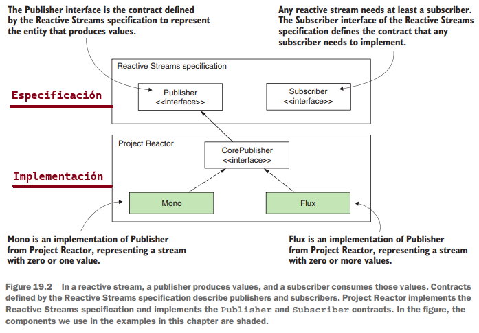
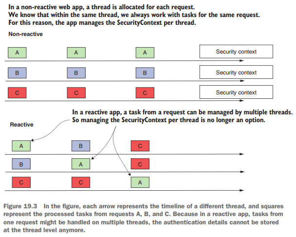
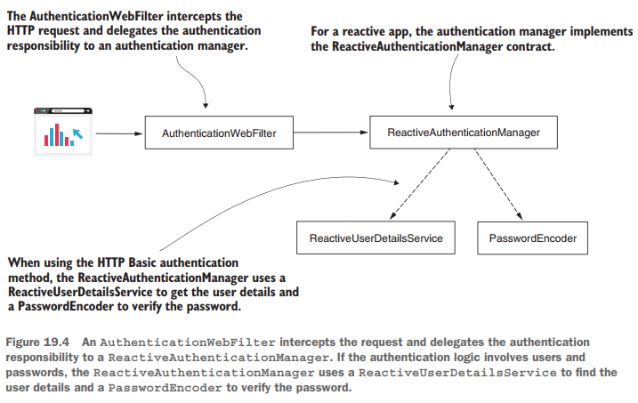
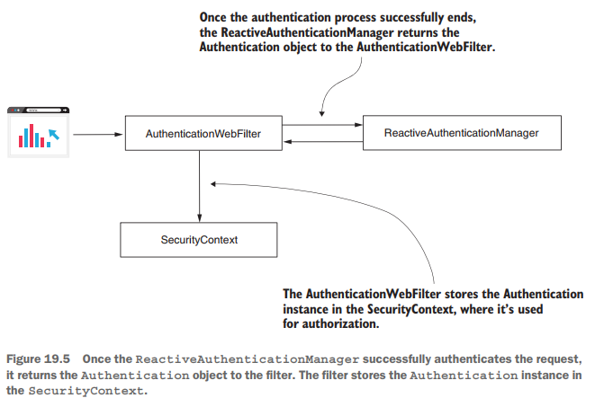
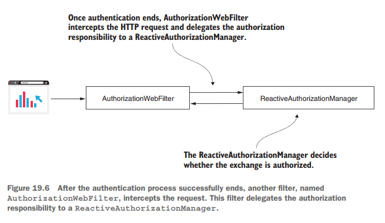
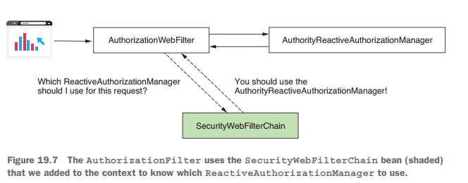
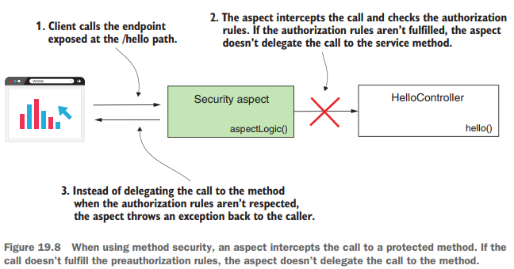

# [Pág. 467] Capítulo 19 - Spring Security para aplicaciones reactivas

---

`Reactive` **es un paradigma de programación en el que aplicamos una forma diferente de pensar a la hora de desarrollar
nuestras aplicaciones.**

En algunos casos, un enfoque reactivo es excelente. En otros casos, puede que solo te complique la vida. Pero, al fin y
al cabo, **el enfoque reactivo existe porque aborda algunas limitaciones de la programación imperativa,** y así se
utiliza para evitar dichas limitaciones. **Una de estas limitaciones tiene que ver con la ejecución de grandes tareas**
que, de alguna manera, pueden fragmentarse. `Con un enfoque imperativo`, le das a la aplicación una tarea para ejecutar,
y la aplicación tiene la responsabilidad de resolverla. Si la tarea es grande, la aplicación puede tardar bastante
tiempo en resolverla. El cliente que asignó la tarea tiene que esperar a que ésta se resuelva por completo antes de
recibir una respuesta. `Con la programación reactiva`, puedes dividir la tarea para que la aplicación tenga la
oportunidad de abordar algunas de las subtareas de forma concurrente. De este modo, el cliente recibe los datos
procesados más rápidamente.

## [Pág. 468] ¿Qué son las aplicaciones reactivas?

Cuando implementamos aplicaciones reactivas, utilizamos **dos enfoques para implementar las funcionalidades**. La
siguiente lista detalla estos enfoques:

- `Con el enfoque imperativo, la aplicación procesa la mayor parte de los datos de una sola vez`. Por ejemplo,
  una aplicación cliente llama a un endpoint expuesto por el servidor y envía al backend todos los datos que deben
  procesarse. Digamos que implementas una funcionalidad en la que el usuario sube archivos. Si el usuario selecciona
  una serie de archivos, y **todos ellos son recibidos por la aplicación backend para ser procesados todos a la vez,
  estás trabajando con un enfoque imperativo.**
- `Con el enfoque reactivo, tu aplicación recibe y procesa los datos en fragmentos`. No todos los datos tienen que
  estar completamente disponibles desde el principio para ser procesados. **El backend recibe y procesa los datos a
  medida que los obtiene.** Digamos que el usuario selecciona algunos archivos, y el backend necesita cargarlos y
  procesarlos. El backend no espera a recibir todos los archivos a la vez antes de procesarlos. **El backend puede
  recibir los archivos uno a uno y procesar cada uno mientras espera a que lleguen más archivos.**

Para implementar aplicaciones reactivas, la especificación [**Reactive Streams**](http://www.reactive-streams.org/)
proporciona una forma estándar para el **procesamiento de flujos asíncronos**. Una de las implementaciones de esta
especificación es el [**Proyecto Reactor**](https://projectreactor.io/), que construye los cimientos del modelo de
programación reactiva de Spring. **Project Reactor proporciona una API funcional para componer Reactive Streams.**

Para tener una sensación más práctica, vamos a empezar con una implementación sencilla de una aplicación reactiva. En
mi caso crearé el proyecto
[spring-security-in-action-2020-cap-19-reactive-app](https://github.com/magadiflo/spring-security-in-action-2020-cap-19-reactive-app.git)
que corresponde al proyecto `ssia-ch19-ex1` del libro de Spring Security In Action 2020.

En el archivo `pom.xml`, necesitamos añadir la dependencia web reactiva `spring-boot-starter-webflux`. Esta dependencia
aloja el `Proyecto Reactor` y nos permite utilizar sus clases e interfaces relacionadas en nuestro proyecto:

````xml
<!--Spring Boot 3.1.4-->
<!--  Java 17-->
<dependencies>
    <dependency>
        <groupId>org.springframework.boot</groupId>
        <artifactId>spring-boot-starter-webflux</artifactId>
    </dependency>

    <dependency>
        <groupId>org.springframework.boot</groupId>
        <artifactId>spring-boot-starter-test</artifactId>
        <scope>test</scope>
    </dependency>
    <dependency>
        <groupId>io.projectreactor</groupId>
        <artifactId>reactor-test</artifactId>
        <scope>test</scope>
    </dependency>
</dependencies>
````

El siguiente fragmento de código muestra la definición de la clase HelloController. En la definición del endpoint,
observarás que he utilizado como **tipo de retorno un Mono**. Mono es uno de los conceptos esenciales que define una
implementación de Reactor. Cuando se trabaja con **Reactor**, a menudo se utiliza `Mono y Flux, que definen publishers
(fuentes de datos)`. En la especificación `Reactive Streams, un publisher se describe mediante la interfaz Publisher`,
**esta interfaz describe uno de los contratos esenciales utilizados con Reactive Streams.** El otro contrato es
el `Subscriber,` **este contrato describe el componente que consume los datos.**

````java

@RestController
@RequestMapping(path = "/api/v1/greetings")
public class HelloController {
    @GetMapping(path = "/hello")
    public Mono<String> hello() {
        return Mono.just("Hola Mundo!");
    }
}
````

**Cuando se diseña un endpoint que devuelve algo, el endpoint se convierte en un publisher**, por lo que tiene que
devolver una implementación de Publisher. `Si se utiliza Project Reactor, esto será un Mono o un Flux`.

- `Mono` es un publisher para un único valor.
- `Flux` es un publisher para múltiples valores.

La Figura 19.2 describe estos componentes y las relaciones entre ellos:



Ahora puede iniciar y probar la aplicación. Lo primero que se observa al mirar en el terminal de la aplicación es que
**Spring Boot ya no configura un servidor Tomcat. Spring Boot solía configurar un Tomcat para una aplicación web por
defecto. En su lugar, ahora Spring Boot autoconfigura Netty como servidor web reactivo por defecto** para un proyecto
Spring Boot.

Lo segundo que habrás observado al llamar **al endpoint es que no se comporta de forma diferente a un endpoint
desarrollado con un enfoque no reactivo.** Todavía puedes encontrar en el cuerpo de la respuesta HTTP el mensaje
Hola Mundo! que el endpoint devuelve en su stream Mono definido.

````bash
$ curl -v http://localhost:8080/api/v1/greetings/hello

>
< HTTP/1.1 200 OK
< Content-Type: text/plain;charset=UTF-8
<
Hola Mundo!
````

Pero, `¿por qué es diferente el enfoque reactivo en términos de Spring Security?` Entre bastidores, una implementación
reactiva utiliza múltiples hilos para resolver las tareas en el flujo. En otras palabras, cambia la filosofía de un hilo
por petición, que utilizamos para una aplicación web diseñada con un enfoque imperativo (figura 19.3). Y, a partir de
aquí, más diferencias:

- **La implementación de SecurityContext no funciona de la misma manera en aplicaciones reactivas.** Recuerda, **el
  SecurityContext está basado en un ThreadLocal**, y ahora tenemos más de un thread por petición. (Discutimos este
  componente en el capítulo 5.).
- **Debido al SecurityContext, cualquier configuración de autorización se ve ahora afectada.** Recuerda que **las
  reglas de autorización generalmente dependen de la instancia de Autenticación almacenada en el SecurityContext.** Así
  que ahora, las configuraciones de seguridad aplicadas en la capa del endpoint así como la funcionalidad de seguridad
  del método global se ven afectadas.
- El **UserDetailsService**, el componente responsable de recuperar los detalles del usuario, es una fuente de datos.
  Debido a esto, el servicio de detalles de usuario también **necesita soportar un enfoque reactivo.** (Aprendimos sobre
  este contrato en el capítulo 2).



Afortunadamente, Spring Security ofrece soporte para aplicaciones reactivas y cubre todos los casos en los que ya no
puedes utilizar las implementaciones para aplicaciones no reactivas.

**Continuaremos en este capítulo discutiendo la forma de implementar configuraciones de seguridad con Spring Security
para aplicaciones reactivas.** Comenzaremos en la sección 19.2 con la implementación de la gestión de usuarios y
continuaremos en la sección 19.3 con la aplicación de reglas de autorización de endpoints, donde descubriremos cómo
funciona el contexto de seguridad en las aplicaciones reactivas. Luego continuaremos nuestra discusión con la seguridad
de métodos reactivos, que reemplaza la seguridad de métodos globales de las aplicaciones imperativas.

## [Pág. 473] Gestión de Usuarios en Aplicaciones Reactivas

Continuamos la implementación de la aplicación
[spring-security-in-action-2020-cap-19-reactive-app](https://github.com/magadiflo/spring-security-in-action-2020-cap-19-reactive-app.git)
que corresponde al proyecto `ssia-ch19-ex1` del libro de Spring Security In Action 2020, que comenzamos en la sección
19.1 añadiendo un `ReactiveUserDetailsService` al contexto de la aplicación. **Queremos asegurarnos de que el endpoint**
`/api/v1/greetings/hello` **sólo puede ser llamado por un usuario autenticado**. Como su nombre indica, el contrato
`ReactiveUserDetailsService` define el servicio de detalles de usuario para una aplicación reactiva.

La definición del contrato es tan sencilla como la de `UserDetailsService`. El `ReactiveUserDetailsService` define un
método utilizado por Spring Security para recuperar un usuario por su nombre de usuario. **La diferencia es que el
método descrito por el** `ReactiveUserDetailsService` **devuelve directamente un** `Mono<UserDetails>` **y no el
UserDetails como ocurre para** `UserDetailsService`. El siguiente fragmento de código muestra la definición de la
interfaz `ReactiveUserDetailsService`:

````java
public interface ReactiveUserDetailsService {
    Mono<UserDetails> findByUsername(String username);
}
````

Como en el caso del `UserDetailsService`, puedes escribir una implementación personalizada
del `ReactiveUserDetailsService` para dar a Spring Security una forma de obtener los detalles del usuario. **Para
simplificar esta demostración, utilizaremos una implementación proporcionada por Spring Security**. La
implementación `MapReactiveUserDetailsService` almacena los detalles del usuario en memoria (igual que
el `InMemoryUserDetailsManager` que conoció en el capítulo 2). Cambiamos el fichero `pom.xml` del
proyecto `ssia-ch19-ex1` y añadimos la dependencia de `Spring Security`, como presenta el siguiente fragmento de código:

````xml

<dependencies>
    <dependency>
        <groupId>org.springframework.boot</groupId>
        <artifactId>spring-boot-starter-security</artifactId>
    </dependency>
    <!-- Other dependencies-->
</dependencies>
````

A continuación creamos una clase de configuración y añadimos un `ReactiveUserDetailsService` y un `PasswordEncoder`
**al contexto de Spring Security**. He llamado a la clase de configuración `ProjectConfig`. Usando un
ReactiveUserDetailsService, definimos un usuario con su nombre de usuario `admin`, la contraseña `12345`, y un
`authority` que llamé `read`. Como puedes observar, **es similar a trabajar con un UserDetailsService.**
**La principal diferencia** en la implementación del `ReactiveUserDetailsService` es que **el método devuelve un objeto
Publisher reactivo que contiene los UserDetails en lugar de la propia instancia de UserDetails**. Spring Security se
encarga del resto de la integración.

````java

@Configuration
public class ProjectConfig {

    // Añade un ReactiveUserDetailsService al contexto Spring
    @Bean
    public ReactiveUserDetailsService reactiveUserDetailsService() {
        UserDetails admin = User.builder()
                .username("admin")
                .password("12345")
                .authorities("read")
                .build();

        // Crea un MapReactiveUserDetailsService para gestionar las instancias de UserDetails
        return new MapReactiveUserDetailsService(admin);
    }

    // Agrega un PasswordEncoder al contexto de Spring
    @Bean
    public PasswordEncoder passwordEncoder() {
        return NoOpPasswordEncoder.getInstance();
    }
}
````

Ahora, iniciamos y probamos la aplicación, podrías notar que puedes llamar al endpoint sólo cuando te autenticas usando
las credenciales apropiadas. En nuestro caso, **sólo podemos utilizar admin con su contraseña 12345**, ya que es el
único registro de usuario que hemos añadido.

El siguiente fragmento de código muestra el comportamiento de la aplicación cuando se llama al endpoint con
**credenciales válidas:**

````bash
$ curl -v -u admin:12345 http://localhost:8080/api/v1/greetings/hello

>
< HTTP/1.1 200 OK
< Content-Type: text/plain;charset=UTF-8
<
Hola Mundo!
````

Si llamamos al endpoint **sin enviarle credenciales (o con credenciales inválidas)** obtendremos el siguiente
resultado:

````bash
$ curl -v http://localhost:8080/api/v1/greetings/hello

>
< HTTP/1.1 401 Unauthorized
< WWW-Authenticate: Basic realm="Realm"
<
````

La Figura 19.4 explica la arquitectura que utilizamos en esta aplicación. Entre bastidores, un `AuthenticationWebFilter`
**intercepta la petición HTTP**. Este filtro **delega la responsabilidad de la autenticación a
un** `Authentication Manager`.
El `Authentication Manager` implementa el contrato `ReactiveAuthenticationManager`. **A diferencia de las aplicaciones
no reactivas, aquí no tenemos proveedores de autenticación**. El `ReactiveAuthenticationManager` **implementa
directamente la lógica de autenticación.**



**Si quieres crear tu propia lógica de autenticación personalizada, implementa la interfaz
ReactiveAuthenticationManager.** La arquitectura para aplicaciones reactivas no es muy diferente de la que ya hemos
discutido a lo largo de este libro para aplicaciones no reactivas. Como se muestra en la figura 19.4, **si la
autenticación involucra credenciales de usuario, entonces usamos un ReactiveUserDetailsService para obtener los detalles
del usuario y un PasswordEncoder para verificar la contraseña.**

Además, el framework todavía sabe inyectar una instancia de autenticación cuando la solicitas. Solicitas los detalles de
autenticación añadiendo `Mono<Authentication>` como parámetro al método en la clase controlador. El listado 19.3
presenta los cambios realizados en la clase controladora. De nuevo, **el cambio significativo es que se utilizan
publicadores reactivos**. Observa que necesitamos usar `Mono<Authentication>` en lugar del Authentication plano como
usábamos en las aplicaciones no reactivas:

````java

@RestController
@RequestMapping(path = "/api/v1/greetings")
public class HelloController {

    @GetMapping(path = "/hello")
    public Mono<String> hello(Mono<Authentication> authenticationMono) { // Solicita al framework que proporcione el objeto de autenticación
        return authenticationMono.map(authentication -> "Hola, " + authentication.getName());
    }

}
````

Re-ejecutando la aplicación y llamando al endpoint, se observa que el comportamiento es el presentado en el siguiente
fragmento de código:

````bash
$ curl -v -u admin:12345 http://localhost:8080/api/v1/greetings/hello

>
< HTTP/1.1 200 OK
< Content-Type: text/plain;charset=UTF-8
<
Hola, admin
````

Y ahora, probablemente tu pregunta sea, `¿de dónde viene el objeto Authentication?` **Al tratarse de una aplicación
reactiva, ya no podemos permitirnos usar un ThreadLocal** porque el framework está diseñado para gestionar el
SecurityContext. Pero **Spring Security nos ofrece una implementación diferente del context holder para aplicaciones
reactivas**, `ReactiveSecurityContextHolder`. **Usamos esto para trabajar con el SecurityContext en una aplicación
reactiva. Así que todavía tenemos el SecurityContext, pero ahora se gestiona de forma diferente.** La Figura 19.5
describe el final del proceso de autenticación una vez que el `ReactiveAuthenticationManager` autentica con éxito la
petición.



El listado 19.4 muestra cómo reescribir la clase del controlador si quieres **obtener los detalles de autenticación
directamente del contexto de seguridad**. Este enfoque es una alternativa a permitir que el framework lo inyecte a
través del parámetro del método.

````java

@RestController
@RequestMapping(path = "/api/v1/greetings")
public class HelloController {

    @GetMapping(path = "/hello")
    public Mono<String> hello() {
        return ReactiveSecurityContextHolder.getContext()
                .map(SecurityContext::getAuthentication)
                .map(authentication -> "Hola, " + authentication.getName());
    }

}
````

Si vuelves a ejecutar la aplicación y pruebas de nuevo el endpoint, puedes observar que se comporta igual que en los
ejemplos anteriores de esta sección. Este es el comando

````bash
$ curl -v -u admin:12345 http://localhost:8080/api/v1/greetings/hello

>
< HTTP/1.1 200 OK
< Content-Type: text/plain;charset=UTF-8
<
Hola, admin
````

Ahora que sabes que **Spring Security ofrece una implementación para gestionar correctamente el SecurityContext en un
entorno reactivo**, sabes que así es como tu aplicación aplica las reglas de autorización. Y estos detalles que acabas
de aprender abren el camino a la configuración de las reglas de autorización, que discutiremos en la sección 19.3.

## [Pág. 477] Configuración de reglas de autorización en aplicaciones reactivas

En las secciones 19.1 y 19.2 hemos visto cómo Spring Security gestiona los usuarios y el SecurityContext en las
aplicaciones reactivas. Pero **una vez que la aplicación termina la autenticación y almacena los detalles de la petición
autenticada en el SecurityContext, es el momento de la autorización.**

Para enseñarte **cómo configurar reglas de autorización en apps reactivas**, primero discutiremos en la sección `19.3.1
la forma de hacer configuraciones en la capa endpoint`. Una vez que terminemos de discutir la configuración de
autorización en la capa de endpoint, aprenderás en la sección `19.3.2 cómo aplicarla en cualquier otra capa de tu
aplicación usando seguridad de métodos.`

### [Pág. 477] Aplicando autorización en la capa endpoint en aplicaciones reactivas

Establecer las reglas de autorización en la capa del endpoint es el enfoque más común para configurar la autorización
en una aplicación web. La configuración de la autorización en la capa del endpoint es esencial - la utilizas en casi
todas las aplicaciones. Por lo tanto, necesitas saber cómo aplicarla para aplicaciones reactivas también.

Aprendiste en capítulos anteriores a establecer las reglas de autorización sobreescribiendo el
método `configure(HttpSecurity http)` de la clase `WebSecurityConfigurerAdapter`. **Este enfoque no funciona en
aplicaciones reactivas.**

**En las apps reactivas,** `Spring Security` utiliza un contrato llamado `SecurityWebFilterChain` para aplicar las
configuraciones que antes hacíamos anulando uno de los métodos `configure()` de la clase `WebSecurityConfigurerAdapter`,
tal y como se ha comentado en capítulos anteriores. **Con las aplicaciones reactivas, añadimos un bean de tipo**
`SecurityWebFilterChain` **en el contexto Spring.**

Continuaremos con el proyecto anterior, donde realizaremos algunos cambios, como por ejemplo, para acceder al endpoint
`/api/v1/greetings/hello`, un usuario necesita autenticarse, pero puede llamar al endpoint `/api/v1/greetings/ciao`
sin autenticación. El siguiente listado presenta la definición del controlador:

````java

@RestController
@RequestMapping(path = "/api/v1/greetings")
public class HelloController {

    @GetMapping(path = "/hello")
    public Mono<String> hello(Mono<Authentication> authenticationMono) {
        return authenticationMono.map(authentication -> "Hola, " + authentication.getName());
    }

    @GetMapping(path = "/ciao")
    public Mono<String> ciao() {
        return Mono.just("Chao!");
    }

}
````

En la clase de configuración `ProjectConfig`, nos aseguramos de declarar un `ReactiveUserDetailsService` y
un `PasswordEncoder` para definir un usuario, como aprendiste en la sección 19.2. El siguiente listado define estas
declaraciones.

````java

@Configuration
public class ProjectConfig {

    @Bean
    public ReactiveUserDetailsService reactiveUserDetailsService() {
        UserDetails admin = User.builder()
                .username("admin")
                .password("12345")
                .authorities("read")
                .build();

        return new MapReactiveUserDetailsService(admin);
    }

    @Bean
    public PasswordEncoder passwordEncoder() {
        return NoOpPasswordEncoder.getInstance();
    }
}
````

### Usando pathMatchers()

El siguiente fragmento de código, lo trabajamos en la misma clase de configuración anterior `ProjectConfig`,
pero omitimos la declaración del `ReactiveUserDetailsService` y el `PasswordEncoder` para que puedas **centrarte en la
configuración de autorización que discutimos.**

Entonces, puedes observar que añadimos un bean de tipo `SecurityWebFilterChain` al contexto Spring. El método recibe
como parámetro un objeto de tipo `ServerHttpSecurity`, que es inyectado por Spring. `ServerHttpSecurity` nos permite
construir una instancia de `SecurityWebFilterChain`. `ServerHttpSecurity` proporciona métodos para la configuración
similares a los que utilizó cuando configuró la autorización para aplicaciones no reactivas.

````java

@Configuration
public class ProjectConfig {

    /* omitted code */

    @Bean
    public SecurityWebFilterChain securityWebFilterChain(ServerHttpSecurity http) {
        return http.authorizeExchange(authorize -> authorize
                        .pathMatchers(HttpMethod.GET, "/api/v1/greetings/hello").authenticated()
                        .anyExchange().permitAll()
                )
                .httpBasic(Customizer.withDefaults())
                .build();
    }
}
````

Comenzamos la configuración de autorización con el método `authorizeExchange()`. Llamamos a este método de forma similar
a como llamamos al método `authorizeRequests()` cuando configuramos la autorización de endpoints para aplicaciones no
reactivas. Luego continuamos usando el método `pathMatchers()`. Puedes considerar este método como el equivalente al uso
de mvcMatchers() cuando configuramos la autorización de endpoints para aplicaciones no reactivas.

En cuanto a las aplicaciones no reactivas, una vez que usamos el método matcher para agrupar las peticiones a las que
aplicamos la regla de autorización, especificamos cuál es la regla de autorización. En nuestro ejemplo, hemos llamado al
método `authenticated()`, que establece que sólo se aceptan peticiones autenticadas. También utilizó un método llamado
authenticated() cuando configuró la autorización de endpoints para aplicaciones no reactivas. **Los métodos para
aplicaciones reactivas tienen el mismo nombre para hacerlos más intuitivos.** De forma similar al método
authenticated(), también puedes llamar a estos métodos:

- `permitAll()`, configura la aplicación para permitir solicitudes sin autenticación.
- `denyAll()`, deniega todas las peticiones.
- `hasRole() y hasAnyRole()`, aplica reglas basadas en roles.
- `hasAuthority() y hasAnyAuthority()`, aplica reglas basadas en autoridades.

Parece que falta algo, **¿no? ¿Tenemos también un método access() como el que teníamos para configurar reglas de
autorización en apps no reactivas?** Sí. Pero es un poco diferente, así que trabajaremos en un ejemplo aparte para
probarlo. Otra similitud en la nomenclatura es el método `anyExchange()` que toma el papel de lo que solía ser
`anyRequest()` en la app no reactiva.

**NOTA**
> **¿Por qué se llama anyExchange() y por qué los desarrolladores no mantuvieron el mismo nombre para el método
anyRequest()? ¿Por qué authorizeExchange() y por qué no authorizeRequests()?** Esto viene simplemente de la terminología
> utilizada con las aplicaciones reactivas. Generalmente nos referimos a la comunicación entre dos componentes de forma
> reactiva como intercambio de datos. Esto refuerza la imagen de que los datos se envían segmentados en un flujo
> continuo y no como un gran montón en una sola petición.

También necesitamos especificar el método de autenticación como cualquier otra configuración relacionada. Hacemos esto
con la misma instancia ServerHttpSecurity, usando métodos con el mismo nombre y de la misma manera que aprendiste a usar
para aplicaciones no reactivas: httpBasic(), formLogin(), csrf(), cors(), añadiendo filtros y personalizando la cadena
de filtros, etc. Al final, llamamos al método build() para crear la instancia de SecurityWebFilterChain, que finalmente
devolvemos para añadir al contexto Spring.

Hasta este punto ejecutamos la aplicación y verificamos las reglas de autorización definidas a los endpoints:

- Accedemos al endpoint con nuestras credenciales válidas:

````bash
$ curl -v -u admin:12345 http://localhost:8080/api/v1/greetings/hello

>
< HTTP/1.1 200 OK
< Content-Type: text/plain;charset=UTF-8
<
Hola, admin
````

- Accedemos al endpoint con credenciales inválidos:

````bash
$ curl -v -u userfake:147859 http://localhost:8080/api/v1/greetings/hello

>
< HTTP/1.1 401 Unauthorized
* Authentication problem. Ignoring this.
< WWW-Authenticate: Basic realm="Realm"
<
````

- No necesitamos autenticarnos para poder acceder al endpoint:

````bash
$ curl -v http://localhost:8080/api/v1/greetings/ciao

>
< HTTP/1.1 200 OK
< Content-Type: text/plain;charset=UTF-8
<
Chao!
````

### Usando access()

Ya te he dicho antes en esta sección que `también puedes utilizar el método access()` en la configuración de la
autorización del endpoint de las aplicaciones reactivas igual que puedes hacerlo para las aplicaciones no reactivas.
**Pero como dije al hablar de la configuración de aplicaciones no reactivas en los capítulos 7 y 8, usa el método
access() sólo cuando no puedas aplicar tu configuración de otra forma.** El método `access()` te ofrece una gran
flexibilidad, pero también hace que la configuración de tu aplicación sea más difícil de leer. Prefiera siempre la
solución más sencilla a la más compleja. Pero encontrarás situaciones en las que necesites esta flexibilidad. *Por
ejemplo, supongamos que necesitas aplicar una regla de autorización más compleja, y usar hasAuthority() o hasRole() y
sus métodos acompañantes no es suficiente. Por esta razón, también te enseñaré a usar el método access().*

**Veamos el siguiente ejemplo:** El `SecurityWebFilterChain` va a permitir el acceso a la ruta `/api/v1/greetings/hello`
solo si el usuario tiene el `ROLE_ADMIN`. Además, el acceso solo puede realizarse `antes del mediodía`. Para todos los
demás endpoints, se restringe completamente el acceso.

Entonces, según el enunciado y usando el método `access()` nuestra clase de configuración quedaría así:

````java

import java.time.LocalTime;

@Configuration
public class ProjectConfig {

    @Bean
    public ReactiveUserDetailsService reactiveUserDetailsService() {
        UserDetails admin = User.builder()
                .username("admin")
                .password("12345")
                .authorities("ROLE_ADMIN") //<-- Defininiéndole el authority ROLE_ADMIN
                .build();

        return new MapReactiveUserDetailsService(admin);
    }

    @Bean
    public PasswordEncoder passwordEncoder() {
        return NoOpPasswordEncoder.getInstance();
    }

    @Bean
    public SecurityWebFilterChain securityWebFilterChain(ServerHttpSecurity http) {
        return http.authorizeExchange(authorize -> authorize
                        .anyExchange().access(this.getAuthorizationDecision()) //<-- usando método access()
                )
                .httpBasic(Customizer.withDefaults())
                .build();
    }

    private ReactiveAuthorizationManager<AuthorizationContext> getAuthorizationDecision() {

        // Determina si se concede el acceso para una autenticación y un objeto específicos.
        return (authentication, context) -> {
            String path = this.getRequestPath(context);
            //<--LocalTime.NOON, la hora del mediodía en pleno día, '12:00'.
            boolean restrictedTime = LocalTime.now().isAfter(LocalTime.NOON);

            if (path.equals("/api/v1/greetings/hello")) {
                return authentication
                        .map(a -> a.getAuthorities().stream()
                                .anyMatch(grantedAuthority -> grantedAuthority.getAuthority().equals("ROLE_ADMIN")))
                        .map(isAdmin -> isAdmin && !restrictedTime)
                        .map(AuthorizationDecision::new); //<-- Retorna una decisión en true o false, depende de la comprobación del map anterior
            }

            return Mono.just(new AuthorizationDecision(false)); //<-- Retorna una decisión en false
        };
    }

    private String getRequestPath(AuthorizationContext context) {
        return context.getExchange().getRequest().getPath().toString();
    }

}
````

Ejecutamos la aplicación y comprobamos:

- Accedemos al endpoint permitido con un usuario con rol permitido y en un horario permitido:

````bash
$ curl -v -u admin:12345 http://localhost:8080/api/v1/greetings/hello

>
< HTTP/1.1 200 OK
< Content-Type: text/plain;charset=UTF-8
<
Hola, admin
````

- Si accedemos a un endpoint distinto, nos restringen completamente el acceso:

````bash
$ curl -v http://localhost:8080/api/v1/greetings/ciao

>
< HTTP/1.1 401 Unauthorized
< WWW-Authenticate: Basic realm="Realm"
<
````

- Cuando ya pasamos el medio día, la aplicación no permite el acceso al endpoint:

````bash
$ curl -v -u admin:12345 http://localhost:8080/api/v1/greetings/hello

>
< HTTP/1.1 403 Forbidden
< Content-Type: text/plain
<
Access Denied
````

**Puede parecer difícil, pero no es tan complicado.** Cuando usas el método `access()`, proporcionamos un
`ReactiveAuthorizationManager` **personalizado que nos permite implementar una lógica de autorización arbitraria.**
Dentro del `ReactiveAuthorizationManager` implementamos el método de la interfaz que nos retorna
un `Mono<AuthorizationDecision>`. Usando el objeto `Authentication`, tienes los detalles del usuario autenticado: nombre
de usuario, roles o autoridades, y otros detalles personalizados dependiendo de cómo implementes la lógica de
autenticación. El `AuthorizationContext` proporciona la información sobre la petición: la ruta, las cabeceras, los
parámetros de consulta, las cookies, etc. `AuthorizationDecision` es la respuesta que le dice a la aplicación si la
petición está permitida. Cuando creas una instancia con `new AuthorizationDecision(true)`, significa que permites la
petición. Si la creas con `new AuthorizationDecision(false)`, significa que no permites la petición.

**¿Qué ocurrió detrás de escena en los ejemplos de esta sección?** Cuando finalizaba la autenticación, otro
filtro interceptaba la petición. El `AuthorizationWebFilter` delega la responsabilidad de la autorización a un
`ReactiveAuthorizationManager` (figura 19.6).



Espera, **¿Esto significa que sólo tenemos un ReactiveAuthorizationManager? ¿Cómo sabe este componente cómo autorizar
una petición basándose en las configuraciones que hemos hecho?** A la primera pregunta, no, en realidad hay múltiples
implementaciones del ReactiveAuthorizationManager. El AuthorizationWebFilter utiliza el bean SecurityWebFilterChain que
añadimos al contexto Spring. Con este bean, el filtro decide en qué implementación de ReactiveAuthorizationManager
delegar la responsabilidad de la autorización (figura 19.7).



### [Pág. 484] Usando seguridad de método en aplicaciones reactivas

En esta sección, **discutiremos la aplicación de reglas de autorización para todas las capas de las aplicaciones
reactivas.** Para aplicaciones no reactivas, usamos seguridad de método global, y en los capítulos 16 y 17, aprendiste
diferentes enfoques para aplicar reglas de autorización a nivel de método. Ser capaz de aplicar reglas de autorización
en capas distintas a la capa de endpoint te ofrece una gran flexibilidad y te permite aplicar autorización para
aplicaciones no web.

Continuaremos trabajando en el mismo proyecto e indicaré las modificaciones que tengamos que hacer. En lugar de
seguridad global de métodos (cuando trabajamos con aplicaciones no reactivas), **llamamos a este enfoque seguridad
reactiva de métodos, donde aplicamos reglas de autorización directamente a nivel de método.** Desafortunadamente, la
seguridad reactiva de métodos aún no es una implementación madura y sólo nos permite utilizar las
anotaciones `@PreAuthorize` y `@PostAuthorize`.

Para nuestro ejemplo, usamos `@PreAuthorize` para validar que un usuario tiene un rol específico para llamar a un
endpoint de prueba. **Para simplificar el ejemplo, utilizamos la anotación @PreAuthorize directamente sobre el método
que define el endpoint.** Pero puedes usarla de la misma forma que discutimos en el capítulo 16 para aplicaciones no
reactivas: **sobre cualquier otro método componente de tu aplicación reactiva**. El listado 19.10 muestra la definición
de la clase controlador. Observa que usamos `@PreAuthorize`, similar a lo que aprendiste en el capítulo 16. Usando
expresiones SpEL, declaramos que sólo un administrador puede llamar al método anotado.

````java

@RestController
@RequestMapping(path = "/api/v1/greetings")
public class HelloController {

    @PreAuthorize("hasRole('ADMIN')") // <-- Utiliza @PreAuthorize para restringir el acceso al método
    @GetMapping(path = "/hello")
    public Mono<String> hello(Mono<Authentication> authenticationMono) {
        return authenticationMono.map(authentication -> "Hola, " + authentication.getName());
    }

}
````

A continuación se muestra la clase de configuración en la que utilizamos la anotación `@EnableReactiveMethodSecurity`
**para habilitar la función de seguridad de métodos reactivos.** De forma similar a la seguridad global de métodos,
necesitamos usar explícitamente una anotación para habilitarla. Además de esta anotación, en la clase de configuración
también se encuentra la definición habitual de gestión de usuarios.

````java

@EnableReactiveMethodSecurity //<-- Habilita la función de seguridad de métodos reactivos
@Configuration
public class ProjectConfig {

    @Bean
    public ReactiveUserDetailsService reactiveUserDetailsService() {
        UserDetails admin = User.builder()
                .username("admin")
                .password("12345")
                .roles("ADMIN")
                .build();

        UserDetails regularUser = User.builder()
                .username("user")
                .password("12345")
                .roles("REGULAR_USER")
                .build();

        return new MapReactiveUserDetailsService(admin, regularUser);
    }

    @Bean
    public PasswordEncoder passwordEncoder() {
        return NoOpPasswordEncoder.getInstance();
    }

}
````

Ahora puede iniciar la aplicación y probar el comportamiento del endpoint llamándolo para cada uno de los usuarios.
Deberías observar que sólo `admin` puede llamar al endpoint porque lo definimos como `ADMIN`. `user` es
un `REGULAR_USER`, por lo que si intentamos llamar al endpoint autenticándonos como `user`, obtendremos una respuesta
con el estado `HTTP 403 Forbidden`:

````bash
$ curl -v -u admin:12345 http://localhost:8080/api/v1/greetings/hello

>
< HTTP/1.1 200 OK
< Content-Type: text/plain;charset=UTF-8
<
Hola, admin
````

````bash
$ curl -v -u user:12345 http://localhost:8080/api/v1/greetings/hello

>
< HTTP/1.1 403 Forbidden
< Content-Type: text/plain
<
Access Denied
````

Entre bastidores, esta funcionalidad funciona igual que para las aplicaciones no reactivas. En los capítulos 16 y 17,
aprendiste que **un aspecto intercepta la llamada al método e implementa la autorización. Si la llamada no cumple las
reglas de preautorización especificadas, el aspecto no delega la llamada al método** (figura 19.8).


